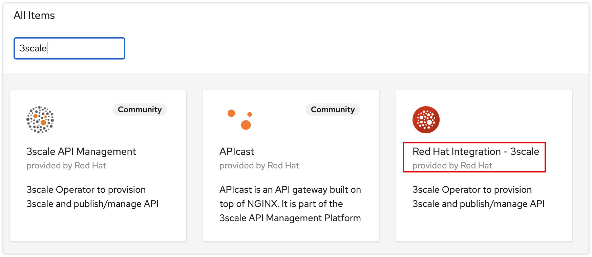
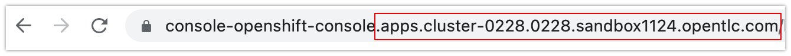

:noaudio:
:scrollbar:
:toc2:
:linkattrs:
:data-uri:

== Goals of the lab

* Create a Noobaa storage class using OpenShift container storage operator
* Create object bucket claim required for 3scale
* Install 3scale Operator
* Install 3scale using APIManager CRD

:numbered:

== Red Hat OpenShift Container Platform

For this course, you need to provision OpenShift 4.8 workshop environment from rhpds

. Login to the https://rhpds.redhat.com and provision an environment as shown below

image::images/rhpds_provision_steps.png[]

It takes up to 75 minutes to provision a cluster in rhpds. You will receive an email with detailed instructions to access the cluster.

== Create Noobaa storage class

=== Install OpenShift Container Storage (OCS) Operator
. Login to the OpenShift console using the details in the email received upon provisioning rhpds cluster
. Go to Operators -> Operator Hub
. Install *OpenShift Container Storage* operator as shown below with default values
+
image::images/ocs_operator.png[]
+
. Upon successful installation of the ocs operator, it should create *openshift-storage* namespace. Go to the OCS operator just installed and create storage cluster as shown below
+
image::images/noobaa_create_storagecluster.png[]
+
. Click *Create StorageCluster* and select the following values
+
image::images/noobaa_create_storagecluster_capacity.png[]
+

In about 10 minutes storage class *openshift-storage.noobaa.io* will be available under Storage->Storageclasses

== Install 3scale

Create a namespace (project) called *3scale* where 3scale will be installed using the Operator
-----
$ oc new-project 3scale
-----

=== Create Object Bucket Claim

Go to Storage->Object Bucket Claims and create *Object BucketClaim* with details as shown below

image::images/create_objectbucketclaim.png[]

image::images/create_objectbucketclaim_details.png[]

- Storage class should be *openshift-storage.noobaa.io*
- Use the default *noobaa-default-bucket-class*

Upon creating the Object BucketClaim, it should show details something like below. Capture the values that will be used to create a secret `aws-auth` in the next step

=== Create aws-auth secret

In 3scale project, go to workloads -> secrets -> Create -> From Yaml

Replace access_key, secret_key, bucket_name, endpoint with the values captured above. *AWS_REGION* value can be anything. `local-s3-bucket` is a made up value. 

Please note that endpoint port value when Object Bucket Claim created is 443. Replace port 443 with 80. E.g. s3.openshift-storage.svc:443 is changed to s3.openshift-storage.svc:80

----
apiVersion: v1                                                       
kind: Secret                                                         
metadata:                                                            
  name: aws-auth                                                     
stringData:                                                          
  AWS_ACCESS_KEY_ID: <<access_key>>
  AWS_SECRET_ACCESS_KEY: <<secret_key>>
  AWS_BUCKET: <<bucket_name>>
  AWS_REGION: local-s3-bucket
  AWS_HOSTNAME: <<endpoint>>
  AWS_PROTOCOL: HTTP
  AWS_PATH_STYLE: 'true'
type: Opaque
----

=== Install 3scale operator

Install 3scale operator in *3scale* namespace as shown in the screenshots below with the default values

=== Create 3scale APIManager CR

Create 3scale APIManager CR to provision 3scale.

. Get the wild card domain of the OCP cluster from the console URL. E.g. `apps.cluster-0228.0228.sandbox1124.opentlc.com`

. Go to Operators -> Installed Operators->  Red Hat Integration - 3Scale
Under APIManager select *Create instance* and switch to the YAML view and paste YAML. YAML sample is

----
apiVersion: apps.3scale.net/v1alpha1
kind: APIManager
metadata:
  name: "3scale-test"
spec:
  wildcardDomain: "{{wildcard domain}}"
  resourceRequirementsEnabled: false
  system:
    fileStorage:
      simpleStorageService:
        configurationSecretRef:
          name: aws-auth
----
Please replace "wildcard domain" with your cluster wildcard domain.

