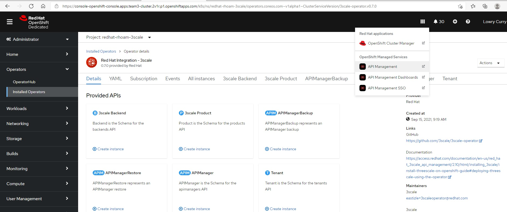

:noaudio:
:scrollbar:
:toc2:
:linkattrs:
:data-uri:

== Red Hat OpenShift API Management (RHOAM) Setup Lab

.Goals

* Setup an OpenShift Dedicated (OSD) cluster 
* Install Red Hat OpenShift API Management (RHOAM) 
* Install lab assets 

:numbered:

The following document walks through the various options to Provision an OpenShift Dedicated Cluster, configure and identity provider, install the Red Hat OpenShift API Management Add-on, and unprovisioning the lab environment once you have completed the labs.

* link:https://docs.google.com/document/d/1Ms-q6ZeK7lWWl8CmcrAjnrGofFEcJ0LMHOEnyxH7Bk4/edit#heading=h.uf3vanolhpne[RHOAM Demo Environment Guide]

== Notes 

.Issue: Incorrect reporting of install completion
If you select to install RHOAM using your own AWS Account, when you provision your OpenShift Dedicated cluster through cloud.redhat.com and install the RHOAM Add-On there is a known issue where the installation reports that it has completed as soon as 10 minutes after starting.  However, it can take up to 45 minutes for all resources to be installed. You will know provioning is complete when the drop-down in Openshift cluster management console contains all 3 of the the API Management components shown in the screenshot below.   

