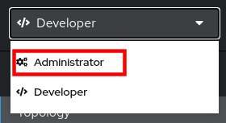

:noaudio:
:scrollbar:
:toc2:
:linkattrs:
:data-uri:

== Environment Setup Lab

.Goals

* Review lab assets
* Become familiar with the multi-tenant Red Hat 3scale API Management lab environment
* Review API gateways
* Review Products API

:numbered:

== Environment variables

Throughout this course, whenever the instructions require environment or user-specific data, environment variables are used. The environment variables should then be replaced by the user or environment specific value.

These environment variables can be exported, and assuming your workstation is a Linux workstation and you use the _Bash_ shell, added to the `.bashrc` shell initialization file (this will be different if you use another operating system or bash shell - adapt the instructions accordingly). By doing so they become available in your terminal windows.

. Open a terminal window on your local machine and set the following environment variables for use throughout the duration of this course:
+
----
# Modify each of the following based on settings provided by Instructor
# Afterwards, execute each of the modified commands in your shell:

$ echo 'export OCP_USER=<provided by your instructor>        # OpenShift username'  >> ~/.bashrc
$ echo 'export OCP_PASSWD=<provided by your instructor>        # OpenShift password' >> ~/.bashrc
$ echo 'export OCP_WILDCARD_DOMAIN=<provided by instructor>        # OpenShift application wildcard domain" >> ~/.bashrc
$ echo 'export OCP_API_HOST=<provided by instructor>        # OpenShift API URL" >> ~/.bashrc
$ echo 'export API_MANAGER_NS=<provided by instructor>        # Name of OpenShift namespace where 3scale API Management is installed'   >> ~/.bashrc
$ echo 'export API_TENANT_USERNAME=<provided by instructor>        # Name of 3scale tenant admin user' >> ~/.bashrc
$ echo 'export API_TENANT_PASSWORD=<provided by instructor>        # Password of 3scale tenant admin user' >> ~/.bashrc

# Execute the following to enable the variables in your existing shell
$ source ~/.bashrc
----

== Red Hat OpenShift Container Platform

For this course, you use a remote OpenShift cluster environment that was provisioned by your instructor. 
All of the labs for this course execute in this remote OpenShift cluster environment.

=== Access Red Hat OpenShift Web Console

. Point your browser to the following URL:
+
-----
$ echo -en "\n\nhttps://console-openshift-console.$OCP_WILDCARD_DOMAIN\n\n"
-----

. At the login prompt, use the `$OCP_USER` and `$OCP_PASSWD` values.
. If this is the first time you access the console, the console opens in the *Developer* perspective, with a pop-up inviting you to take a tour of the perspective. This is not required for the remainder of this course, so feel free to click *Skip tour*.
+

. The OpenShift web console has two perspectives, *Developer* and *Administrator*. For this course you will mostly use the Administrator perspective. +
Switch to the Administrator perspective. In the drop-down box on the top left, select *Administrator*.
+

. Expect to see the _Projects_ page, which lists the OpenShift projects you have access to.
+

=== Install `oc` Utility Tooling

The OpenShift `oc` client allows to interact with the OpenShift platform from the command line. The `oc` utility needs to be installed on your host laptop.

The version of the `oc` utility needs to be of the same major version as the Red Hat OpenShift Container Platform (OCP) shared cluster environment provisioned by your instructor.

If you do not already have a compatible version of the `oc` utility installed on your host machine, you can retrieve it by completing these steps in the OpenShift web console:

. Click  and select *Command Line Tools*.
. Under *oc - OpenShift Command Line Interface (CLI)*, click the link corresponding to your workstation operating system. +
This starts the download of the `oc` utility archive.
+

. Install the `oc` utility, then log in to OpenShift using it:
+
----
$ oc login $OCP_API_HOST -u $OCP_USER -p $OCP_PASSWD
----
+
The oc utility in your shell terminal is now authenticated with the master node of your OpenShift lab environment.

=== Verify OpenShift Projects

. After you authenticate, confirm that you see these three OpenShift projects:
+
-----
$ oc get projects
-----
+
.Sample Output
-----
NAME                       DISPLAY NAME                      STATUS
3scale                                                       Active
user50-3scale-gw           user50 APICast Gateways Project   Active
user50-business-services                                     Active
-----
+
Or from the OpenShift web console:
+

. The different projects you have access to are:
* `3scale`: In this project 3scale API Management is installed. Your OpenShift user has _view_ access to this project.
* `$OCP_USER-3scale-gw`: This project includes APIcast gateways (staging and production) that are pre-configured to interact with your 3scale API Management tenant.
* `$OCP_USER-business-services`: This project includes the _CoolStore Products_ application which you will use as an example API during this course.

. Issue the following `oc` command to see the different deployments running in the `3scale` namespace:
+
----
$ oc get deploymentconfig -n $API_MANAGER_NS
----
+
.Sample Output
----
apicast-production   1          1         1         config,image(amp-apicast:2.9)
apicast-staging      1          1         1         config,image(amp-apicast:2.9)
backend-cron         1          1         1         config,image(amp-backend:2.9)
backend-listener     1          1         1         config,image(amp-backend:2.9)
backend-redis        1          1         1         config,image(backend-redis:2.9)
backend-worker       1          1         1         config,image(amp-backend:2.9)
system-app           1          1         1         config,image(amp-system:2.9)
system-memcache      1          1         1         config,image(system-memcached:2.9)
system-mysql         1          1         1         config,image(system-mysql:2.9)
system-redis         1          1         1         config,image(system-redis:2.9)
system-sidekiq       1          1         1         config,image(amp-system:2.9)
system-sphinx        1          1         1         config,image(amp-system:2.9)
zync                 1          1         1         config,image(amp-zync:2.9)
zync-database        1          1         1         config,image(zync-database-postgresql:2.9)
zync-que             1          1         1         config,image(amp-zync:2.9)
----
+
Or alternatively from the OpenShift Web console:
+
* On the _Projects_ page, click on the *3scale* project.
* Navigate to *Workloads -> Deployment Configs*.
+

. This corresponds to the following deployment architecture:
+

+

== Access Multi-Tenant 3scale API Management

Red Hat 3scale API Management allows multiple independent instances of 3scale _tenants_ (also known as _accounts_) to exist on a single on-premises deployment. Tenants operate independently from one another, and cannot share information among themselves. 

On the lab environment, a separate tenant has been provisioned for each student. You serve as the administrator of your own 3scale API Management tenant.

As a tenant you have access to your own separate Admin Portal and Developer Portal.

. Access your 3scale Admin Portal by pointing your browser to the output of the following:
+
-----
$ echo -en "\n\nhttps://${OCP_USER}-3scale-admin.${OCP_WILDCARD_DOMAIN}\n\n"
-----
+
Where `${OCP_USER}-3scale` represents the name of the tenant.

. Authenticate using the following values:
* *Username*:  $API_TENANT_USERNAME
* *Password*:  $API_TENANT_PASSWORD

. Expect to see the _Dashboard_ page of the 3scale Admin Portal:
+

. You can click on the  to sign out from the Admin Portal.
+

. Click on the  to get access to the settings of your 3scale account.
+

+
From here you can change your personal settings, invite additional users to the account and create access tokens to interact with the 3scale Admin APIs.

== Review APIcast Gateways

=== Explore 3scale API Management Gateways

Your 3scale API Management multi-tenant lab environment comes with a set of associated staging and production APIcast gateways.

. Execute the following command to view these gateways:
+
-----
$ oc get deploymentconfig -n $API_MANAGER_NS | grep apicast
-----
+
.Sample Output
-----
apicast-production   1          1         1         config,image(amp-apicast:2.9)
apicast-staging      1          1         1         config,image(amp-apicast:2.9)
-----

It is technically feasible for your back-end services to be managed by these default 3scale API Management gateways.

However these gateways are deployed in the same namespace as the 3scale API Management platform. In a typical enterprise setup, tenant admins won't have full access to this namespace. This is also the case in the lab setup, where each tenant admin user only has _view_ access to the 3scale API Management namespace. This means that as a tenant admin you won't have the ability to e.g bounce the gateway pods, or modify them if need be. 

=== Explore Tenant-Specific API Gateways

Your lab environment is provisioned with a set of API gateways that are specific to your tenant. 
You have full administrative access to the OpenShift namespace containing  your tenant-specific API gateways.
These are the API gateways that you use to manage your back-end services for the duration of this course.

. The API gateways for your tenant are deployed in the `$OCP_USER-3scale-gw` namespace. Get a list of these API gateways by executing the following command:
+
-----
$ oc get deployment -n $OCP_USER-3scale-gw
-----
+
.Sample Output
-----
NAME                    READY   UP-TO-DATE   AVAILABLE   AGE
apicast-operator        1/1     1            1           12h
apicast-prod            1/1     1            1           12h
apicast-stage           1/1     1            1           12h
-----

. The APIcast gateways use the value of an environment variable named `THREESCALE_PORTAL_ENDPOINT` to invoke the API Manager and retrieve details of your APIs and report API usage. +
The value of `$THREESCALE_PORTAL_ENDPOINT` is mounted in the APIcast pods from a secret. +
To view the value of the secret, you can use the following `oc` command:
+
----
$ oc get secret apicast-configuration-url-secret-stage -o jsonpath='{.data.AdminPortalURL}' -n ${OCP_USER}-3scale-gw | base64 -d | xargs -I var echo -e var\n
----
+
.Sample output
+
----
https://81330658413eb42bdc4b2b8fa777af54@user50-3scale-admin.apps.cluster-e189.e189.sandbox1208.opentlc.com
----
+
Or alternatively in the OpenShift web console:
+
* Select the `${OCP_USER}-3scale-gw project`.
* Navigate to *Workloads -> Secrets*.
* Open the `apicast-configuration-url-secret-stage` secret.
* Click *Reveal values* to see the value of the secret entries.
+

+

. Note that the host part of the `THREESCALE_PORTAL_ENDPOINT` environment variable corresponds to the host of the 3scale Admin Portal of your tenant. The API Key (the part before the `@` in the URL) corresponds to the Provider Key as defined in the *Account Settings* of the Admin Portal.
+

== Explore CoolStore Products Service

Throughout the labs of this course, you will use the _CoolStore Products service_ application as example API. The Products service application is one of the services from a fictitious retail company, _CoolStore_. It is a fairly simple application which exposes CRUD functionality (Create, Retrieve, Update, Delete) for Product entities from the CoolStore catalog.

In this section of the lab you will explore this application. More in particular you will explore the capabilities of the application using its _OpenAPI_ specification.

The OpenAPI Specification (OAS) defines a standard, language-agnostic interface to RESTful APIs which allows both humans and computers to discover and understand the capabilities of the service without access to source code, documentation, or through network traffic inspection. When properly defined, a consumer can understand and interact with the remote service with a minimal amount of implementation logic.

An OpenAPI definition can then be used by documentation generation tools to display the API, code generation tools to generate servers and clients in various programming languages, testing tools, and many other use cases.

. The Products service application is deployed on the lab OpenShift cluster in the `${OCP_USER}-business-services` namespace. Execute the following `oc` command to see the application deployments:
+
----
$ oc get deploymentconfig -n ${OCP_USER}-business-services
----
+
.Sample Output
----
NAME               REVISION   DESIRED   CURRENT   TRIGGERED BY
products-db        1          1         1         config
products-service   3          1         1         config,image(products-service:latest)
----
+
Or alternatively in the OpenShift web console:
+

+
* The application consists of a web application which exposes a REST interface, and a database to store and retrieve product entities.

. The OpenAPI specification document for the REST APIs exposed by the Products service application can be obtained from the `/openapi` endpoint on the application. From there it can be imported into an OpenAPI editor.
* In a new browser window, navigate to http://editor.swagger.io/. 
* Select *File -> Import URL*.
+

* Enter the URL of the Products service OpenAPI specification.  This URL can be determined by executing the following command:
+
-----
$ echo -en "\nhttps://products-service-${OCP_USER}-business-services.${OCP_WILDCARD_DOMAIN}/openapi\n\n"
-----
* Click *OK*.
* Notice that the OpenAPI specification document is loaded in the left pane of the editor, while the right pane shows a graphical representation of the API, including methods, paths and sample requests/responses.
+

* The Swagger OpenAPI editor is not just an online editor, but can also be used to send sample requests to the API. +
In order to do so a server needs to be added to the OpenAPI document. 
From the editor menu, select *Insert -> Add Servers*.
+

* In the _Add Server_ dialog box, enter the URL to the Products Service. This URL can be determined by executing the following command:
+
-----
$ echo -en "\nhttps://products-service-${OCP_USER}-business-services.${OCP_WILDCARD_DOMAIN}\n\n"
-----
* Click *Add Servers* to add the server definition to the OpenAPI document.

. Navigate around the right pane of the editor. Pay particular attention to the 4 REST operations, corresponding HTTP methods and relative path.
+

. Click on a REST operation to expand it. A well documented REST API will provide details about request parameters, HTTP response codes, request and response media types, and request and response samples.
+

. You can send sample requests to the API for each method to get an understanding of the request and response types. +
Click *Try it out* next to an operation, enter query or body parameters a required and click *Execute*.
+

. Notice the response and response content types for each request.
+

Now that you are familiar with the API, the next step is to add the Products service as an API to the 3Scale Admin Portal and define the methods and mappings for the API.