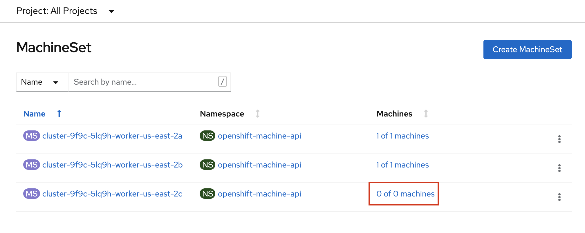
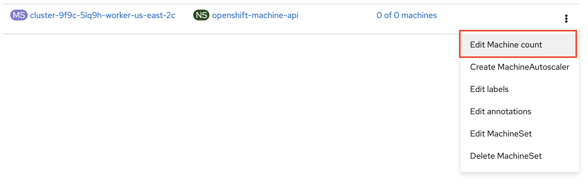
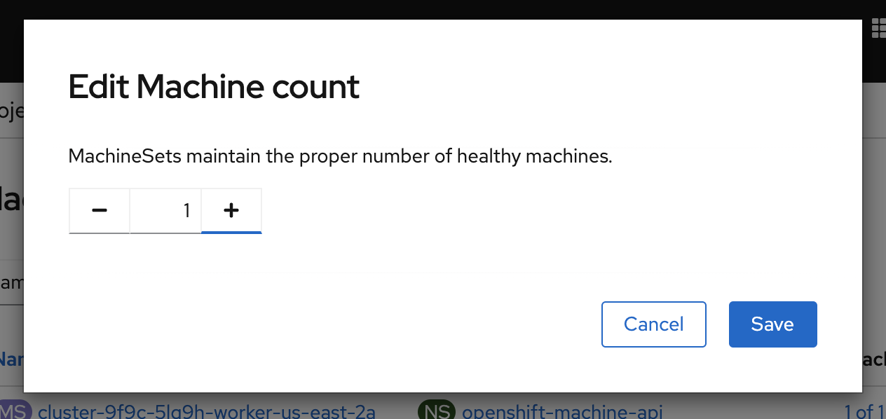

# NOTE

These steps are an alternative install using OCS, NOT RWO Storage.

# Early Notes on Running 3scale 2.10 on OCP 4.8
### Background
The 3scale course has been delivered so far on OCP 3.x even though 3scale has been supported on OCP 4 since 3scale 2.5.

Primarily, this is due to following issues:

- The 3scale template is not supported to deploy AMP on OCP. Only the 3scale operator is supported. Hence, the existing 3scale Install Ansible Roles cannot be used for deploying to OCP 4.
- On OCP 3.x, Gluster FS is available for providing RWX storage necessary for 3scale. On OCP 4.x, no RWx storage is available on OpenTLC or RHPDS.
- 3scale Operator does not allow customization of template used, so the resources and limits cannot be changed. This interferes with the quotas in the OpenTLC and RHPDS OCP workshop instances.

# Installation Overview
1. Request RHPDS + create project
2. In web console, update machinesets to change 3rd set from 0 to 1 replica
3. Install 3scale operator
4. Install OpenShift Container Storage operator
5. Create ClusterStorage resource using all 3 machines
6. Create APIManager resource

'''

### 1. Request RHPDS + Create Project
1. Order `OpenShift Workshop 4.8` on the [RHPDS catalog](https://rhpds.redhat.com/catalog/explorer).
2. Confirm the warning, and leave all other default settings.
3. Select `Training` as the Purpose.
4. Submit - this can take about 30 minutes to finish, and you will get an email. 
5. If the provision fails, simply repeat the previous steps.
6. Once provisioned, `ssh` to the bastion using the SSH password provided in the email.
7. sudo as `root` user:

    # sudo -i

8. Create `3scale-amp` project.
    
    # oc new-project 3scale-amp
    
### 2. Update machinesets
1. In the web UI, navigate to `Compute` > `MachineSets`
2. You should see 3 MachineSets, with one spinned down. Update the machine count of that MachineSet to 1.
 
 
 
    
### 3. Install the 3scale operator
1. From the OpenShift admin console, install the `3scale-community-operator` from Operator Hub to the `3scale-amp` namespace.
2. Choose `threescale-2.10`

### 4. Storage
1. Install the OpenShift Container Storage operator to the `openshift-storage` namespace.
2. Select update channel `stable-4.8`

### 5. Create ClusterStorage resource using all 3 machines
1. After installing the operator, you should see this message prompting you to create a `StorageCluster`:

    Installed operator - operand required
    
2. Set `Requested Capacity` to `0.5 TiB`
3. Select all three nodes
4. All other settings can keep their defaults. Hit Create. If you see a `404` message, reload your browser.
5. Change the default storage class

### 6. Create APIManager resource    
1. Create the `smtp.yml` configmap to configure SMTP access:

    # vim smtp.yml
    
    kind: ConfigMap
    apiVersion: v1
    metadata:
      name: smtp
      labels:
        app: 3scale-api-management
        threescale_component: system
        threescale_component_element: smtp
    data:
      address: 'smtp.gmail.com'
      authentication: 'login'
      domain: 'redhat.com'
      openssl.verify.mode: 'false'
      password: '<< your password>>'
      port: '587'
      username: '<< your userid>>'

2. Add the configmap to `3scale-amp` namespace:

    # oc create -f smtp.yml
    
3. Once Operator is installed and ready, get back to the terminal and add the APIManager:

    # vim amp-s3.yml
    
    apiVersion: apps.3scale.net/v1alpha1
    kind: APIManager
    metadata:
      name: apimanager
    spec:
      system:
        fileStorage:
          persistentVolumeClaim:
            storageClassName: ocs-storagecluster-cephfs
        redisResources:
          limits:
            memory: 6Gi
      backend:
        redisResources:
          limits:
            memory: 6Gi
      wildcardDomain: <WILDCARD-DOMAIN>
  
    # oc create -f amp-s3.yml

4. Wait for 10 mins for all the 3scale pods to be ready.
5. Login to the Master URL and the `3scale-admin` tenant.
6. Verify that you can open the Developer Portal and the Content is loaded correctly.
