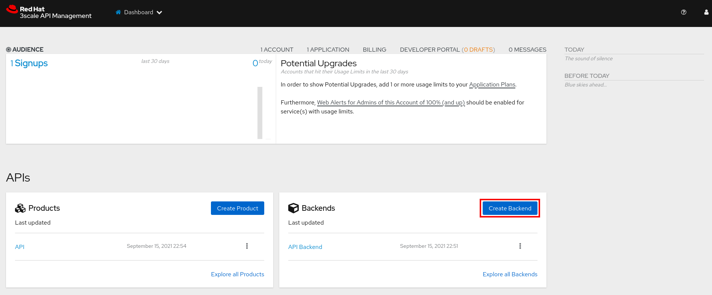
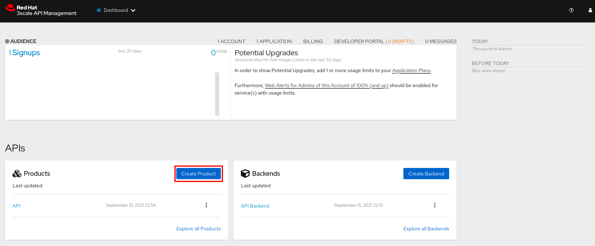

:noaudio:
:scrollbar:
:toc2:
:linkattrs:
:data-uri:

== Integrating APIs with 3scale Lab

.Overview

In this lab you integrate and manage the application that exposes the RESTful Products service API. 

In addition, _methods_, _metrics_, and _rate limits_ are defined and used.

.Goals

* Expose RESTful Products service API with 3scale API Management
* Create application plans for _basic_ and _premium_ users
* Define _methods_ and _mappings_
* Apply rate limits for _basic_ users to control access to the API

:numbered:

== Manage API Resources

In this section you expose the Products service API described in an earlier lab using 3scale API gateway.
You use 3scale Admin Portal to create the accounts, applications, application plans, services, and API definitions.

=== Default _Developer_ Account

A new API Management installation typically comes provisioned with a default account called `Developer`.
If you have not already done so, this default _Developer_ account can be deleted.

Deletion of this `Developer` account will reduce possible confusion later on in this course.
If this default `Developer` account is not deleted or suspended, new API services that are defined will automatically have a default _application_ (with corresponding API keys) created for this user.
You'll then have to subsequently make sure you are using the desired _application_ and not this default _application_ associated with this default _developer_ account.

. In a browser window, access the Admin Portal of your 3scale tenant.

. Navigate to the *Audience* perspective (from the drop-down in the top panel of the Admin Portal).
. Navigate to *Accounts -> Listing*
+

. Click the `Developer` account.
. Click the green *Edit* link.
+

. Delete the default `Developer` account :
+

=== Define Products API Backend

In this section you create an API _backend_ which points to the Products service.

. In the Admin Portal of your 3scale tenant, navigate to the *Dashboard* perspective.
. Select the *Backends* tab.
. Click the *New Backend* link to create a new _Backend_.
+

. In the *New Backend* form, fill in the following:
* *Name*: `Products Service Backend`
* *System Name*: `products_service_backend`
* *Private Base URL*: `http://products-service.${OCP_USER}-business-services.svc:8080`
+
Replace ${OCP_USER} with your OpenShift user name.
+
[NOTE]
====
The _Private Base URL_ corresponds to the internal OpenShift service URL of the Products service. As the Products service is deployed in the same OpenShift cluster as the APIcast gateway, the OpenShift service URL can be used. This is more efficient than using the external URL for the products service.
====
. Click *Create Backend* to create the backend.
+

+
You are redirected to the _Products Service Backend_ overview page.

=== Define Products API

In this section you define an API _product_ that manages access to the Products service.

. In the Admin Portal of your 3scale tenant, navigate to the *Dashboard* perspective.
. Select the *Products* tab.
. Click the *New Product* link to create a new _Product_.
+

. In the *New Product* form:
* Select *Define manually*
* *Name*: `Products API`
* *System name*: `products_api`
* *Description*: `CoolStore Products API`
. Click *Create Product* to create the product.
+

+
You are redirected to the _Products API_ product overview page.

=== Define Application Plans

_Application plans_ are used for granting access to specific APIs and endpoints, limiting traffic, and monetizing API usage.
Application plans let you configure access rights to an API by specifying rate limits and pricing rules. All applications must be associated with a plan.
Multiple custom application plans can be defined for an API.

In this section of the lab, you'll create two new Application Plans for the _Products_ API.

. From the top panel, select *Product:Products API* and on the _Overview_ page scroll down to the *Published Application Plans* section.
. Create a *basic plan* for the Products API :
.. Click: *Create Application Plan*.
.. Use the following parameters:
* *Name*: `Products Basic Plan`
* *System Name*: `products/basic`
* Leave the rest of the fields as-is.
.. Click *Create Application Plan*:
+

. Navigate back to the Product overview page, and create another application plan with :
. Create a *premium plan* for the Products API :
.. Click: *Create Application Plan*
.. User the following parameters:
* *Name*: `Products Premium Plan`
* *System Name*: `products/premium`
* Click *Create Application Plan*

. On the *Application Plans* overview page, select `Products Basic Plan` from the *Default Plan* drop-down and *Publish* both `Products Basic Plan` and `Products Premium Plan` :
+

=== Define Accounts and Users

In this section you create a new developer account to use the Products API.

. Navigate to  *Audience -> Accounts -> Listing*.
. Click *Create*.
. Create a new account with the following credentials:
* *Username*: `test-dev`
* *Email*: Provide a valid email address. The email address does not have to be a real email address.
* *Password*: Provide a unique, easy-to-remember password.
* *Organization/Group Name*: `TestAccount`
+

. Click *Create* to create the developer account.

=== Create Application

In this section you associate an application to your previously defined user.
This generates a user key for the application.
The user key is used as a query parameter to the HTTP request to invoke your business services via your on-premise API gateway.

[NOTE]
====
It's likely that an _application_ was already auto-generated and an association made between the _TestAccount_ account and the _Products Basic Plan_ Application Plan.
If so, you can delete this auto-generated Application.

To delete the auto-generated applications:

* Navigate to *Audience -> Applications -> Listing*.
+

* Click on the application name in the list to open the application page.
* Click the *Edit* link next on the application overview page.
+

* On the _Edit application_ page, click the *Delete* link.
+

Follow the instructions below to gain practice in creating a new Application.
====

. Navigate to  *Audience -> Accounts -> Listing*.
. Select *TestAccount* -> *0 Applications*.
+

+
. Click *Create Application*.
. On the _New Application_ page, enter the following values:
* *Application plan*: `Products Basic Plan`
* *Service plan*: `Default`
* *Name*: `Products App`
* *Description*: `Products Application`

. Click the blue *Create Application* button in the bottom right corner.  After the application is created, make a note of the _user key_:
+

=== Products API Integration

In this section you associate the Products API with a backend, and set up the external URLs to the managed API on the staging and production APIcast.

. Navigate to the *Product:Products API* perspective.
. Select *Integration -> Configuration*.
+
As you have yet not associated the Products API with a backend, the configuration page shows a blue button *add a Backend and promote the configuration*.
+

+
Click the button to add a backend to the product.

. In the _Add Backend_ page:
* Select `Products Service Backend` from the *Backend* drop-down box.
* Set the path to `/`.
+
[NOTE]
====
When you add a backend to a product, you define the path the backend uses within the context of this specific product. This path is not part of the backend. +
APIcast redirects the traffic to the backend with the specified path matching the prefix of the requested endpoint path. 

When defining the path for a backend:

* You can indicate `/` as path of one of the backends.
* Paths must be unique inside the product. This means that you cannot add two backends with the same path inside the same product. Neither you can add the same backend twice to the same product.
* You can give the same backend the same path in different products. 

This is how the backend path works:

* Each backend added to a product is mounted in the specified path.
* Before redirecting the traffic, the path is removed from the public URL of the request to the product.

.Example
Consider the following configuration:

* Backend: Inventory service, with private URL <private-api-domain>
* Backend resource path: `/list`
* Product: Petstore API with public URL  <public-api-domain>
* Inventory backend mounted in path: `/supplies` 

Action flow when a request is sent to the Petstore API:

* The request is sent to the public URL: `<public-api-domain>/supplies/list`
* The backend path is removed before redirecting to the private URL: `<private-api-domain>/list`
* The request is redirected to the Inventory backend. 

====
* Click *Add to Product*.
+

. Navigate to *Integration -> Settings* to set up the external URLs to the Products API managed by your tenant APIcast.
* On the _Settings_ page, in the _Deployment_ section, check the radio-button *APIcast self-managed*.
+
[NOTE]
====
*APIcast 3scale managed vs APIcast self-managed*

When installing 3scale API Manager, a set of APIcast gateways - staging and production - are deployed in the same OpenShift namespace as the API Manager. These APIcast gateways are _3scale managed_. In contrast, APIcast gateways deployed outside of the API manager namespace are _self-managed_. This is the case for the tenant-specific APIcast gateways deployed in the lab environment.

When creating an API product using the 3scale managed gateways, the routes (public addressable URL) to the staging and production APIcast gateways will be created automatically by the 3scale API manager. For every API product, another set of routes will be created.

On the other hand, when using self-managed APIcast gateways, it is the responsibility of the tenant admin to specify the URL to the APIcast gateways, and to create the OpenShift routes pointing to the APIcast deployment.
====

* Set the *Staging Public Base URL* to `https://products-api-${OCP_USER}-staging.${OCP_WILDCARD_DOMAIN}`.
+
Replace `${OCP_USER}` and `${OCP_WILDCARD_DOMAIN}` with the value of the environment variable as set in the previous lab.
* Set the *Production Public Base URL* to `https://products-api-${OCP_USER}.${OCP_WILDCARD_DOMAIN}`.
+

* Scroll to the bottom of the page and click *Update Product*.

. Navigate back to *Integration -> Configuration*. Notice that the Products API is ready to be deployed into the staging APIcast.
+

. Click the *Promote v. 1 to Staging APIcast* button to deploy the API to the staging APIcast.
+

. In a terminal window, execute the following `curl` command. Add the `-v` parameter for more verbose output. Replace `${PRODUCTS_API_USER_KEY}` with the value of the user key of the application you created earlier:
+
----
$ curl -v "https://products-api-${OCP_USER}-staging.${OCP_WILDCARD_DOMAIN}:443/?user_key=${PRODUCTS_API_USER_KEY}"
----
+
.Sample output
----
*   Trying 54.93.126.15:443...
* Connected to products-api-user50-staging.apps.cluster-6a1a.6a1a.example.opentlc.com (54.93.126.15) port 443 (#0)
* ALPN, offering h2
* ALPN, offering http/1.1
* successfully set certificate verify locations:
*   CAfile: /etc/pki/tls/certs/ca-bundle.crt
  CApath: none
* TLSv1.3 (OUT), TLS handshake, Client hello (1):
* TLSv1.3 (IN), TLS handshake, Server hello (2):
* TLSv1.3 (IN), TLS handshake, Encrypted Extensions (8):
* TLSv1.3 (IN), TLS handshake, Certificate (11):
* TLSv1.3 (IN), TLS handshake, CERT verify (15):
* TLSv1.3 (IN), TLS handshake, Finished (20):
* TLSv1.3 (OUT), TLS change cipher, Change cipher spec (1):
* TLSv1.3 (OUT), TLS handshake, Finished (20):
* SSL connection using TLSv1.3 / TLS_AES_256_GCM_SHA384
* ALPN, server did not agree to a protocol
* Server certificate:
*  subject: CN=api.cluster-6a1a.6a1a.example.opentlc.com
*  start date: Jan 12 08:30:46 2021 GMT
*  expire date: Apr 12 08:30:46 2021 GMT
*  subjectAltName: host "products-api-user50-staging.apps.cluster-6a1a.6a1a.example.opentlc.com" matched cert's "*.apps.cluster-6a1a.6a1a.example.
opentlc.com"
*  issuer: C=US; O=Let's Encrypt; CN=R3
*  SSL certificate verify ok.
> GET /?user_key=9be65d7c70d8cd464c56898d5e9e1e37 HTTP/1.1
> Host: products-api-user50-staging.apps.cluster-6a1a.6a1a.example.opentlc.com
> User-Agent: curl/7.71.1
> Accept: */*
>
* TLSv1.3 (IN), TLS handshake, Newsession Ticket (4):
* TLSv1.3 (IN), TLS handshake, Newsession Ticket (4):
* old SSL session ID is stale, removing
* Mark bundle as not supporting multiuse
* HTTP 1.0, assume close after body
< HTTP/1.0 503 Service Unavailable
----
+
Notice the HTTP return code `503 Service Unavailable`. This is expected because the public staging and production URLs of the Products API are not associated with a route on OpenShift. So the OpenShift router - which handles all incoming traffic into the OpenShift cluster - does not know where to route the request to, and replies with a `503 Service Unavailable` error code.

=== Products API Stage and Production Routes

In this section you create the routes to the staging and production APIcast for the Products API.

If you have the OpenShift `oc` client installed on your workstation, you can create the routes using `oc` in a terminal window.

. Open a terminal window, and login into the OpenShift cluster with your OpenShift username and password.
+
----
$ oc login -u ${OCP_USER} -p ${OCP_PASSWD} ${OCP_API_HOST}
----

. Create the route for the stage APIcast
+
----
$ oc create route edge products-staging-route  --service=apicast-stage --hostname=products-api-${OCP_USER}-staging.${OCP_WILDCARD_DOMAIN} -n ${OCP_USER}-3scale-gw
----
+
.Expected Output
----
route.route.openshift.io/products-staging-route created
----
+
* Make sure that the hostname matches the staging URL as defined in the Products API configuration.
* `${OCP_USER}-3scale-gw` is the name of the OpenShift project where the stage and production APIcast gateways for your tenant have been deployed.
* `apicast-stage` is the name of the service of the staging APIcast deployment in the APIcast gateway project.
* `edge` means that the route will use HTTPS, but TLS will be terminated by the router.

. Create the route for the production APIcast:
+
----
$ oc create route edge products-production-route  --service=apicast-prod --hostname=products-api-${OCP_USER}.${OCP_WILDCARD_DOMAIN} -n ${OCP_USER}-3scale-gw
----
+
.Expected Output
----
route.route.openshift.io/products-production-route created
----

[NOTE]
====
As an alternative, you can also create the routes through the OpenShift web console.

. In a browser window, enter the URL to the OpenShift web console - `https://console-openshift-console.${OCP_WILDCARD_DOMAIN}`.
. Log in with your OpenShift username and password.
. Select the _Administrator_ perspective, navigate to *Home -> Projects* and in the _Projects_ list click on the link to the `${OCP_USER}-3scale-gw` project.
+

. Navigate to *Network -> Routes*. If you haven't created the routes to the stage and production APIcast instances with `oc`, the list of routes will be empty.
. Click on *Create Route* to create a new route.
. On the _Create Route_ page, fill in the following values:
* *Name*: `products-staging-route`
* *Hostname*: `products-api-${OCP_USER}-staging.${OCP_WILDCARD_DOMAIN}`
* *Path*: leave to `/`
* *Service*: select `apicast-stage`
* *Target Port*: select `8080 -> 8080 (TCP)`
* *Security* : check the `Secure route` checkbox.
* *TLS Termination*: select `Edge`
* *Insecure traffic*: select `Redirect`
+

. Click *Create* to create the route.
. Repeat the above for the production route.
====

At this point you are ready to test the deployment of the Products API on the staging APIcast.

. In a terminal window, execute the following `curl` command:
+
----
$ curl -v "https://products-api-${OCP_USER}-staging.${OCP_WILDCARD_DOMAIN}/api/products?user_key=${PRODUCTS_API_USER_KEY}"
---- 
+
.Sample Output
----
*   Trying 52.28.126.68:443...
* Connected to products-api-user50-staging.apps.cluster-6a1a.6a1a.example.opentlc.com (52.28.126.68) port 443 (#0)
* ALPN, offering h2
* ALPN, offering http/1.1
* successfully set certificate verify locations:
*   CAfile: /etc/pki/tls/certs/ca-bundle.crt
  CApath: none
* TLSv1.3 (OUT), TLS handshake, Client hello (1):
* TLSv1.3 (IN), TLS handshake, Server hello (2):
* TLSv1.3 (IN), TLS handshake, Encrypted Extensions (8):
* TLSv1.3 (IN), TLS handshake, Certificate (11):
* TLSv1.3 (IN), TLS handshake, CERT verify (15):
* TLSv1.3 (IN), TLS handshake, Finished (20):
* TLSv1.3 (OUT), TLS change cipher, Change cipher spec (1):
* TLSv1.3 (OUT), TLS handshake, Finished (20):
* SSL connection using TLSv1.3 / TLS_AES_256_GCM_SHA384
* ALPN, server did not agree to a protocol
* Server certificate:
*  subject: CN=api.cluster-6a1a.6a1a.example.opentlc.com
*  start date: Jan 12 08:30:46 2021 GMT
*  expire date: Apr 12 08:30:46 2021 GMT
*  subjectAltName: host "products-api-user50-staging.apps.cluster-6a1a.6a1a.example.opentlc.com" matched cert's "*.apps.cluster-6a1a.6a1a.example.opentlc.com"
*  issuer: C=US; O=Let's Encrypt; CN=R3
*  SSL certificate verify ok.
> GET /api/products?user_key=3393b443b1674ccab9738783d49df6b7 HTTP/1.1
> Host: products-api-user50-staging.apps.cluster-6a1a.6a1a.example.opentlc.com
> User-Agent: curl/7.71.1
> Accept: */*
>
* TLSv1.3 (IN), TLS handshake, Newsession Ticket (4):
* TLSv1.3 (IN), TLS handshake, Newsession Ticket (4):
* old SSL session ID is stale, removing
* Mark bundle as not supporting multiuse
< HTTP/1.1 200 OK
< server: openresty
< date: Thu, 14 Jan 2021 09:54:10 GMT
< content-type: application/json
< content-length: 540
< set-cookie: f834931a80a7552cfa2ec69e8192582f=5b32df3d1d096c7f70dbee420a04d44f; path=/; HttpOnly; Secure; SameSite=None
< cache-control: private
<
* Connection #0 to host products-api-user50-staging.apps.cluster-6a1a.6a1a.example.opentlc.com left intact
[{"id":1,"name":"Ninja Blender","price":320.00},{"id":11,"name":"Ninja Blender Pro","price":515.00},{"id":21,"name":"Kitchenhelp Juicer","price":149.99},{"id":31,"name":"ArtCuisine Toaster","price":79.99},{"id":41,"name":"White and Decor Toaster Oven","price":49.99},{"id":51,"name":"Mexpresso Maker","price":199.99},{"id":61,"name":"Mini Fridge","price":229.99},{"id":71,"name":"Slow-Cooker Pot","price":44.99},{"id":81,"name":"SungSamn 4-Door Refrigerator","price":2199.99},{"id":91,"name":"Hanilton 12 Cup Food Processor","price":49.99}]
----
+
* Substitute the value of `PRODUCTS_API_USER_KEY` with the _User Key_ for the _Products App_ application of the _TestAccount_ account.
* Expect a HTTP return code `200 OK`.

=== Methods and Mappings

From the previous lab, recall the resources exposed by the Products API when you reviewed them in http://editor.swagger.io.
This understanding of the Products API will now be utilized to define _methods_ in 3scale and map those methods to the resources exposed by your Products API.

In a later section of this lab, you'll use those methods to define _rate limits_ and collect utilization _metrics_ on each of those Products API resources.

==== Methods

The RESTful backend service exposes _resources_ via different HTTP verbs.
In a similar manner, your 3scale API defines corresponding _methods_.

In this section of the lab, you define various API _methods_ that correspond with the various resources exposed by the Products service backend.

. Navigate to: *Products:Products API -> Integration -> Methods & Metrics*.
. In the *Methods* section, click *New method*.
. Enter the following values:
* *Friendly name*: `Get Product`
* *System name*: `product/get`
* *Description*: `Get a product by ID`
. Click *Create Method*:
+

. Repeat the previous steps to create the following additional methods:
+
[options="header"]
|=======================
|Friendly name|System name|Description
|`Create Product`|`product/create`|`Create a new product.`
|`Delete Product`|`product/delete`|`Delete a product by ID.`
|`Get All Products`|`product/getall`|`Get all products.`
|=======================

==== Mappings

Now that API _methods_ have been defined, you create mappings between those API _methods_ and the actual _resource_ and HTTP verb exposed by the Products RESTful service.

. In the overview table of the mappings, click the link *Add a mapping rule* in the row *Get Product*.
. Enter the following values in the _New mapping Rule_ page:
* *Verb*: `GET`
* *Pattern*: `/api/product/{product}`
* *Method*: select `Get Product`
. Click *Create Mapping Rule* to create the mapping rule.

. Repeat the previous steps to create the following additional _mappings_ :
+
[options="header"]
|=======================
|Verb|Pattern|Method
|`POST`|`/api/product`|`Create Product`
|`DELETE`|`/api/product/{product}`|`Delete Product`
|`GET`|`/api/products`|`Get All Products`
|=======================

. From the _Mapping Rules_ overview page, delete the `GET /` mapping. The mappings overview page should look like:
+

+
[NOTE]
====
Some details about mapping rules and mapping rule evaluation:

* A mapping rule must start with a forward slash (/).
* Mapping rules can contain named wildcards (for example, `/{word}`). This rule will match anything in the placeholder `{word}`, making requests like `/morning` match the rule.
* A rule `/v1`, will be matched for all requests whose paths start with `/v1` (for example, `/v1/word` or `/v1/sentence`).
* By default, all mapping rules are evaluated from first to last, according to the sort you specified.
* You can add a dollar sign (`$`) to the end of a pattern to specify exact matching. For example, `/v1/word$` will only match `/v1/word` requests, and will not match `/v1/word/hello` requests.
* If a mapping rule is marked as `last`, rule evaluation stops if the rule matches, and mapping rules beyond the matching rule will not be evaluated.
* More than one mapping rule can match the request path, but if none matches, the request is discarded with an HTTP 404 status code.
* Mapping rules can be defined on a backend and on a product. A product inherits the mapping rules of the backend.
====

. At this point, the Products API can be deployed to the production APIcast. +
Navigate to *Products:Products API -> Integration -> Configuration*. +
* Deploy the new version of the API to the staging APIcast by clicking the *Promote v. 2 to Staging APIcast* button. +
* Deploy the API to the production APIcast by clicking the *Promote v. 2 to Production APIcast* button.

. Test the API. In a terminal window, use the following `curl` command:
+
----
$ curl -v "https://products-api-${OCP_USER}.${OCP_WILDCARD_DOMAIN}/api/products?user_key=${PRODUCTS_API_USER_KEY}"
----
+
* Expect a HTTP `200 OK` return code.
* If you get a HTTP `404 Not Found` return code, this means that the new state has not yet been synchronized to the production API Gateway. Recall that you may have to wait up to 5 minutes for this synchronization to happen. 

. You can also test the other methods of the Products API. Use the following `curl` commands:
+
----
$ curl -v "https://products-api-${OCP_USER}.${OCP_WILDCARD_DOMAIN}/api/product/1?user_key=${PRODUCTS_API_USER_KEY}"
$ curl -v -X POST -H "Content-type: application/json" -d '{"name": "my product", "price": 29.99}' "https://products-api-${OCP_USER}.${OCP_WILDCARD_DOMAIN}/api/product?user_key=${PRODUCTS_API_USER_KEY}"
$ curl -v -X DELETE "https://products-api-${OCP_USER}.${OCP_WILDCARD_DOMAIN}/api/product/92?user_key=${PRODUCTS_API_USER_KEY}"
----

== Rate Limiting

Rate limits allow you to throttle access to your API resources. You can configure different limits for separate developer segments through the use of application plans.

Once you have rate limits in place, these limits control the responses a developer receives when he or she makes authorization request calls to the backend service using 3scale. 
The limits are configured in the Admin Portal, and are enforced by the API gateway during service invocation. 
The gateway receives the configuration information from the 3scale backend which contains the rate limits for the different application plans within each service. 

The sequence of steps is as follows:

. API gateway refreshes itself with the latest API configurations from the API manager backend every 5 minutes (or as configured).
. API gateway implements a local in-memory cache for authorization keys and metrics.
. With every inbound request to a backend service, API gateway uses an asynchronous transport to make an `authrep` request to the backend listener API in 3scale.
. An `authrep` response from the 3scale backend updates the local API gateway cache.
. API gateway rejects all subsequent inbound requests if the backend determines that the rate limit has been exceeded.

In this lab, you will check the rate limiting in the context of the Products API. 

You will modify the _Products Basic Plan_ to enable only some methods of the Products API. And then you will apply rate limits to these methods.

=== Set Rate Limits

. In the Admin Portal, navigate to *Product:Products API -> Applications -> Application Plans*.
. In the application plan list, click *Products Basic Plan* to edit the application plan.
. Scroll down to the *Metrics, Methods, Limits & Pricing Rules* section.
. Disable the *Create Product* and *Delete Product* methods by clicking the green check marks in the *Enabled* column:
+

. Click *Limits* for the *Get Product* method.
. Click *New usage limit*:
+

. Enter the following values:
* *Period*: `hour`
* *Max. value*: `5`

. Click *Create usage limit*:
+

. Enter a new usage limit for the *Get All Products* method with the following values:
* *Period*: `minute`
* *Max. value*: `1`
. Click *create usage limit*.

[NOTE]
====
Disabling a method effectively creates a limit of `0` for a period of `eternity`.
====

=== Test Rate Limits

. In a terminal window, use `curl` to make a call to _Get Product_ on the staging APIcast:
+
----
$ curl -v "https://products-api-${OCP_USER}-staging.${OCP_WILDCARD_DOMAIN}/api/product/1?user_key=${PRODUCTS_API_USER_KEY}"
----
+
Expect a HTTP response code `200 OK`
+
.Output (truncated)
----
* Trying 52.57.210.45:443...
* Connected to products-api-user50-staging.apps.cluster-6a1a.6a1a.example.opentlc.com (52.57.210.45) port 443 (#0)
[...]
> GET /api/product/1?user_key=915bada43cf794eb3cdfe91d115d1163 HTTP/1.1
> Host: products-api-user50-staging.apps.cluster-6a1a.6a1a.example.opentlc.com
> User-Agent: curl/7.71.1
> Accept: */*
[...]
< HTTP/1.1 200 OK
[...]
< content-type: application/json
[...]
{"id":1,"name":"Ninja Blender","price":320.00}
----

. Repeat the call 4 times.

. Repeat the call a sixth time. This time expect a HTTP `429 Too Many Requests` response code, with response body `Usage limit exceeded`.
+
.Output (truncated)
----
* Trying 52.57.210.45:443...
* Connected to products-api-user50-staging.apps.cluster-6a1a.6a1a.example.opentlc.com (52.57.210.45) port 443 (#0)
[...]
> GET /api/product/1?user_key=915bada43cf794eb3cdfe91d115d1163 HTTP/1.1
> Host: products-api-user50-staging.apps.cluster-6a1a.6a1a.example.opentlc.com
> User-Agent: curl/7.71.1
> Accept: */*
[...]
HTTP/1.1 429 Too Many Requests
[...]
< content-type: text/plain; charset=us-ascii
[...]
Usage limit exceeded
----

. Repeat the test for the for the *Get All Products* method.
+
----
$ curl -v "https://products-api-${OCP_USER}-staging.${OCP_WILDCARD_DOMAIN}/api/products?user_key=${PRODUCTS_API_USER_KEY}"
----
+
* Because the limit is set to 1 request per minute, expect an *HTTP 429 Usage limit exceeded* HTTP response on subsequent requests.
+
.Sample Output

. Repeat the tests for the production APIcast. +
Notice that the rate limits are applied cumulatively between the staging and the production APIcast gateways for a given API. If the rate is exceeded on the staging APIcast, calls to the production APIcast will fail as well. 

. Try one of the disabled methods (*Create Product*, *Delete Product*).
+
----
$ curl -v -X POST -H "Content-type: application/json" -d '{"name": "another product", "price": 49.29}' "https://products-api-${OCP_USER}.${OCP_WILDCARD_DOMAIN}/api/product?user_key=${PRODUCTS_API_USER_KEY}"
----
+
.Output (truncated)
----
> DELETE /api/product/94?user_key=915bada43cf794eb3cdfe91d115d1163 HTTP/1.1
[...]
< HTTP/1.1 403 Forbidden
[...]
]< content-type: text/plain; charset=us-ascii
[...]
Authentication failed
----

[NOTE]
====
The response code, content type and response body for the different gateway error conditions can be customized in the *Settings* page of the API product.

 
====
