:noaudio:
:scrollbar:
:toc2:
:linkattrs:
:data-uri:

== Developer Portal Customization Lab

In this lab you create API documentation for the APIs managed by Red Hat 3scale API Management, learn about the Developer Portal and customization and explore additional role based access control features of 3scale.

.Goals
* Create API documentation for the Products API application
* Integrate the API documentation with 3scale API Management
* Customize the development portal
* Explore additional role based access control features available via both Application Plans and in the Developer Portal

:numbered:

== API Documentation

In this section, you generate and test ActiveDocs documentation for the API created in the previous module.

ActiveDocs is not a replacement for the OpenAPI Specification; it is an instantiation of it. 
With ActiveDocs, you do not have to run your own OpenAPI server or deal with the UI components of the interactive documentation. 
The interactive documentation is served and rendered from your 3scale Developer Portal.

[NOTE]
====
Since version 2.8, 3scale has support for OpenApi Specification v3 (OAS 3). This means that OAS3 documents can be imported as ActiveDocs and rendered in the Developer Portal. However, the support is still somewhat limited. The ActiveDoc will not have additional features such as credential injection when attempting requests, and autocompletion using real data like service name. 
====

=== Customize Products API OpenAPI configs

In a previous lab, you have already been introduced to the OpenAPI specification document of the Products service.

In this section of the lab, you will customize that OpenAPI specification document so as to make it specific to the Products API managed by the 3scale API Manager.

. In a new browser window, navigate to `https://editor.swagger.io/`.
. Select *File -> Import URL*.
. Enter the URL of the Products service OpenAPI specification as per the output of the following :
+
-----
$ echo -en "\n\nhttps://products-service-$OCP_USER-business-services.$OCP_WILDCARD_DOMAIN/openapi\n\n"
-----

. Click *OK*.
. The editor renders the YAML as well as the graphical representation of the Products service REST API:
+
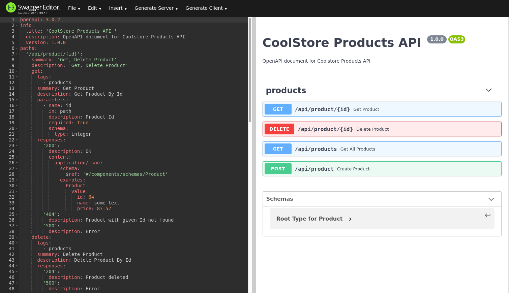

. Add a query parameter `user_key` to the parameters of the *GET /api/product* operation. Add the following lines at line 22:
+
-----
        - name: user_key
          in: query
          description: 3scale User Key
          x-data-threescale-name: user_keys
          required: true
          schema:
            type: string
-----
+
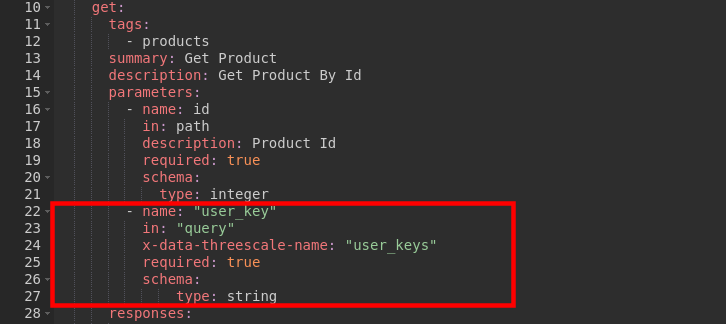
+
The above config snippet will augment the Products API documentation with an indication that a _user_key_ query parameter is required.
And, via the _x-data-threescale-name_ configuration, this field will be auto-filled with the user's actual API key when invoking this service from the API documentation in the 3scale Developer Portal.

. Repeat for the *DELETE api/product* operation, at line 58.
+
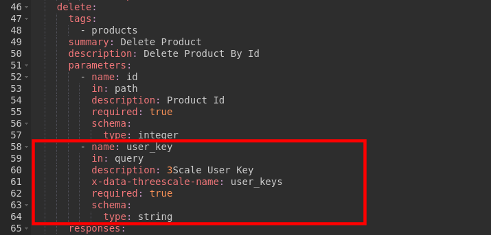

. Add the _user_key_ query parameter to the *POST /api/product* operation at line 78:
+
----
      parameters:
        - name: user_key
          in: query
          description: 3scale User Key
          x-data-threescale-name: user_keys
          required: true
          schema:
            type: string
----
+
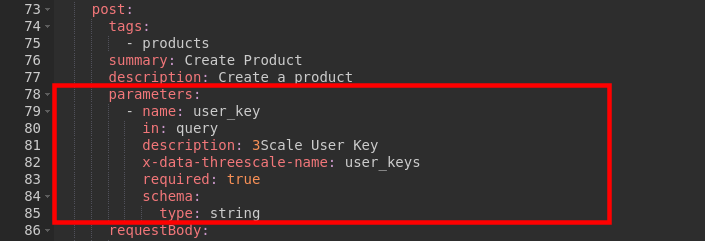

. Repeat for the *GET /api/products* operation at line 116.
+
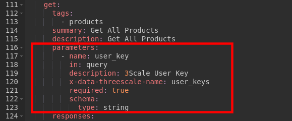

. Select *File -> Convert and save as JSON*:
+
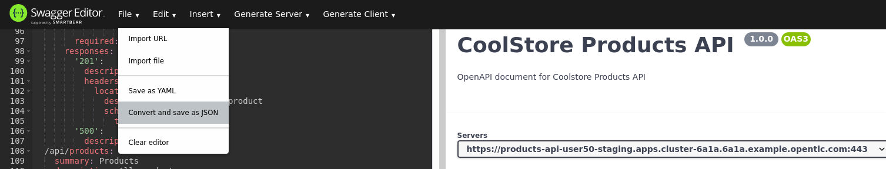

. Save the JSON file to your disk.
. Close the browser tab.

=== Create Documentation Using ActiveDocs

. Log in to your 3scale Admin Portal from the browser.
. Navigate to: *Product:Products API -> ActiveDocs*:
. Click *Create your first spec*:
+
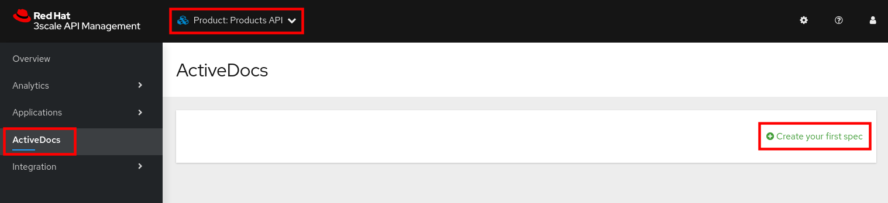

. On the *ActiveDocs: New Service Spec* page, enter the following values:
* *Name*: `Products API`
* *System Name*: `products_api_spec`
* *Publish?*: Checked
* *Description*: `Products API Documentation`
+
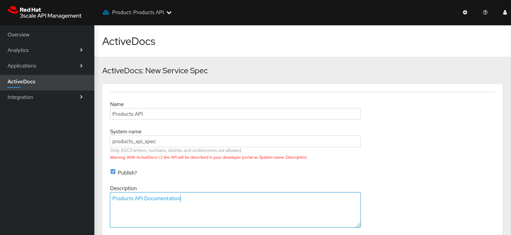

. In a text editor, open the `openapi.json` file created in the previous step.
. Copy the contents of `openapi.json` and paste it into the *API JSON Spec* window:
+
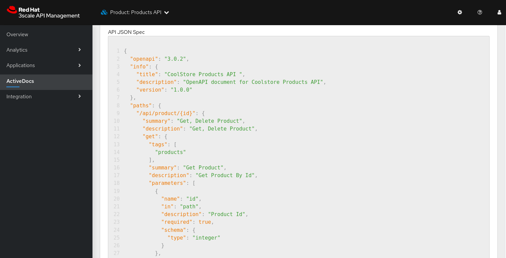

. Scroll down to the bottom of the page, leave *Skip swagger validations* unchecked and click *Create Service*. +
Expect to be redirected to the *ActiveDocs Preview Spec Page*:
+
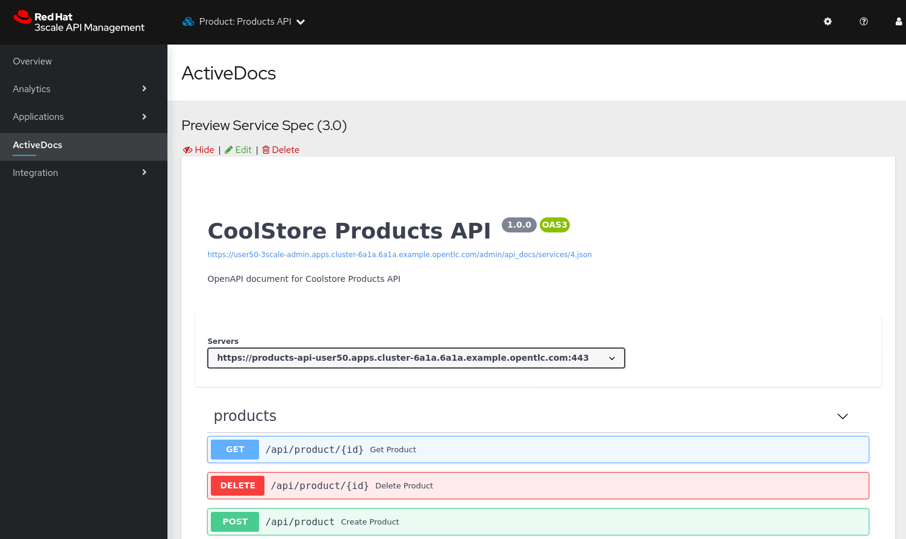
+
Note that the the URL to the Products API on the production APIcast is automatically added to the ActiveDocs document.

=== Test the ActiveDocs API and Documentation

From the *ActiveDocs Preview Spec Page* you can test the ActiveDocs documentation.

. Click *Get All Products* to expand the method.
. Click *Try it out*.
. In the *Parameters* section, populate the *user_key* value field with the _User Key_ of the *Products App* application.
. Click *Execute*
. Expect the call to return a `HTTP 200` response code:
+
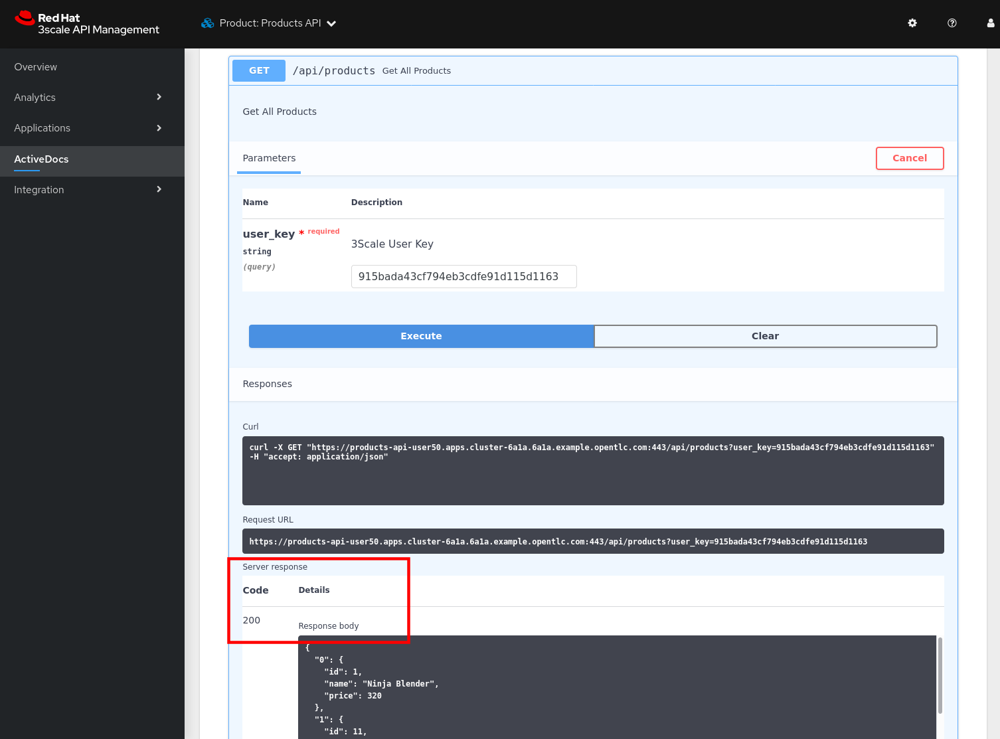

[NOTE]
====
In case you don't get a `HTTP 200` return code, but rather a an error `TypeError: NetworkError when attempting to fetch resource`, this means you have to enable CORS (Cross Origin Resource Sharing) for the Products API.

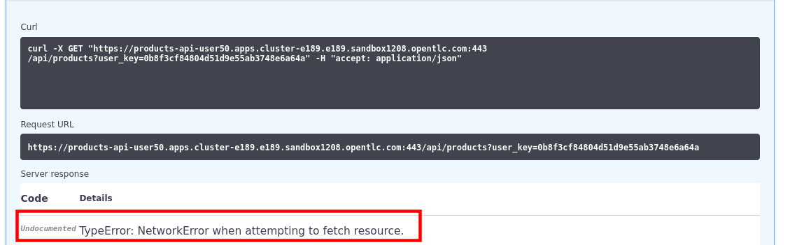

More details about CORS can be found here: https://developer.mozilla.org/en-US/docs/Web/HTTP/CORS. +
To enable CORS on the Products API:

. In the admin portal navigate to *Product: Products API -> Integration -> Policies* and click *Add Policy*.
+
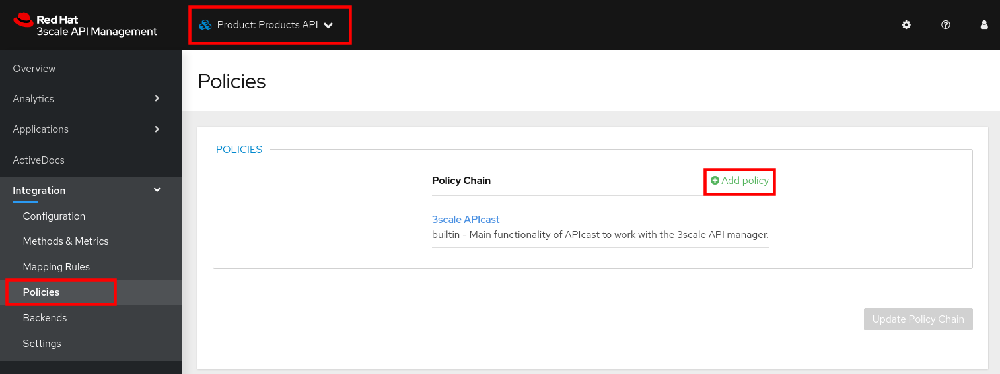
. From the list of _Policies_, select *CORS Request Handling*:
+
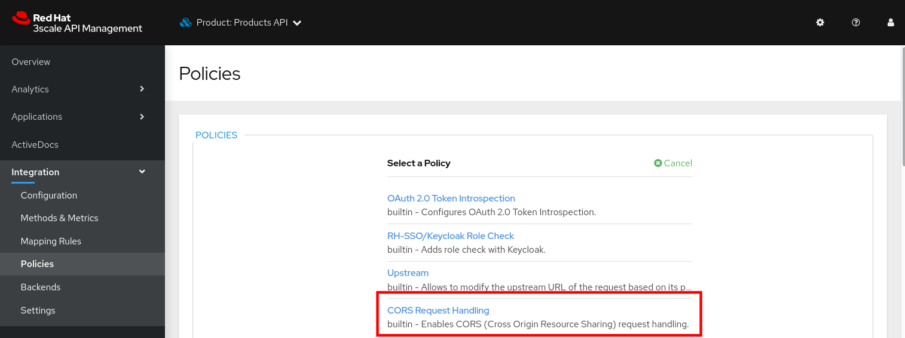
. Use the  to bring the CORS Request Handling Policy to the top of the list.
+
image::images/amp_admin_portal_api_integration_cors_policy_order.png[]
. Click on the *CORS Request Handling Policy* to configure it.
. Enable the policy and set the _Allowed Headers_ to `*`.
+
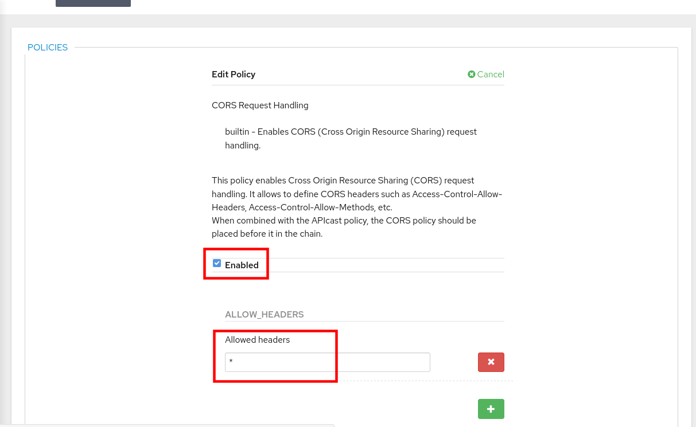
. Check *Allow credentials*.
. Use the  button under _Allow Methods_ and select the `GET`, `POST`, `PUT`, `DELETE` and `OPTIONS` methods.
+
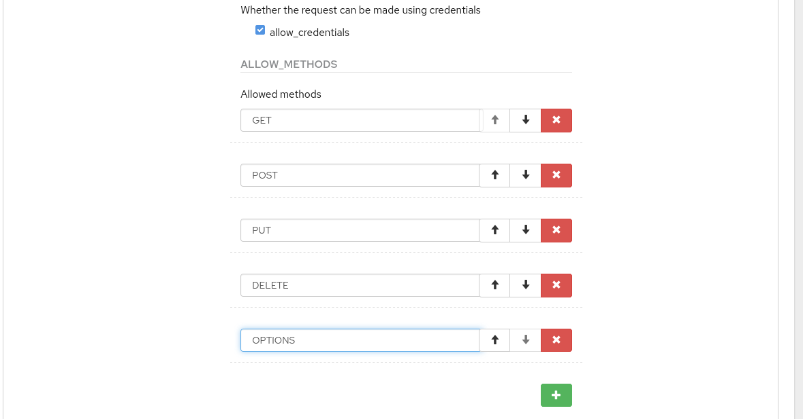
. Set *Allow_Origin* to `*`.
. Click *Update Policy*.
+
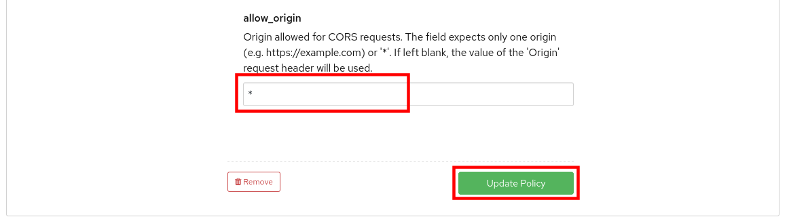
. Back on the _Policies_ page, click the blue *Update Policy Chain* button.
. Promote the new configuration to the staging and production APIcast.
. You should now be able to successfully call the Products API from the OAS 3 ActiveDoc. 
====

== Customize the Developer Portal

In this lab you customize the Developer Portal for the Products API consumers. 
The Developer Portal can be fully customized via the built-in _Content Management System_ (CMS).

=== Import Logo Files

. Open a web browser and navigate to link:https://github.com/btison/3scale_labs/tree/main/devportal[3scale_labs/devportal].
. Download these two files:
* `CoolStoreBackground.jpg`
* `CoolStoreLogo.png`

. In the Admin Portal, navigate to *Audience -> Developer Portal -> Content* .
. To import the _CoolStoreLogo.png_ file, click *New Page -> New File*:
+
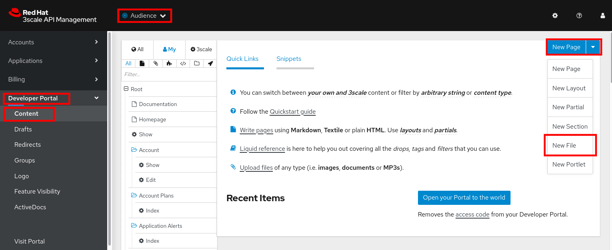
.. Enter the following:
* *Section*: `images`
* *Path*: `/images/CoolStoreLogo.png`
* *Attachment*: `CoolStoreLogo.png` from your local host
+
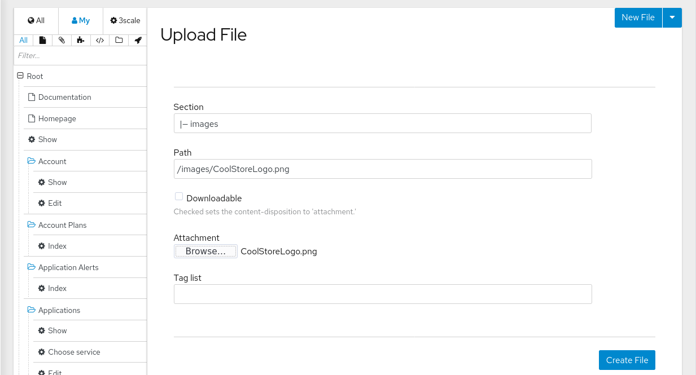
.. Click *Create File*

. To import the _CoolStoreBackground.jpg_ file, click *New File*.
.. Enter the following:
* *Section*: `images`
* *Path*:  `/images/CoolStoreBackground.jpg`
* *Attachment*: `CoolStoreBackground.jpg` from your local host
.. Click *Create File*.

=== Modify the HTML/CSS

. In the top left of the page, select 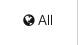.
. Click the 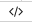 (Layouts) icon.
. Click *Main layout*:
+
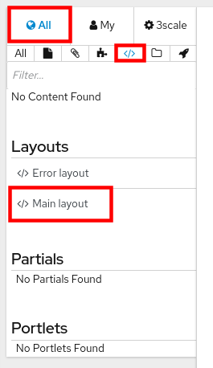
. Replace the default icon in the navigation bar with the icon you imported previously.
.. Delete line 43:
+

-----
            <a class="navbar-brand" href="/">{{  provider.name }}</a>
-----
+
.. Replace it with the following:
+

-----
            

               
            

-----
+
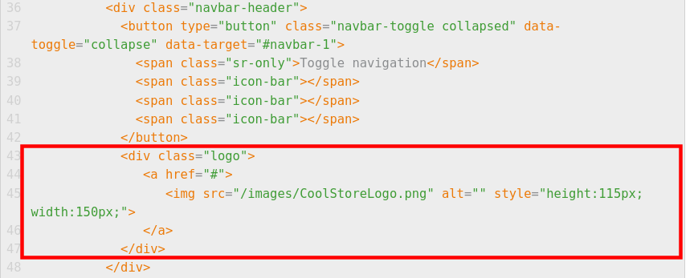

.. Scroll to the bottom of the page and click *Save*.

. Click the 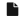 (Pages) icon, and then click *Documentation*:
+
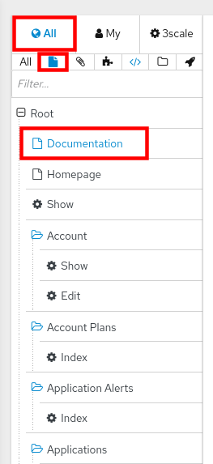

.. On line 5, replace `` with ``.
+
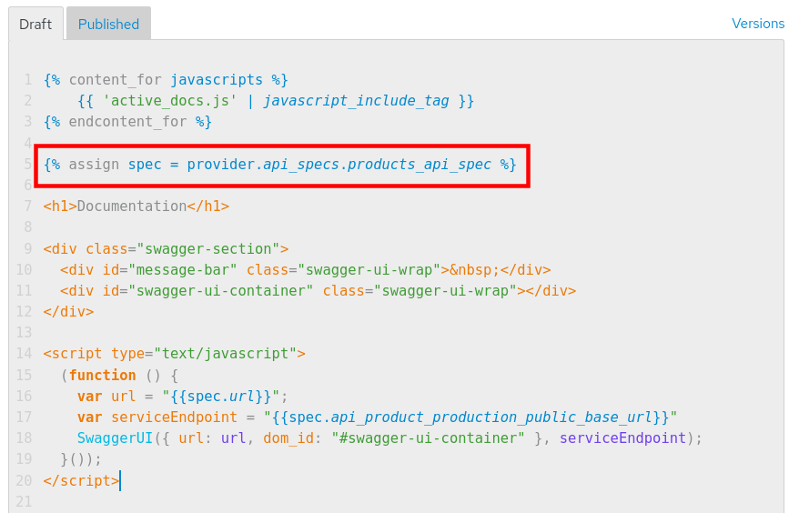
+
* `products_api_spec` corresponds to the system name of the APIDocs you defined in the previous section.
.. Click *Save*.

. Click *Homepage*:
+
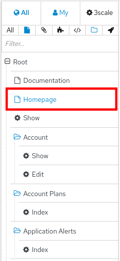

.. In the HTML editor, replace line 5 with the following:
+

-----
            <h1 style="text-shadow: 4px 4px #000000;">CoolStore API</h1>
-----
+
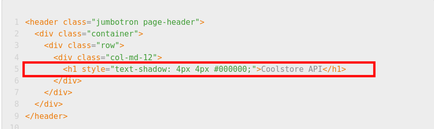
.. Perform a search and replace `Echo` (with a capital _E_) with `CoolStore` in lines 19, 98, and 112.
+
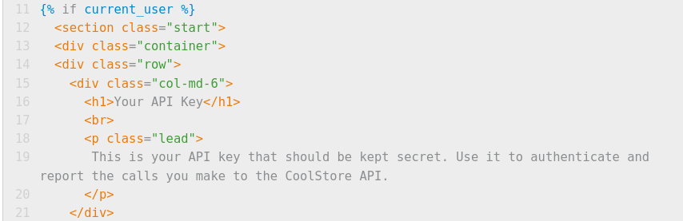
+
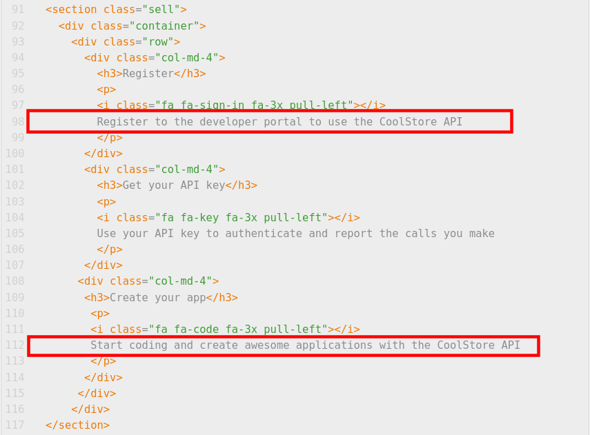

.. On line 124, replace `` with ``
+
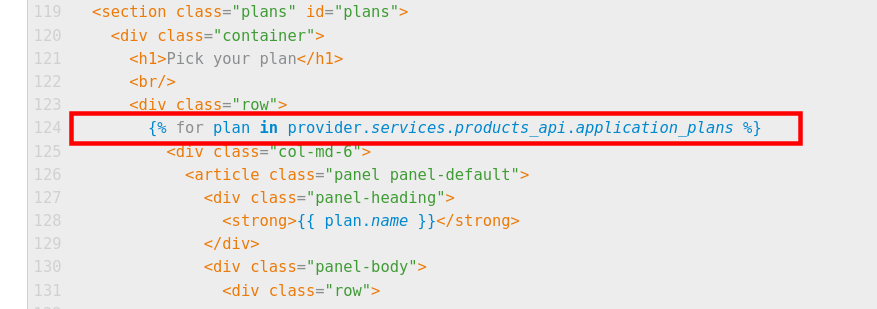
+
`products_api` corresponds to the system name of the Products API.

.. Delete the lines 185 to 230 - corresponding to the `<section class="invert>` block.

.. Click *Save*.

. Under the *css* folder, click *default.css*:
+
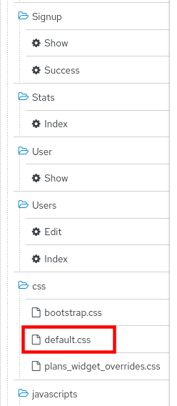

.. Replace line 22 with the following:
+
-----
    background-image: url('/images/CoolStoreBackground.jpg');
-----
+
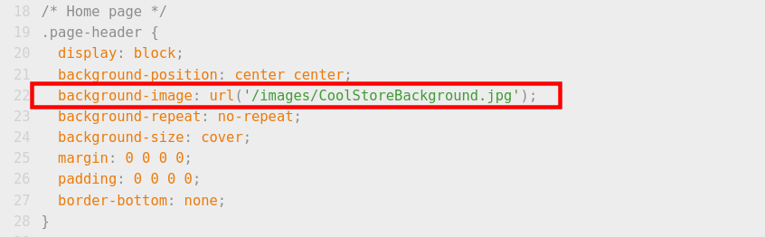

=== Test the Changes

. Click *Audience -> Developer Portal -> Visit Portal*:

. The Developer Portal opens in a new tab on your browser:
+
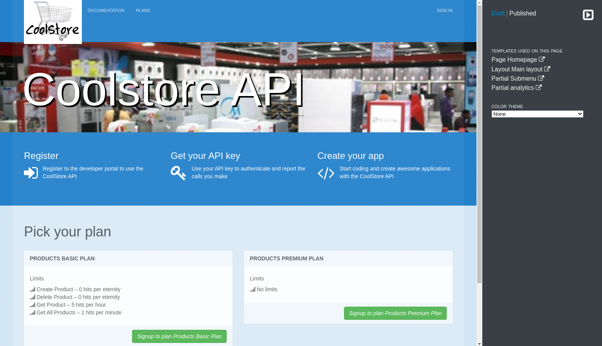

. The *CMS Toolbar* on the right of the Developer Portal Preview page allows to switch between the Draft and the Published versions of the Developer Portal.
+
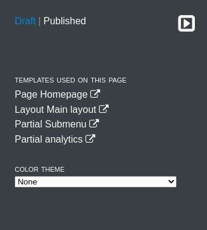
+
Notice that you did not publish your changes yet, so they only appear when selecting *Draft*.

=== Publish the Changes

Go back to the browser tab of the Admin Portal.  

. Navigate to *Audience -> Developer Portal -> Drafts* and then click *Publish All*:
+
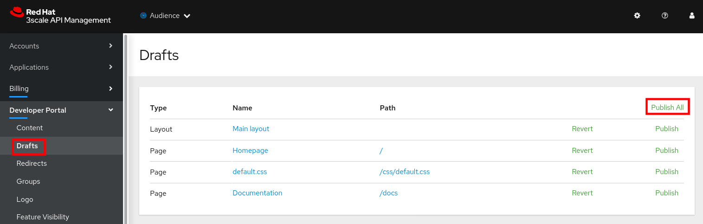

. When prompted to confirm the changes, click *OK*.

. Go the the browser tab with the Developer Portal Preview, and select *Published*. Notice that your changes are now published to the Developer Portal.

. At this point you can close the *CMS Toolbar* by clicking the  icon.
 
. Click *SIGN IN* at the top right, and log in as `test-dev` with the password you provided in the previous lab.

. The Developer Portal homepage now shows the API Key for the `Products App` application of the `TestAccount` account.
+
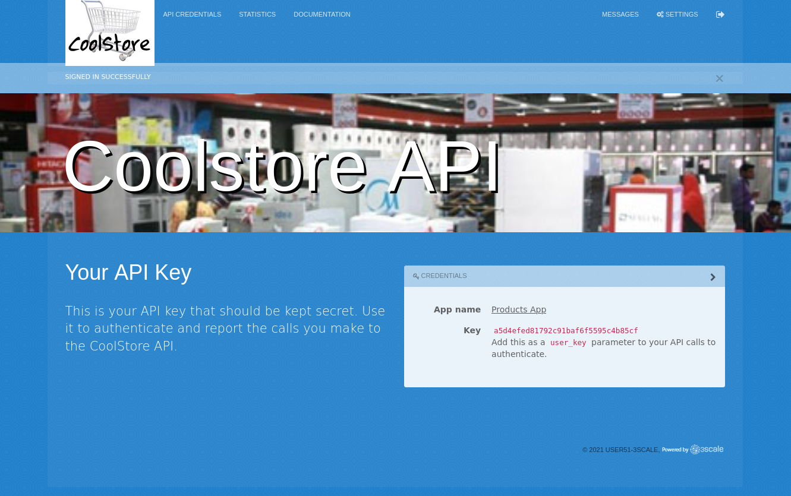
+
This part of the homepage corresponds to lines 11-89 in the homepage HTML source:
+
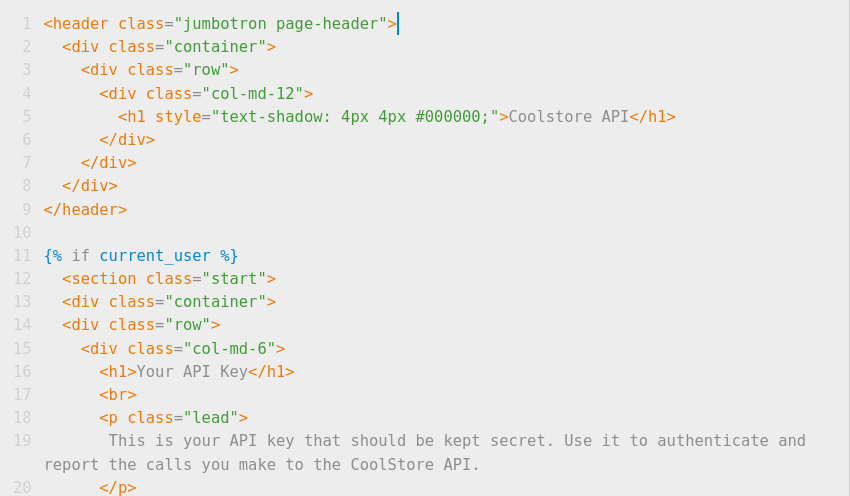

. On the homepage, explore the *API CREDENTIALS* and *STATISTICS* sections.
+
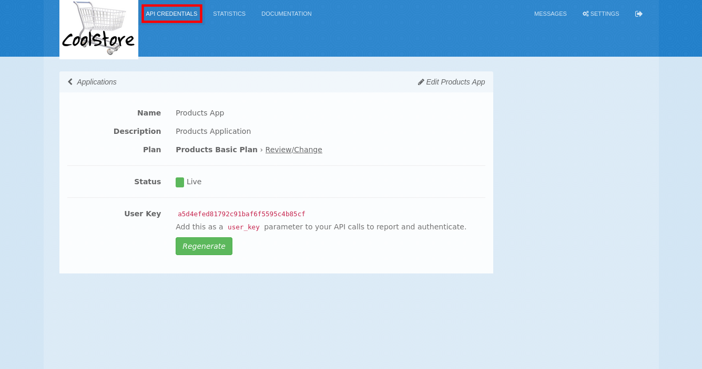
+
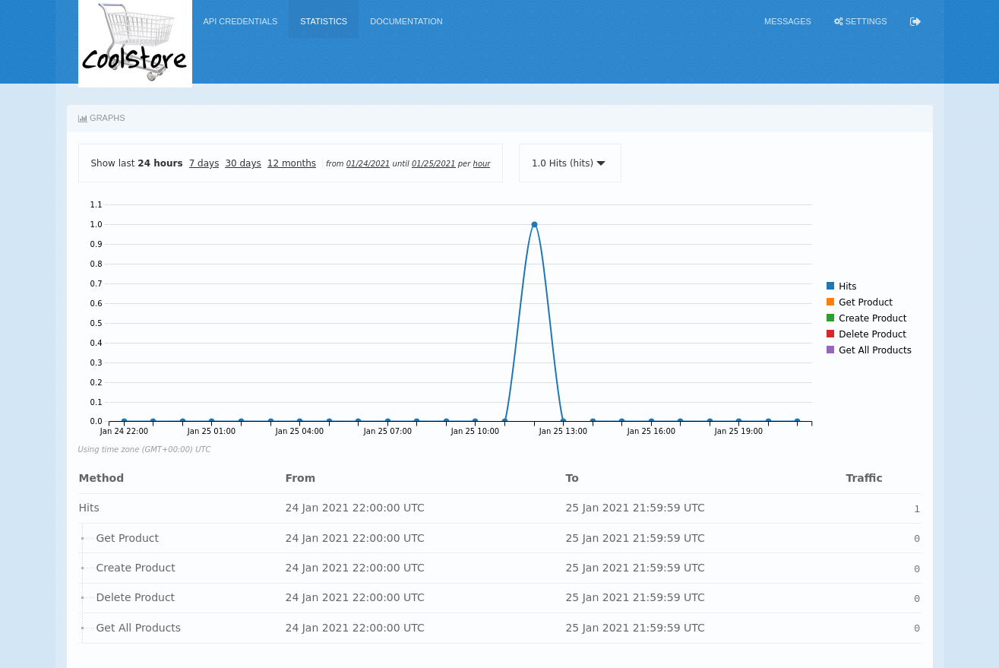
+
These pages are built-in pages from the Developer Portal. +
The *API CREDENTIALS* page corresponds to the `Applications/Show` page in the Developer Portal CMS:
+
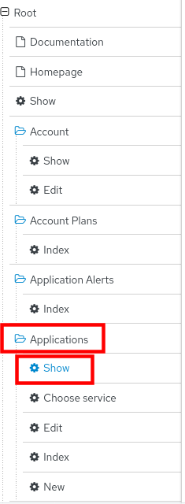

. Click *DOCUMENTATION*. Note that the ActiveDocs documentation created earlier is shown.
* You can test the API requests from this page:
+
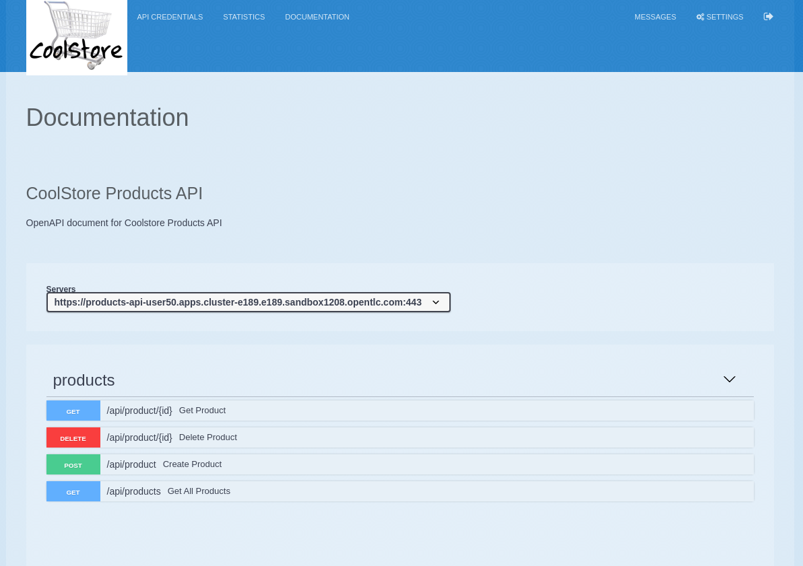

== Additional Role Based Access Control

=== Premium App Plan with fully exposed Products API

In a previous lab, you defined a _Products Basic Plan_ application plan where both the _Create Product_ and _Delete Product_ methods are disabled.
Afterwards, an _application_ from this _Products Basic Plan_ app plan was set up for the `TestAccount` account.

Subsequently, you could expect a request for either of these methods to result in a *HTTP 429: Too Many Requests* error.

You also defined a _Products Premium Plan_ application plan, without limitations on the frequency of calls or API methods.

In this section of the lab, you will create an admin account and user which will have full access to all methods of the Products API.

. Create a new user `test-admin` as part of the `TestAdminAccount` group
. Create an application using the `Products Premium Plan` application plan. Delete the default applications created for the new account and user.
+
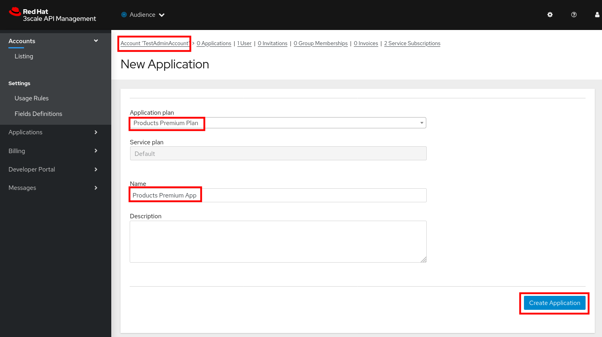

. Using `curl`, test the `Create Account` and `Delete Account` API Requests using the *user key* generated for this new account and application.

.. For instance to test the _Create Product_ operation:
+

-----
$ curl -v -X POST --header "Content-Type: application/json" --header "Accept: application/json" -d '{"name": "Samsung LED TV", "price": 499.95}' "https://products-api-${OCP_USER}-staging.${OCP_WILDCARD_DOMAIN}:443/api/product?user_key=${PRODUCTS_API_TEST_ADMIN_USER_KEY}"
-----
+
Expect a response code `HTTP/1.1 201 Created`, with an empty response body.

.. For the `Delete Product` operation:
+
-----
$ curl -v -X DELETE "https://products-api-${OCP_USER}-staging.${OCP_WILDCARD_DOMAIN}:443/api/product/15?user_key=${PRODUCTS_API_TEST_ADMIN_USER_KEY}"
-----
+
Expect a response code `HTTP/1.1 204 No Content`, with an empty response body.

Alternatively, you can test the POST and DELETE operations from the Documentation in the Developer Portal. Make sure you are logged in as user `test-admin`

=== Augment Dev Portal with Admin Section and Group

In this section you create a private section of the developer portal for access by users of the `Admin` group.

. Log in to the 3scale Admin Portal.
. Navigate to the _Content_ section of the Content Management System and then click *New Section*:
+
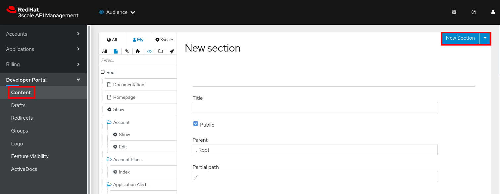

.. In the *New Section* form, provide the following information:
* *Title*: `Admin`
* *Parent*: `Root`
* *Partial Path*: `/admin`

.. Verify that *public* is unchecked, and click *Create Section*.
* Your new section appears in the main menu:
+
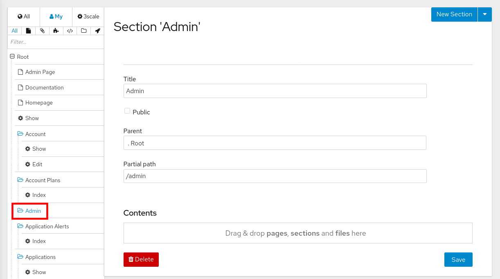

. Select *New Page* to create a new page for your section.

.. In the *New Page* form, enter the following values:
* *Title*: `Admin Page`
* *Section*: `Admin`
* *Path*: `/admin/welcome`
* *Advanced Options -> Liquid enabled*: Checked
+
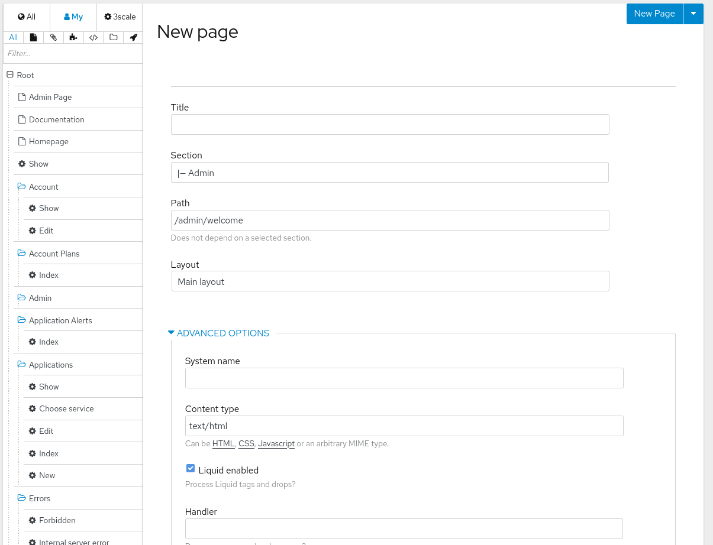
* Enter the following in the editor:
+
-----
<h2>Administration Portal</h2>

Hello <B>{{ current_user.username }}</B>, you are an Admin user of  <B>Account organization {{ current_account.name }}</B>.

Welcome to the Administration Section of the portal.
-----
+
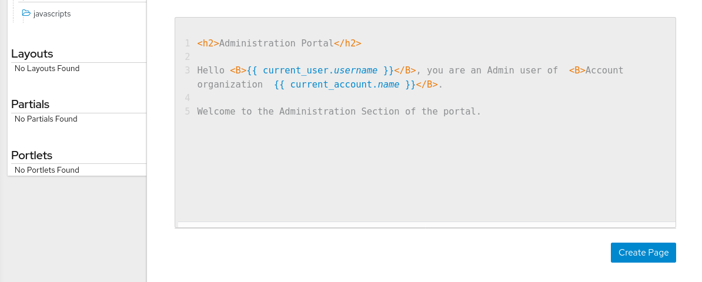

.. Click *Create Page*.
* You see the *Admin* page in the *Admin* section on the menu:
+
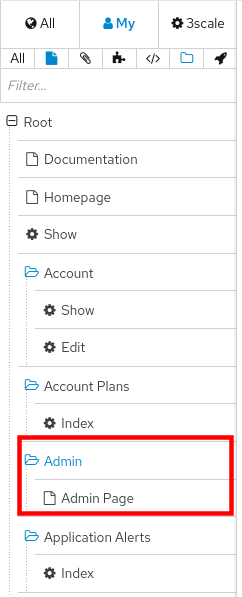

. Scroll down to the *Partials* section of the menu, and click *submenu*:
+
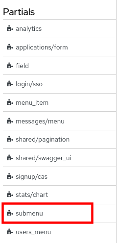

.. Add the following on line 38, after the `Documentation` item.
+

-----
        
        
          
          
            <li class="active">
              <a href="/admin/welcome">Admin</a>
            </li>
                 
        
-----
+
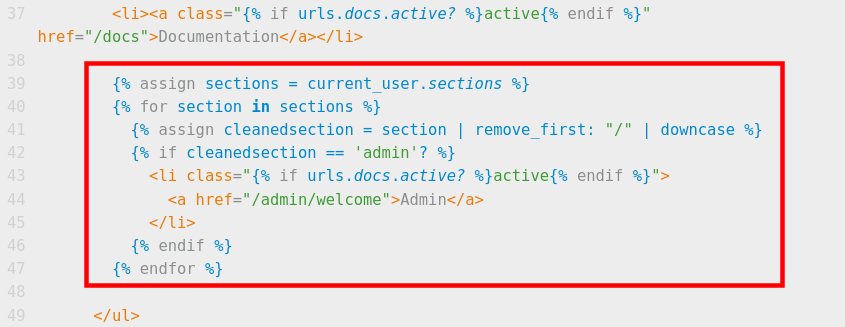
+
The code fragment loops through the sections to which the current logged in user has access to (through the definition and assignment of groups), and displays the _Admin_ menu item if the user has access to the section `admin`.  

.. Click *Save*.
. Navigate to *Drafts* and then click *Publish All*:
+
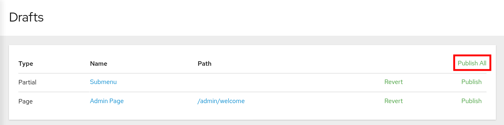
+
* All your changes are published and can be tested from the Developer Portal.

. Navigate to *Audience -> Developer Portal -> Groups*, and then click *Create Group*:

.. Enter the following values:
* *Name*: `Admin`
* *Allowed Sections*: `Admin`
.. Click *Create Group*.
. Navigate to the *Audience -> Accounts* section, and click the *TestAdminAccount* account.
+
TIP: This is the account you created in the previous section to use the *ProductsPremiumPlan*.

.. Click *O Group Memberships*:
+
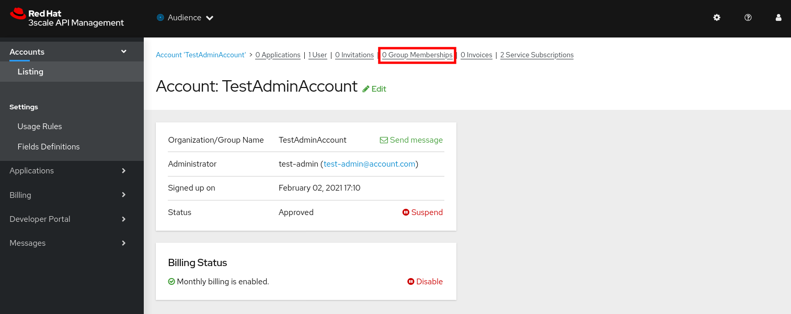

.. Select the *Admin* group in the *Groups* list, and click *Save*:
+
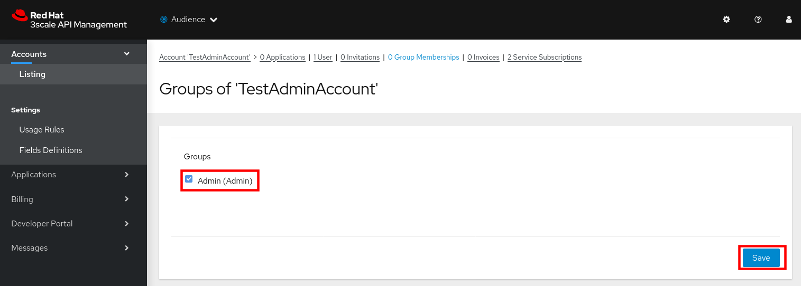

* The configuration for the Admin section and groups is complete and can be tested.

=== Test the Admin Group Section

. Open the Developer Portal and click *Sign In* (sign out first if you are still signed in as `test-dev` user).
. Log in as user `test-admin` with the password you provided earlier:

. Observe that the *ADMIN* link appears on the top menu.
+
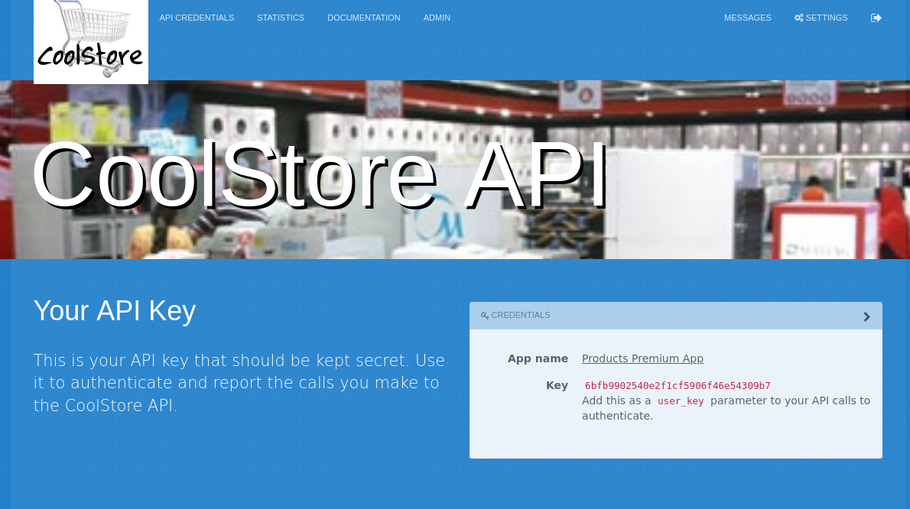

. Click *ADMIN* and observe that the Administration Portal page appears:
+
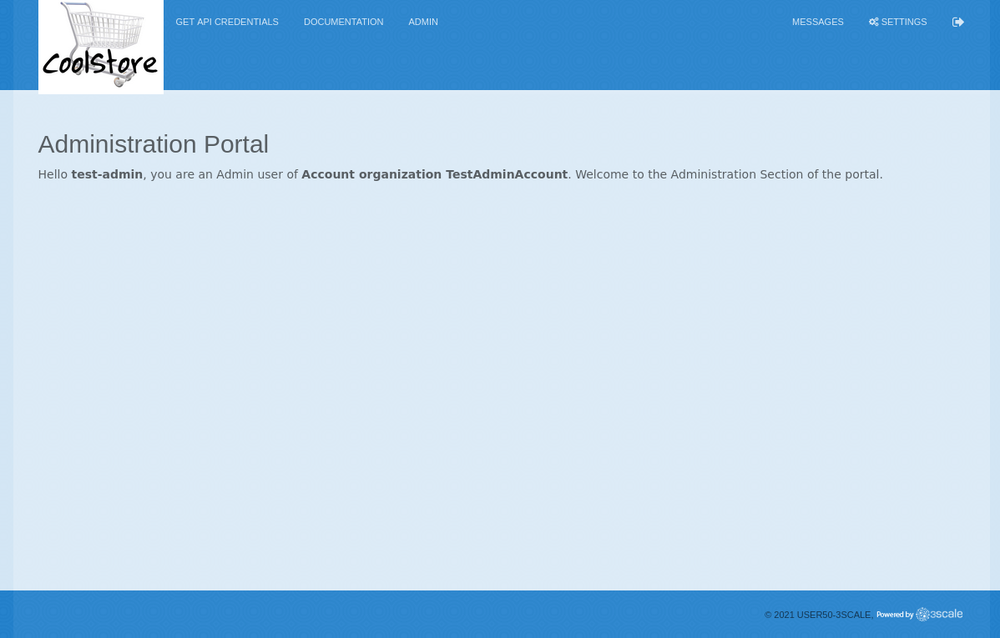

. Click the image:images/dev_portal_logout.png[] (Log Out) icon to log out of the portal.

. Log in as user `test-dev` with the appropriate password.
* Observe that because this user is a basic user, the *ADMIN* link is not available:
+
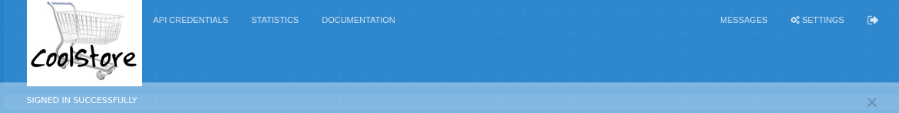

* If the `test-dev` user tries to access the `/admin/welcome` link directly, an error message results:
+
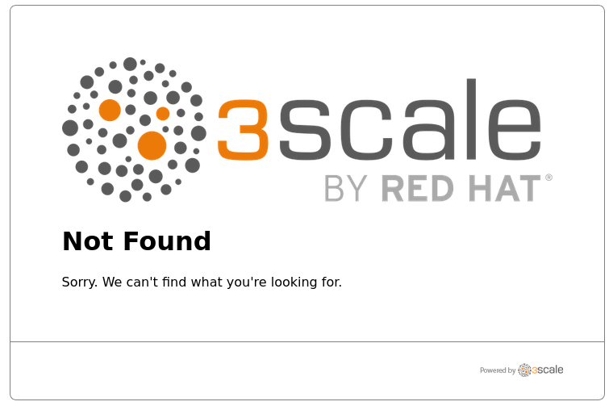

Groups and private sections can be used to control access to certain sections of the Developer Portal, or to ensure that different sections or layouts could be accessed depending on the user's role.
