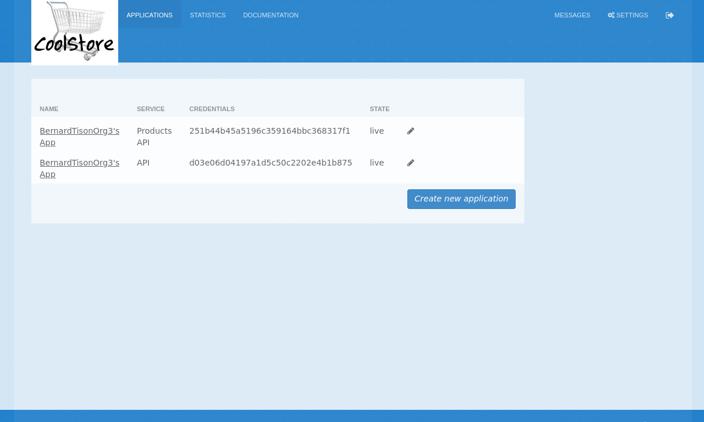
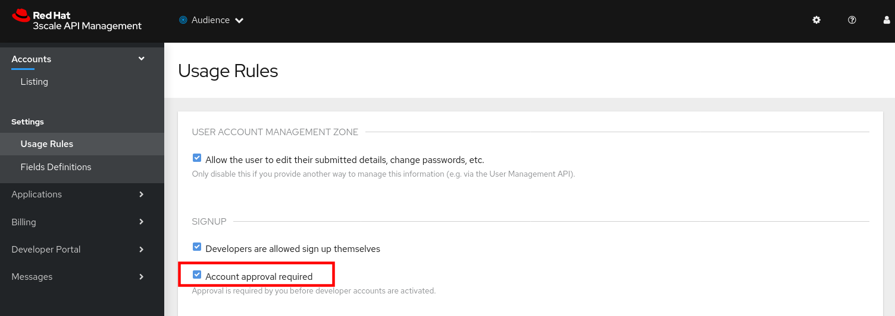
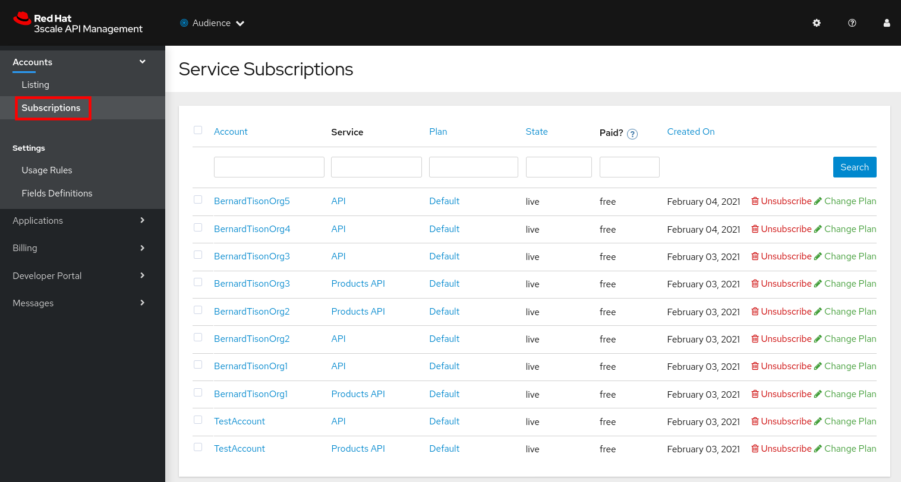

:noaudio:
:scrollbar:
:toc2:
:linkattrs:
:data-uri:

== Developer Portal Custom Signup Flows Lab

In this lab, you create custom signup flows to manage various signup approaches for the API consumers of your Red Hat 3scale-managed APIs.
Several signup flows are covered in this lab, including _single application signups_, _multiple application signups_, _custom field flow_ and _group membership_ flows.

.Prerequisites
The instructions in the lab assume that you finished the previous labs on configuring and registering an API on 3scale and customization of the Developer Portal.

:numbered:

== Introduction

=== Design Considerations

The blog article from Kevin Price on link:https://developers.redhat.com/blog/2017/12/18/3scale-developer-portal-signup-flows/["3scale Developer Portal signup flows"] gives an excellent overview of the subject.

In this lab, you follow the four examples discussed in the blog article and adapt them to the services and APIs managed here.

The signup flow that you, as an API provider, select and implement in your production environment to onboard API consumers is a function of several considerations, including the following:

* Should any of your API services be made available to non-registered API consumers ?
* Should default _applications_ be created for each service API upon account creation ?
* Should API consumers be prevented from sign-up to more than one application ?
* Should the API provider manually activate all accounts created by API consumers ?
* Are API services available to all API consumers or should they be made available via a group?

=== SMTP Considerations

Email plays an important role in the onboarding of API consumers. As an example, when new developers sign up, they have to activate their account by replying to an activation email. Email is also used for notifications to admin users to inform them of developer and other activities  happening in the platform.

For these purposes, 3scale should be configured with an external SMTP provider.

In this course, the 3scale API Management platform is not configured to use SMTP. Every student would have to be able to provide several unique and genuine email addresses to complete the different labs of the course, which in practice is quite problematic.

This means that when new API consumers are created as part of the labs, the new accounts need to be explicitly activated by an admin user in the 3scale Admin Portal. 

=== API Consumer Signup initiated by Administrators

All of the examples of API consumer signup in this course until now have involved creation of a _developer account_ by the tenant administrator.
This approach to API consumer onboarding is fine for demo purposes but most likely is not scalable in a real-world production environment.

The follow-on sections in this lab focus on API Consumer sign-up flows initiated by the API Consumer.

=== Automatic Signup via Account Creation

The existence of a _default_ application plan for an API service will influence the behavior of API consumer sign-up flows.

For example, the out of the box API product (called _API_) that comes pre-provisioned with the creation of a new tenant includes two Application Plans.
One of the Application Plans (called _Basic_ ) is designated as the  _Default Application Plan_ for the API product.

Subsequently, upon creation of a new API Consumer  _account_, a new _application_ (derived from the _Basic_ application plan and the new account) is created.

From the perspective of the API Consumer, this behavior could support the most basic type of signup to your Developer Portal:

. API Consumer navigates to the Developer Portal of your tenant.
. API Consumer creates an account.
.. An _application_ derived from that API Consumer's account and the _default application plan_ of each API product is automatically created.
.. Using the details of this new _application_, the API Consumer can send requests to corresponding backend business services via the API Gateway.

The remainder of the exercises in this lab assume API services that do not define a _default_ application plan.

Navigate to the _Application Plans_ section of each of your APIs to verify that a default application plan is not defined. If a default application plan is defined, please remove it.

Because your API services do not specify a default Application Plan, an _application_ that an API Consumer can get started with will not be created by simply creating a new account.
Instead, the signup flow via the Developer Portal involves requiring the API Consumer to select specific applications plans.

== Save Original Signup Flow as a _Partial_

=== Overview

The out-of-the-box Homepage in the 3scale Content Management System (CMS), which gets rendered to API consumers in the Developer Portal, has a very simple signup flow embedded in it.

In this section of the lab, you extract that embedded signup flow and save it as a _partial_.
You then reference that new partial in your homepage.

Because you are simply moving the original signup flow logic from the Homepage to a referenced partial, you can expect to see no changes to the look and feel of your Developer Portal.

In subsequent sections of this lab, you implement more sophisticated signup flows that are also implemented as partials.
All of your signup flows can easily be swapped in and out of the Developer Portal Homepage simply by changing the reference to the desired partial.
You can then compare and contrast their features and behaviors.

=== Create Partial

. From the Admin Portal, navigate to *Audience -> Developer Portal*. This expands options related to the CMS.
. In the left-hand panel, click *Visit Portal*. +
Make note of the look and feel of the Developer Portal.
+

. In the left-hand panel, click *Content*.
. In the CMS, Open the *Homepage*.
. In the text editor, cut lines 119 through 182 (NOTE: do not delete) and save the change.
. From the *New Page* list at the top right, select *New Partial*:
+

. Enter `original_app_signup_form` as the *System name*.
. Paste the contents you previously cut from the *Homepage* into the text box and click *Create Partial*.
. Return to the *Homepage* text editor and enter the following at line 119:
+
-----
    
-----
+

. Save the changes.

. Publish both changes by clicking *Drafts* in the left-hand panel, then *Publish All*:
+

. Click *Visit Portal* again and make sure nothing has changed.

=== Test Signup

. In a browser window, navigate to the Developer Portal. From the Admin Portal you can use the *Visit Portal* link, or you can go directly to `https://${OCP_USER}-3scale.${OCP_WILDCARD_DOMAIN}`.
. Make sure you are logged out. If needed click the  icon.
. Sign up for one of the plans of the Products API.
. In the _Sign Up_ page enter the *Organization Name*, *UserName*, *Email* and *Password*. The email should be a unique and valid, but not necessarily working, email address. +
Click *Sign up*. +
You are redirected to a page stating you will need to confirm your email address.
+

. In the 3scale Admin Portal, navigate to *Audience -> Accounts -> Listing*.
. Notice the account that was created as result of signing up in the Developer Portal. The status of the account is *Created*.
+

. Navigate to *Audience -> Applications -> Listing*. 
. Notice that an application has been created for the new account and which uses the application plan selected when signing up.
. Go back to the Developer Portal and try to login with the username or email address of the user you signed up with.
. Expect to see an error message stating that the account isn't active yet or hasn't been approved yet.
+

. Go back to the Admin Portal, navigate to *Audience -> Accounts -> Listing*, and click on the *Activate* link to activate the account.
+

+
Notice that the account status becomes *Approved*.
.  Go back to the Developer Portal and try to login with the username or email address of the activated user. You should be able to sign in successfully.
+

== Single Application Signup Flow

=== Overview

This is the simplest signup flow that requires the API Consumer to select from application plans.

It allows a subscription to a single service and application plan upon account creation.

This signup flow is actually very similar to the original signup flow you saved as a partial in the previous section of this lab.

The only differences between this signup flow and the original are:

* The original partial is hard-coded to render the details of the _Products_ API.
* The `single-app` signup flow used in this section iterates through the application plans of all of the services from the provider account.
The API consumer is allowed to sign up for one of the many application plans displayed.

You do not need to enable any special features in the Developer Portal to use this flow.

=== Create Single Application Signup Flow

. The code for the signup flow can be found at https://raw.githubusercontent.com/btison/3scale_labs/main/devportal/signup/single_app_signup_form.html.liquid
. Examine the code for the signup flow:
* Service/Application filter:
+
----
            
      		<h2> {{ service.name }} </h2>
      		

            
----
+
** The above liquid filter iterates through the list of all services for the provider, and then further iterates through all of the application plans.
Thus, this filter allows you to display a list of all services along with the _service plans_.

* Plan features/limits:
+
----
    

        <article class="panel panel-default">
            

                <strong>{{ plan.name }}</strong>
            

            

                

                    
                    

                        <h5>Features</h5>
                        <ul class="features list-unstyled">
                            
                            <li>
                                <i class="fa fa-check"></i> {{ feature.name }}
                            </li>
                            
                        </ul>
                    

                    
                    

                        <h5>Limits</h5>
                        <ul class="limits list-unstyled">
                             
                            <li>
                                <i class="fa fa-signal"></i> {{ limit.metric.name }} &ndash; {{ limit.value }} {{ limit.metric.unit }}s per {{ limit.period }}
                            </li>
                             
                            <li>
                                <i class="fa fa-signal"></i> No limits
                            </li>
                            
                        </ul>
                    

                

            

----
** This code displays the plan name and the features and limits that are set up for the plan.

* Signup link:
+
----
                   <a class="btn btn-cta-secondary pull-right" href="{{ urls.signup }}?{{ plan | to_param }}&{{ service.service_plans.first | to_param }}">Signup to plan {{ plan.name }}</a>

----
** This section shows the link that redirects to the signup form for the chosen plan and service.

. Add this partial to the Developer Portal:
.. From the *New Page* list at the top right, select *New Partial*.
.. Enter `single_app_signup_form` as the *System name*.
.. Copy and paste the contents of the https://raw.githubusercontent.com/btison/3scale_labs/main/devportal/signup/single_app_signup_form.html.liquid into the text editor.
.. Click *Create Partial*.
.. Confirm that the partial shows up in the *Partials* list:
+

. Edit the Homepage:
.. Near line 119, replace `original_app_signup_form` with `single_app_signup_form`:
+
----
    
----

. Save the file.
. Publish both changes by clicking Drafts in the left-hand panel, then Publish All:
+

=== Test
. Navigate to the *Developer Portal* and make sure you are currently logged out.
. Verify that the home page now displays all of the API services and application plans that you created in the previous labs:
+

. Sign up by clicking the signup link for one of the application plans.

* Note that you are only allowed to select the link for one application plan at a time.

. Complete the form with details about a new user, including a valid email address

. In the Admin Portal, navigate to *Audience -> Accounts* and verify that the account and user were created.
. Navigate to *Audience -> Applications -> Listing* and verify that an application has been created for the new account and which uses the plan chosen when signing up.
+

. At this point you can activate the account, and sign in to the Developer Portal using the username or email.

== Multiple Application Signup Flow

=== Overview

The multiple application signup flow allows users to sign up for multiple services (and their associated application plans) at the same time.
It does so by providing a partial that renders a multiple-selection check-box HTML form in the Developer Portal.

In addition, the *Multiple Applications* feature needs to be enabled in the Developer Portal.

=== Create Multiple Application Signup Flow

. Log in to the Admin Portal and navigate to *Developer Portal*.
. Click *Feature Visibility*.
. Confirm that the *Multiple Services* and *Multiple Applications* features are marked *Visible*:
+

. The code for the signup flow can be found at https://raw.githubusercontent.com/btison/3scale_labs/main/devportal/signup/multiple_app_signup_form.html.liquid. +
Examine the code for the signup.
* Note that the form is very similar to the `single_app_signup_form.html.liquid` form.
. Observe the following key points:
* The signup form:
+
----
<form action="{{ urls.signup }}" method="get">
----

* The check box input:
+
----
<input type="checkbox" name="plan_ids[]" value="{{ plan.id }}">Signup to {{ plan.name }}</input>
<input type="hidden" name="plan_ids[]" value="{{ service.service_plans.first.id }}"></input>

----

* A "Submit" button that directs to the signup form:
+
----
    <button type="submit" class="btn btn-cta-primary">Signup</a>
----
. Upload the partial to the Developer Portal:
.. Enter `multi_app_signup_form` as the *System name*.
.. Copy and paste the contents of https://raw.githubusercontent.com/btison/3scale_labs/main/devportal/signup/multiple_app_signup_form.html.liquid into the text editor and click *Create Partial*.
. Make sure that the partial shows up in the menu.
. Edit the *Homepage* and change the `include` section to use `multi_app_signup_form` instead of `single_app_signup_form`.
. Save and publish the changes.

=== Test
. Navigate to the *Developer Portal* and make sure you are currently logged out.
. Confirm that the homepage now has the multiple signup form, with a check box for each application plan:
+

. Attempt to sign up for two different applications, such as *Products Basic Plan* and *Unlimited*.
. Complete the form with details about a new user, including a valid email address.

. In the Admin Portal, navigate to *Audience -> Accounts* and verify that the account and user were created.
. Navigate to *Audience -> Applications -> Listing* and verify that two applications have been created for the new account.
+

. Activate the new account.
. Go back to the Developer Portal and log in as the new user.
* Note that you can see all of the registered applications and the keys that were created for those applications:
+

+

== Custom Field Flow

=== Overview

In this section of the lab, you will make use of the following 3scale capabilities:

. *Custom _fields_ on API consumer accounts*
+
This flow uses a custom field on the API consumer account to control which services those API consumers can see and subscribe to.
+
A typical use case is one in which there are multiple application plans, each with different access--for example, one plan for internal developers and another for external developers.

. *API consumer account approval*
+
The custom field that you define on an API consumer account can be combined with signup flows that make use of the _Account Approval_ feature that an administrator uses to view and approve a user for a particular service.

. *Custom _features_ on application plans*
+
Custom _features_ on application plans correspond to the custom _fields_ on API consumer accounts and assist in the filtering of application plans visible in the Developer Portal during sign-up.

. *Allow consumers to select an application plan after account sign-up*

==== APIs
In this use case, you utilize the Echo API (with product name _API_). The Echo API has two application plans.

* *Unlimited* +
In this scenario, you make this _internal_ and available only to API consumers who are signed up as internal users.

* *Basic* +
In this scenario, you make this endpoint available to API consumers who are signed up as _public_ users.
+
You further restrict public users by requiring application approval by an administrator before they can access the API.

=== Set Up Custom Field on Accounts

You start by defining the custom field on the API consumer's Accounts object.

. Open the Admin Portal and navigate to *Audience -> Accounts -> Settings -> Fields Definitions*.
. Click *Create* to the right of *Account*:
+

. Enter the following values:
* *Name*: `access`
* *Label*: `access`
* Leave the *Required*, *Hidden*, and *Read only* boxes unchecked.
* *Choices*: `internal, public`
+

+
[NOTE]
====
You can make the field a *Required* field so that any user signup flow contains this field.
Another use case is to make it a *Hidden* field with simple JavaScript code providing this value--for example, based on the user's email address.
You can also make this field a *Read Only* field that only an API provider tenant administrator can change.

In this scenario, you leave all of these options unchecked so that upon signup, the user can see this field and optionally decide whether to gain access to the internal or public API.
====
. Click *Create* and verify that the field is successfully added to the Account object:
+

=== Enable Account Approval
It is possible to require that an API provider approves and activates all accounts initiated by API consumers.
In this section, you enable this feature.

. In the Admin Portal, as an API provider, navigate to *Audience -> Accounts -> Settings -> Usage Rules*.
. In the *Signup* section, check the *Account approval required* box.
+

. Click *Update Settings*.

This feature is used in both this custom signup flow and the group membership signup flow introduced later in this lab.

=== Modify APIs and Application Plans

In this section, you define a custom feature for the Echo API service.

The values (`internal` and `public`) of this feature correspond to the values of the field you previously defined for all API consumer accounts.

==== Modify Echo API

. Navigate to *Product:API -> Applications -> Usage Rules* and check the *Developers can select a plan when creating a new application* box:
+

. Click *Update Product*.

. Navigate to the *Basic* application plan of the Echo API.
. Go to *Products -> API -> Applications -> Application Plans*
. Click on plan *Basic* and in the page loaded, scroll down to see the features list.
. Create a new *Feature* with the following values:
* *Name*: `internal`
* *System name*: `internal`
* *Description*: `This Plan is intended for internal users.`
+

. Click *Save*.
. Create another Feature with the following values:
* *Name*: `public`
* *System name*: `public`
* *Description*: `This Plan is intended for public users.`

. Click the  in the *Enabled?* column of the `public` feature to enable it. The `internal` feature should remain disabled.
+

. Open the *Unlimited* application plan. Notice that the new features are added automatically. Enable the `internal` feature, and leave the `public` feature disabled.

=== Make Developer Portal Changes

In this section, you specify two partials in the Homepage.

The first new partial (called: _unauthenticated_noplan_signup_form_) renders in the Developer Portal for unauthenticated users.
The second new partial (called: _custom_field_signup_form_)  renders in the Developer Portal only after the API consumer has registered a new account and authenticated in.

. Add the `unauthenticated_noplan_signup_form` partial using the contents of https://raw.githubusercontent.com/btison/3scale_labs/main/devportal/signup/unauthenticated_noplan_signup_form.html.liquid.
.. In the *Homepage*, modify the `include` statement near line 121, between a </section> tag and an :
+
----
  </section>

  


----

* This partial is rendered for unauthenticated users.
Note that it simply provides a link to the registration page.

. Add the `custom_field_signup_form` partial using the contents of https://raw.githubusercontent.com/btison/3scale_labs/main/devportal/signup/custom_field_plans.html.liquid.
.. In the *Homepage*, add the following after line 87 and before the `` line:
+
----

----
+

* This partial is rendered for authenticated API consumers.
Note that it contains logic to iterate through the list of services and application plans and then offers the API consumer the ability to register for only those plans available per the custom account field.

. Save and publish all of the changes.

=== Test Custom Field Flow for Public Access

. Navigate to the *Developer Portal* and make sure you are currently logged out.
. Click the link provided by `unauthenticated_noplan_signup_form`:
+

. Complete the form with details about a new user, including a valid email address.
. For *ACCESS*, select `public`.
. Click *Sign up*:
+

. In the Admin Portal, navigate to *Audience -> Accounts* and verify that the account and user were created:
+

. Activate the user by clicking the *Activate* link on the _Accounts_ page.
. Notice that the account status becomes *Pending*, and that the account still needs to be approved. +
Click the *Approve* link to approve the account
+

+
Account activation is required because you (as an admin of your tenant) previously checked the box `Account approval required`.

. Log in to the Developer Portal as the new user and note that the homepage now displays only the *Basic* plan for the user to subscribe to:
+

.. This plan is viewable to the authenticated API Consumer because the API Provider previously enabled the option: `Developers can select a plan when creating a new application` on the API.

. Click *Signup to plan Basic*
. On the _New Application_ page, enter a name an a description for the application:
+

+
Click *Create Application*.

=== Test Custom Field Flow for Internal Access

For this test, repeat the steps from the previous section to create a user with `internal` access, and make sure that you can subscribe the user to the `Unlimited` plan of the Echo API.

=== Application Plan Approval

An application plan can be marked as requiring approval. In that case an administrator has to approve every new application requesting that plan.

. Navigate to *Product:API -> Applications -> Application Plans* and open the *Basic* application plan.
. Check the *Applications require approval?* check-box.
+

. Click *Update Application plan* to update the application plan.
. In the Developer Portal, sign up as a _public_ user, and subscribe to the *Basic* plan.
. Notice that the new application needs to be approved in the Admin Portal before the new user can get access to his user key in the Developer Portal.

== Group Membership Signup Flow

=== Overview

Group membership signup flow is especially useful when you want to control access to the services as well as the application plans.
If you want to specify _sections_ of HTML content that API consumers can access only when they have the correct permissions, this is the flow to use.

The use case for this exercise is similar to the previous exercise on custom field signup.
Instead of relying on application plans for `internal` and `public` user signup, you rely on _service plan_ features to restrict signups to API services.

Specifically in this use case, APIs are designated--via a feature of their default service plans--as either `external` or `private`.
In this manner, API consumers who are assigned to an `external` group by the API provider can only sign up for application plans from an `external` API.
Similarly, API consumers who are assigned to a `private` group by the API provider can only sign up for application plans from a `private` API.

You need a mechanism to allow an API provider to specify the type (`external` or `private`) of newly registered API consumer accounts.
You use *Groups* and *Sections* for this.

=== Create APIs

For this lab you configure a couple of new APIs, for which you reuse the Echo API Backend.

. In the Admin Portal, navigate to *Dashboard*
. Select the *Products* tab, and click *Create Product*.
. On the _New Product_ page:
* Select *Define manually*
* *Name*: `Echo API Public`
* *System name*: `echo_api_public`
. Click *Create Product*.
. Create an application plan for the API with following values:
* *Name*: `Public`
* *System name*: `echo_api_public`
. Publish the application plan.
. Navigate to *Product: Echo API Public -> Integration -> Backends*, and add the `API Backend` to the product with path `/`.
+
image::images/amp_admin_portal_product_echo_public.png[]
. Create another API named `Echo API Private` with an application plan named `Private`. Use the `API Backend` as backend.
+

=== Enable Service Plans
To set up this group membership signup flow, you need to enable _service plans_.

==== What are _service plans_ ?

Service Plans establish pricing and features on the service API level (as opposed to the application plan level).

They allow an API provider to define grades of service for each of the APIs available through the developer portal.

==== Procedure

. Log in to the Admin Portal and navigate to *Audience -> Accounts -> Settings -> Usage Rules*.
. Check the *Service Plans* box and click *Update Settings*:
+

* Enabling service plans makes the following features visible in the Admin Portal:

** *<any API> -> Overview -> Published Service Plans*
+

** *Audience -> Accounts -> Subscriptions*:
+

=== Modify Default Service Plan of Echo API Public

. As an API provider, navigate to the *Subscriptions -> Service Plans* section of the `Echo API Public` API.
. Make sure that the *Default Plan* text box is empty:
+

. Click the *Default* service plan.
. Click *New Feature* and enter the following values:
* *Name*: `External Feature`
* *System name*: `serviceplan/external`
* *Description*: `This is the external service plan.`
. Click *Save* and then click  in the *Enabled?* column to enable the feature:
+

=== Modify Default Service Plan of Echo API Private

. As you did in the previous section, create a new feature for the *Default* service plan of the `Echo API Private` with the following details:
* *Name*: `Private Feature`
* *System name*: `serviceplan/private`
* *Description*: `This is the private service plan.`

. After save the new feature, click on the  in the *Enabled?* column to enable the feature.
. As you did with the previous service, make sure that the *Default* service plan text box for this API is empty.

=== Disable Default Service Plans

. Check the other APIs (_Product API_, _Echo API_), and make sure that the *Default*  service plan text box for these APIs is empty.

=== Enable Features in Developer Portal

By default, some features of the Developer Portal are configured as `hidden`.
Specifically for this group membership signup flow, you need to enable an important feature of the Developer Portal.

. Navigate to *Audience -> Developer Portal -> Feature Visibility*.
. Ensure the *Multiple Services* feature is marked _Visible_. Click *Show* if this is not the case.
+

=== Create New Sections in Developer Portal

HTML _sections_ are groupings of content and appear as entries in an outline of an HTML page.

Beyond this basic HTML functionality, 3scale API Management further enhances the use of HTML sections.
Specifically, 3scale API Management also maintains a listing of HTML sections that an API consumer of an account is affiliated with.

It is this latter capability of sections that facilitates the group membership signup flow.

. Navigate to *Audience -> Developer Portal -> Content*.
. Select *New Section* from the *New Page* list.
. Enter the following values:
* *Title*: `external`
* *Public*: Uncheck the box
* *Parent*: `.Root`
* *Partial path*: `/external`
+

. Click *Create Section*.
. Create another *New Section* for `private` with the following values:
* *Title*: `private`
* *Public*: Uncheck the box
* *Parent*: `.Root`
* *Partial path*: `/private`

=== Create New Groups in Developer Portal

Now that you have defined HTML sections that align with your use case, you need to make use of _groups_ to create a grouping of these sections.

Later in the lab, you see how an API provider can associate groups to API consumer accounts.

. From the left-hand panel of the CMS, click *Groups*.
. Create a new group called `External` and assign it the `external` section:
+

. Create another new group called `Private` and assign it the `private` section.
. Confirm that both groups are created and the correct sections are assigned (click on the group name and verify that the section is marked, you may need mark the section again after create the group) :
+

=== Add Group Membership Flow to Developer Portal

. Study the contents of https://raw.githubusercontent.com/btison/3scale_labs/main/devportal/signup/group_membership_plans.html.liquid and make sure you understand the liquid logic that is used to present the user with the correct signup form based on their group membership.

. Create a new partial `group_member_signup_form` in the Developer Portal.
. Paste the contents of https://raw.githubusercontent.com/btison/3scale_labs/main/devportal/signup/group_membership_plans.html.liquid into the new partial.

. Make the following changes to the *Homepage*:
.. At about line 89 (above the `` liquid tag), remove the reference to the following line you created previously:
+
----
 
----

..  Replace that line with the following:
+
----
  

      

        

      

        

    

  
----
+
NOTE: This liquid code ensures that if the user has a private section--that is, they are part of the group--then the section is presented to the user. Otherwise, the custom field signup form section is presented.

. In your *HomePage*, you should still have an include statement below the `` tag that references the `unauthenticated_noplan_signup_form`
+

. Publish all of the changes in the Developer Portal.

=== Test Group Membership Flow for External Access

To subscribe to any API, an API consumer must sign up to create an account first.
Therefore, the services and plans are only visible to API consumers once they have an account.

The API provider assigns the appropriate group membership once the account has been created.

==== Register New User
. Navigate to the *Developer Portal* and make sure that you are currently logged out.
. Click the *Register and be approved for a plan* link.
. Complete the form with details about a new user, including a valid email address.
. Leave the *Access* parameter blank.
. Click *Sign up*.

==== Activate Account and Assign Group Membership
As the API provider, you need to activate the new account and assign group membership.

. In the Admin Portal, navigate to *Audience -> Accounts* and verify that the account and user were created:
+

+
Note that the account does not have any service subscriptions or applications associated with it.
The reason for this is that you previously set the value of the *Default Service Plan* for all APIs to blank. 

. From the *Accounts* page, click *Activate* to activate the account.

. On the account's *Account Summary* page, click *Group Memberships*:
+

. Assign the *External* group to the account and click *Save*:
+

+
NOTE: This step associates a list of sections to the API consumers of this account via the group of sections you previously created.
This becomes important in the `group_membership_plans` partial where the sections associated with a user are compared with the features of the API via the API's service plans.

. On the account's *Account Summary* page, click *Approve* to approve the account.
+

==== Subscribe to Service
As the API consumer, you need to subscribe to the service.

. In a new browser window, log in to the *Developer Portal* as the new user:
+

. Click *Subscribe to the Echo API Public service*. +
You are redirected to the *Services* page.
* Note that the *Services* page shows that the user subscribed to the *Default* service for the `Echo API Public` service:
+

+
NOTE: You can also edit the *Services - Index* page to show only the subscribed services or remove the link to the service subscriptions for the other services, so that the user can see only the services they are already subscribed to. This is an optional exercise.

. In the 3scale Admin Portal, verify that the new account is now associated with one service subscription:
+

==== Select and Approve Application

. In the Developer Portal, as the API consumer, click *Applications*.
. Click *Create New Application*.
. Complete the form and click *Create Application*

. In the 3scale Admin Portal, verify that the account is now associated with an application for the *Public* application plan of the *Echo API Public* service.

=== Test Group Membership Flow for Private Access

Repeat the steps from the previous section to create a user with `private` group membership, and make sure that you can subscribe the user to the *Echo API Private* service`.

== Reset Admin Portal Settings

Before continuing with the remainder of the labs, it is recommended to reset some of the settings introduced in this lab. More in particular:

* In *Audience -> Accounts -> Settings -> Usage Rules*:
** Uncheck *Account approval required*.
** Uncheck *Service Plans*
** Click *Update Settings*
* In *Product:API -> Applications -> Application Plans -> Basic*:
** Uncheck *Applications require approval?*
** Click *Update Application plan*
* In the Developer Portal Homepage:
** Remove the `` block between lines 89 and 101
** Replace the `` statement at line 105 with ``
