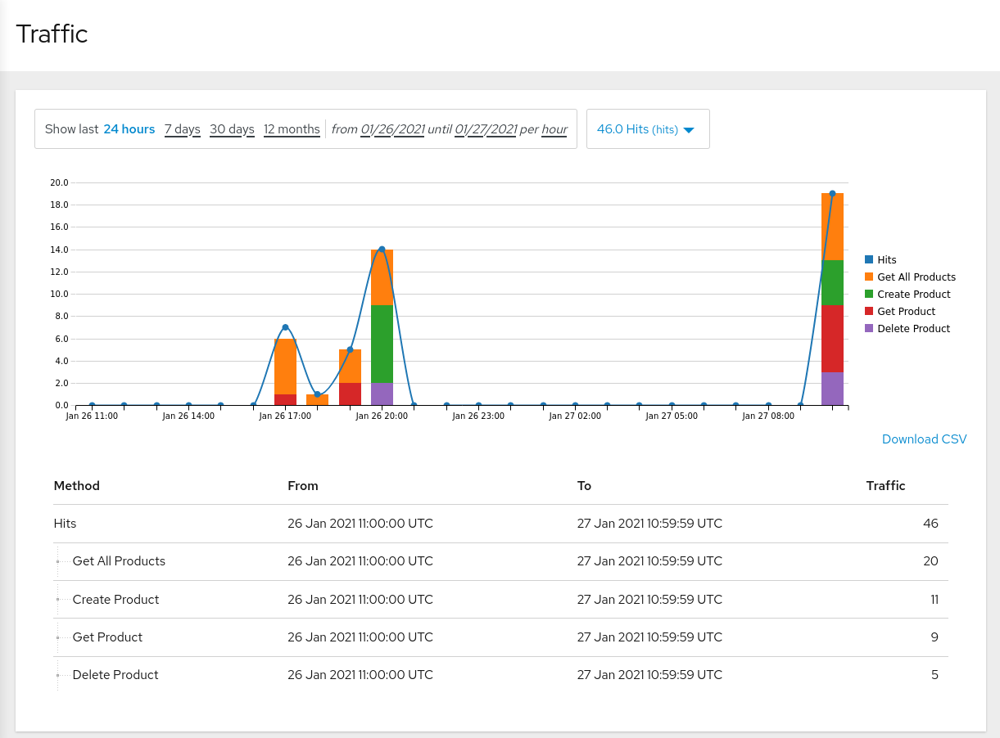

:noaudio:
:scrollbar:
:toc2:
:linkattrs:
:data-uri:

== Observe Analytics Lab

In this lab, you set up and view the analytics provided by Red Hat 3scale API Management. 

You also export data and events from 3scale API Management so that an external analytics tool can be used.

You start by generating some load for the API and then check the analytics graphics to understand the API traffic.

:numbered:

== Observe Analytics

=== Generate Load on Products API

In this section, you make various requests on the Products API so that this load can be visualized in the analytics portal of the 3scale API Management platform.

The instructions in this section use the `curl` utility on the command line to generate requests to the Products API, but you can as well use a tool like Postman (https://www.postman.com).

. In a terminal window, create an environment variable for the user key of the _Products Premium App_ application.
.. You can determine the user key by authenticating into the Developer Portal as the _test-admin_ user.
.. At the command line, create the following environment variable:
+
-----
$ PRODUCTS_PREMIUM_APP_USER_KEY=<your user key>
-----

. Add a new product by initiating a POST request to the `POST /api/product` resource of the Products API:
+
----
$ curl -v -X POST \
    --header 'Content-Type: application/json'  \
    -d '{"name": "Samsung LED TV", "price": 299.95 }' \
    https://products-api-${OCP_USER}.${OCP_WILDCARD_DOMAIN}/api/product?user_key=${PRODUCTS_PREMIUM_APP_USER_KEY}
----
+
.Expected Output (truncated)
----
*   Trying 18.202.45.214:443...
* Connected to products-api-user50.apps.cluster-e189.e189.sandbox1208.opentlc.com (18.202.45.214) port 443 (#0)
[...]]
< HTTP/1.1 201 Created
< server: openresty
< date: Wed, 27 Jan 2021 10:04:33 GMT
< content-length: 0
< location: http://products-service.user50-business-services.svc:8080/api/product/102
< set-cookie: bf94641fd3335c2df6a1cb065ef048fb=c5220ae17085b0b6e2e35a32cfadda5f; path=/; HttpOnly; Secure; SameSite=None
< 
* Connection #0 to host products-api-user50.apps.cluster-e189.e189.sandbox1208.opentlc.com left intact
----
+
Expect a HTTP `201 Created` return code.

. Create more products in a similar manner using the following request bodies :
.. `{  "name": "Panasoic LED TV", "price": 399.95 }`
.. `{  "name": "Panasoic Plasma TV", "price": 199.95 }`
.. `{  "name": "JVC OLED TV", "price": 199.95 }`

. In a similar manner, try the `DELETE /api/product/{productId}`, `GET /api/product/{productId}` and `GET /api/products` methods.
.. Delete a product - notice that the value of the product ID is not important, as the call will succeed even if the product does not exist. 
+
----
$ curl -v -X DELETE \
    https://products-api-${OCP_USER}.${OCP_WILDCARD_DOMAIN}/api/product/100?user_key=${PRODUCTS_PREMIUM_APP_USER_KEY}
----
.. Get all products:
+
----
$ curl -v -X GET \
    https://products-api-${OCP_USER}.${OCP_WILDCARD_DOMAIN}/api/products?user_key=${PRODUCTS_PREMIUM_APP_USER_KEY}
----
.. Get a product by ID:
+
----
$ curl -v -X GET \
    https://products-api-${OCP_USER}.${OCP_WILDCARD_DOMAIN}/api/product/11?user_key=${PRODUCTS_PREMIUM_APP_USER_KEY}
----

. At this point you can also create some `GET /api/product/{productId}` and `GET /api/products` using the user key for the Products API application which uses the _Products Basic Plan_ application plan.

=== API Provider: Observe analytics for all applications

Recall that there are various _applications_ associated with the _Products API_.
In this section of the lab, you will observe the aggregate of all requests of all applications of the Products API.

. Log in to the 3scale Admin Portal.
. Navigate to *Product:Products API -> Analytics -> Traffic*. From the drop-down list on the top right of the graph, select *Hits*.
+

. Observe the statistics provided:
+

+
Notice how the traffic statistics are driven by the _Metrics_ and _Mappings_ definitions created in the previous labs.

. Click *Top Applications*, *Daily Averages*, and *Alerts*, and observe the statistics shared.

=== API Provider: Observe analytics for a specific application

. Navigate to *Product:Products API -> Applications -> Listing*:
. Click the *Products Premium App*:

. Click *Analytics* link at the top of the page to view the statistics pertaining to this application:
+

=== API Consumer: Observe analytics for a specific user

. Log in to the Developer Portal as user `test-admin` with the password you provided for the account.
. Click  the *Statistics* tab in the top menu bar.

. Observe the statistics for the user's application plan:
+

. Click *Download CSV* at the bottom right to download the analytics data in a CSV format.
* The CSV file can be used as input for an external analytics tool.

. To further explore the relationship in the statistics from a _Product_, _Application_ and _User_ point of view, you can do the following:
* Create a new Account.
* Add an Application for the _Products Premium Plan_ to the Account.
* Generate some load for the Products API using the user key of the new Account.
* Examine the statistics at Product, Application and User level.

=== Analytics for an API Backend

. Navigate to *Product:Products API -> Analytics -> Traffic*. Notice the values in the drop-down box on the top right of the graph. Besides *Hits*, there is another value *Hits.x*:
+

+
*Hits.x* shows the traffic data for the Products API backend (the `x` stands for the backend ID). +
But as no metrics nor methods were defined for the backend, the graph shows no data.

. Navigate to *Product:Products API -> Integration -> Backends*, and select the `Products Service Backend`.

. On left menu, select *Methods and Metrics*.

. For simplicity sake, let's say you're only interested in the accumulated hits for the `GET` operations.
* Click on *New metric* on the left of the Metrics table.
+
You need to define a new metric, otherwise the hits will be added to the hits defined at the product level.
* Create a new Metric:
** *Friendly name*: `Backend Hits`.
** *System name*: `hits/backend`
** *Unit*: `hit`
+
image::images/amp_adm_portal_backend_add_metric.png[]
* Click *Create Metric* to create the new metric.
* Click on *Add a mapping rule* on the row for the *Backend Hits* metric:
+

* Add a new mapping rule:
** *Verb*: `GET`
** *Pattern*: `/api/`
** *Metric or method to increment*: `Backend Hits`
+

* Click *Create Mapping Rule* to create the new mapping rule.

. Deploy the new version of the Products API to the staging and production APIcast gateways.
. Using `curl` or another tool, issue a couple of calls to the `GET /api/products` and/or the `GET /api/product/{productId}` endpoints of the Products API, using one of the available user keys.
. Navigate to *Backend: Products Service Backend -> Analytics* and observe the traffic graph for the backend hits:
+

+
The backend hits graph can also be viewed from the API product analytics graph.