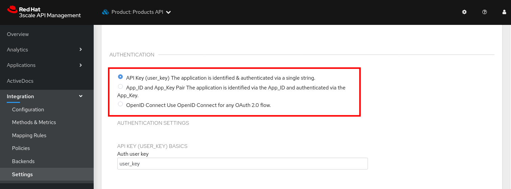
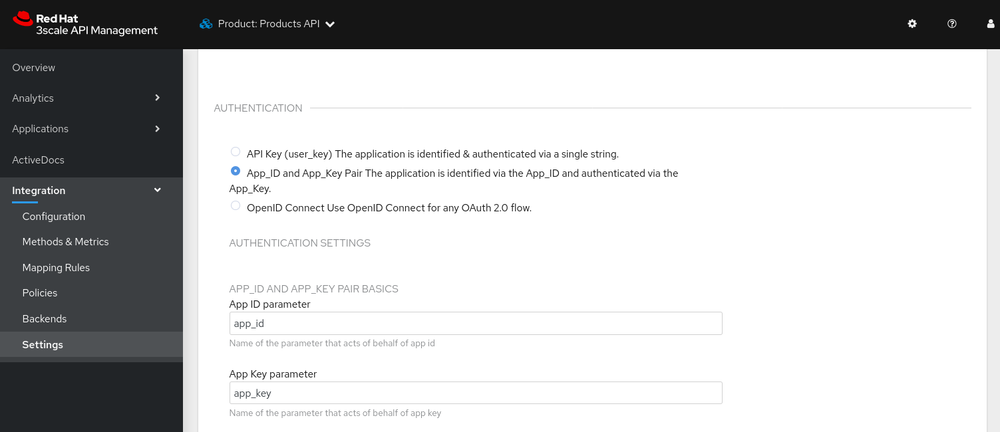
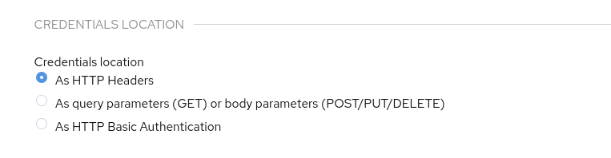
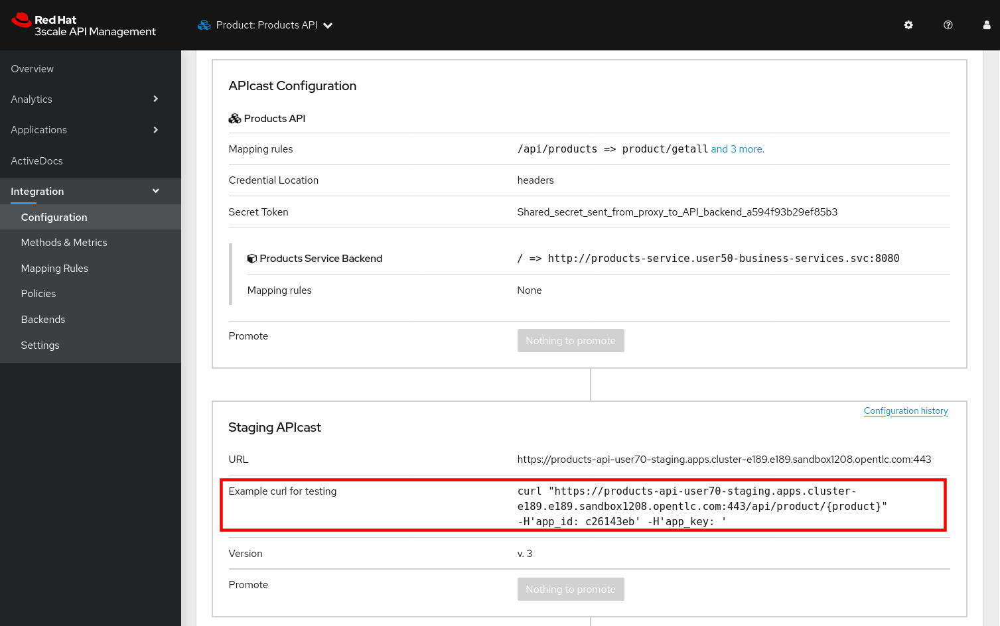
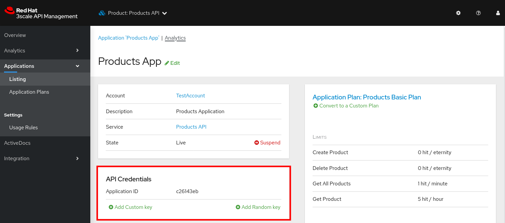
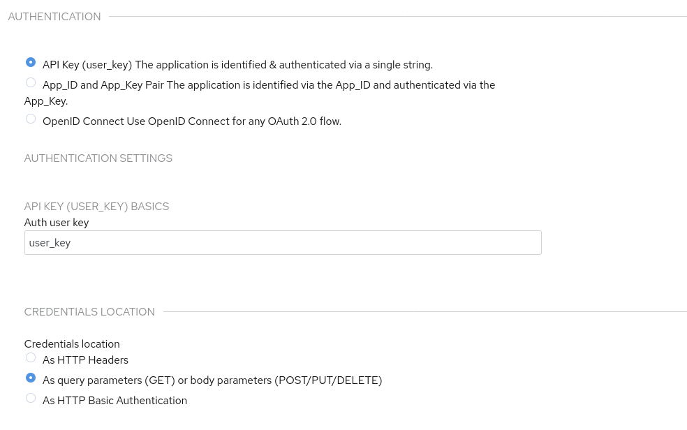

:noaudio:
:scrollbar:
:toc2:
:linkattrs:
:data-uri:

== Integrating with Secure APIs Lab

The APIs you deployed and configured until now on the 3scale API Management platform were secured with an API Key (user key). 

An alternative to using the API key (user key) for authentication is to use a combination of _App ID_ and _App Key_. 
In this method, the application is identified by its App ID and then authenticated with the App Key. 

This security mechanism tends to be superior to use of only a simple API Key.
The App ID + App Key security mechanism provides improved long term management.
Multiple App Keys can be generated and each distributed to different API consumers of the same application.
The lifecycle of each of these App Keys can be managed independently of each other and of the application.

In this lab you change the authentication for the Products service to use the App ID and App key instead of the API Key.

:numbered:

== Update Products Service

. In a browser window, navigate to your tenant's 3scale Admin Portal.
. Navigate to *Product:Products API -> Integration -> Settings*.
. Scroll down to the *Authentication* section. +
Notice that you have 3 choices to protect the Products API:
* API Key
* App ID and App Key Pair
* OpenID Connect.
+

. Change the authentication to *App_ID and App_Key Pair*.
+

. By default the App ID and App Key security mechanism uses `app_id` as parameter for the application ID, and `app_key` for the application key. Feel free to modify these values.
. By default the App ID and App Key are transmitted as query parameters appended to the request URL. An alternative is to use HTTP headers, or a HTTP Basic Authentication header. +
From a security point of view there is no really a difference, provided TLS (HTTPS) is used. With TLS, both the URL and the HTTP Headers are encrypted.
+
For this lab, change the *Credentials Location* to `Http Headers`:
+

. Scroll down and click *Update Product* to update the configuration.
. Navigate to *Product: Products API -> Integration -> Configuration*.
. Promote the API to the staging and production APIcast.
. Notice how the sample URL in the *Staging APIcast* section reflects the new security settings.
+

. Navigate to *Product: Products API -> Applications -> Listing*. Select the `Products App` belonging to the `TestAccount` account. +
Observe that the *API Credentials* section was changed to reflect the new authentication settings:
+

+
The application ID was generated automatically, and is different for every application.
. Click *Add Random key* to provide a new app key for this application.
. You can generate multiple application keys, up to 5 per application. Generate one more key.

== Test Products API with App ID and App Key

. Using `curl`, test the Products API, using the App ID and App Key from the `TestAccount` account.
+
----
$ curl -X GET -H "app_id: $APP_ID" -H "app_key: $APP_KEY" -H "Accept: application/json" https://products-api-${OCP_USER}.${OCP_WILDCARD_DOMAIN}/api/products
----
+
Expect a HTTP `200 OK` response code.
. Also test with the other App Key(s) you generated.

== Reset Authentication Settings

Before continuing with the remainder of the labs, it is recommended to reset the authentication settings for the Products API to their original settings.

* Reset the authentication mechanism to *API Key*.
* Reset the credential locations to *As query parameters*

Update the API and promote to staging and production APIcast. 
