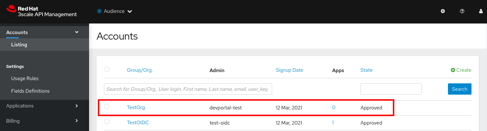

:noaudio:
:scrollbar:
:toc2:
:linkattrs:
:data-uri:

== Secure Developer Portal Lab

.Goals
* Secure the 3scale Developer Portal using the OIDC protocol and RH-SSO
* Secure the 3scale Admin Portal using the OIDC protocol and RH-SSO

:numbered:

== Overview

In the previous labs of this course, API providers & tenant admins have authenticated into their Admin Portals using IDs and passwords maintained in the 3scale API Management platform.
Similarly, API consumers have authenticated into the Developer Portal using IDs and passwords maintained in the 3scale API Management platform.

From a security perspective, this is less than ideal.
It's typically an anti-pattern to have user authentication credentials scattered throughout different applications.
Authentication credential data should normally be centralized in a trusted IdentityProvider.

In this lab, you secure the traffic to the _Developer_ Portal of the 3scale API Management platform.
Similar to the previous lab, you do so using the OIDC protocol and Red Hat Single Sign-on (RH-SSO).
Specifically, the _Authorization Code_ flow of OAuth2 will be used to allow the portals to acquire a trusted _Access Token_ from RH-SSO.
The _Access Token_ contains information about authenticated API consumers (accessing the Dev Portal).

== Secure Developer Portal

=== Overview
The objective of this portion of the lab is to enable authentication of your Developer Portal via RH-SSO.

Doing so allows for consolidation of API Consumer security credentials to a trusted central Identity Provider.

=== `api_dev_portal` SSO Client
In this section of the lab, you configure a SSO _client_ that supports the OAuth2 _Authorization Code_ flow.
This SSO client will issue a trusted _Access Token_ when authenticated API consumers access the Developer Portal of your 3scale tenant.

The RH-SSO site admin (ie: the instructor) has already allocated an SSO _realm_ to each 3scale tenant to secure the Developer Portals.

. Set the following environment variable that provides the name of this dedicated realm for your API Developer Portal:
+
-----
$ echo 'export DEVPORTAL_SSO_REALM=<provided by your instructor>      # Name of the realm on RHSSO to secure the Developer Portal' >> ~/.bashrc
$ source ~/.bashrc
-----

. Obtain the URL to the console of your target realm:
+
-----
$ echo -en "\nhttps://$RHSSO_URL/auth/admin/$DEVPORTAL_SSO_REALM/console\n\n"
-----

. Open a web browser and navigate to the console of your target realm.
. As you've done in previous lab, create an account in this new realm by going through the *Register* process.
+
NOTE: Recall that this newly registered realm user has administrative access to all settings of the realm

. Add a client by navigating to *Clients* and clicking on *Create*.  Fill the form as follows:
.. *Client ID*: `api_dev_portal`
.. *Client Protocol*: `openid-connect`
.. *Root URL*:  URL of your Developer Portal. Use the output of the following as the value of this field:
+
-----
$ echo -en "\n\nhttps://$OCP_USER-$API_MANAGER_NS.$OCP_WILDCARD_DOMAIN\n\n"
-----
. Click *Save*.
. In the *Settings* page of your new _api_dev_port_ SSO client, make the following modifications:

.. *Access Type*: `confidential`
.. *Direct Access Grants Enabled*: `Disabled`
. Scroll to the bottom and click *Save*.
. In the *Credentials* page of your new `api_dev_portal` SSO client, make note of the Secret.
+

. SSO Client Mappers
+
In order to configure a seamless integration and make the signup on 3scale transparent to API consumers, you need to configure a couple of SSO protocol mappers.
In particular, additional data about API consumers needs to be added to the Access Token sent to the Developer Portal.

.. To do so, navigate to the *Mappers* tab of your _api_dev_portal_ SSO client.
.. For the first mapper, _email verified_ , click on *Add Builtin*.
+

+
Find the `email verified` mapper in the list, and check the *Add* check-box.
+

+
Scroll to the bottom of the page and click *Add Selected*.
.. For the second mapper, click on *Create*. 
+

+
Fill in the form as follows:
+
* *Name*: org_name
* *Mapper Type*: User Attribute
* *User Attribute*: org_name
* *Token Claim Name*: org_name
* *Claim JSON Type*: String
.. Click *Save*.
+
By doing so, the _org_name_ attribute is added to users in RH-SSO.
3scale will now be able to create an account automatically.
If not, the user will be asked to indicate an organization name before the account can be created.

. Users
+
There are currently no API consumer users registered in your _api_dev_portal_ SSO realm.
Create at least one API consumer user as follows:

.. In the left panel of RH-SSO, select *Users*, and click *Add User*.
+

.. Populate the *Add user* form with the required fields.
+
In addition, set a valid email address and ensure the *Email verified* field is set to `On`. +
Otherwise, the user will not be activated in 3scale. +
Click *Save* to save the user. 

.. For this new user, navigate to the *Credentials* tab and set a password. Make sure to set the *Temporary* field to `Off`. Click *Set password* to save the password.
.. Navigate to the *Attributes* tab and create a new attribute called `org_name`.
+

+
This user attribute corresponds to the SSO protocol _mapper_ you defined previously.
+
For the value of this attribute, add anything you want.  The value you set will be used to automatically create the name of the API consumer `account`.
+
Click *Save* to save the attribute.

=== API Manager Configurations

. As the tenant admin, authenticate into the Admin Portal of the API Manager.
. Navigate to: *Audience -> Developer Portal -> Settings -> SSO Integrations*.
. Click on *Red Hat Single Sign-On*.
. Add the details of the _api_dev_portal_ SSO client configured in the previous section:

.. *Client*: `api_dev_portal`
.. *Client Secret*: secret of _api_dev_portal_ SSO client
.. *Realm*: Realm name and URL address to your RH-SSO.  Use the output of the following to determine this:
+
-----
$ echo -en "\n\nhttps://$RHSSO_URL/auth/realms/$DEVPORTAL_SSO_REALM\n\n"
-----
+

. Check the *Published* box and click on *Create Red Hat Single Sign-on* to make it available on your developer portal. 

=== Test

. In a new browser tab, navigate to your Developer Portal.
. Pick a plan and signup for it.
. In the signup form, you should see the option:  `Authenticate with Red Hat Single Sign-On`
+

+
Click this link. Doing so should redirect your browser to the login page of your RH-SSO _realm_
+

. Authenticate using the credentials of the user you created in the  SSO realm in the previous section. +
Expect to be redirected to the Developer Portal as logged in user.
+

. Click  and verify that you are logged in as the same user you logged in into the SSO realm.
+

. As the API tenant admin, navigate back to the Admin Portal and in the list of accounts, notice the creation of a new account and user.
+

+
The name of the account should match the value of _org_name_ you set on the user created in RH-SSO.

== Secure Admin Portal

=== Overview

The objective of this section of the lab is to enable authentication of your Admin Portal via RH-SSO.

Doing so allows for consolidation of API Provider and tenant administrator security credentials to a trusted central Identity Provider.

=== `api_admin_portal` SSO Client
In this section of the lab, you configure a SSO _client_ that supports the OAuth2 _Authorization Code_ flow.
This SSO client will issue a trusted _Access Token_ when authenticated 3scale admin users access the Admin Portal of a 3scale tenant.

The RH-SSO site admin (ie: the instructor) has already allocated an SSO _realm_ to each 3scale tenant to secure the Admin Portal.

. Set the following environment variable that provides the name of this dedicated realm for your 3scale Admin Portal:
+
-----
$ echo 'export ADMINPORTAL_SSO_REALM=<provided by your instructor>      # Name of the realm on RHSSO to secure the Admin Portal' >> ~/.bashrc
$ source ~/.bashrc
-----

. Obtain the URL to the console of your target realm:
+
-----
$ echo -en "\nhttps://$RHSSO_URL/auth/admin/$ADMINPORTAL_SSO_REALM/console\n\n"
-----

. Open a web browser and navigate to the console of your target realm.
. As you've done in previous lab, create an account in this new realm by going through the *Register* process.
+
NOTE: Recall that this newly registered realm user has administrative access to all settings of the realm.

. Navigate to *Users* and click *View all users*. Click on the *Edit* button next to the user you registered with.
. In the _Details_ pane, set the *Email Verified* field to `On`. +
If not set to `On`, the user will only be activated in RH-SSO after replying to an activation email. In the lab, RH-SSO is not set up to handle email, so this verification step needs to be skipped.
. Click *Save*.

. Add a client by navigating to *Clients* and clicking on *Create*.  Fill the form as follows:
.. *Client ID*: `api_admin_portal`
.. *Client Protocol*: `openid-connect`
.. *Root URL*:  URL of your Admin Portal. Use the output of the following as the value of this field:
+
-----
$ echo -en "\n\nhttps://$OCP_USER-$API_MANAGER_NS-admin.$OCP_WILDCARD_DOMAIN\n\n"
-----
. Click *Save*.
. In the *Settings* page of your new _api_admin_portal_ SSO client, make the following modifications:
.. *Access Type*: `confidential`
.. *Direct Access Grants Enabled*: `OFF`
. Scroll to the bottom and click *Save*.
. In the *Credentials* page of your new `api_dev_portal` SSO client, make note of the Secret.

=== API Manager Configurations

. Authenticate into the Admin Portal using your existing credentials.
. Click the  icon and navigate to *Users -> SSO Integrations*.
. Click *New SSO Integration*.
+

. In the _New SSO Integration_ form, fill in the fields as follows:
.. *SSO Provider*:  `Red Hat Single Sign-On`
.. *Client*: `api_admin_portal`
.. *Client Secret*: secret of _api_admin_portal_ SSO client
.. *Realm*: Realm name and URL address to your RH-SSO.  Use the output of the following to determine this:
+
-----
$ echo -en "\n\nhttps://$RHSSO_URL/auth/realms/$ADMINPORTAL_SSO_REALM\n\n"
-----

. Click *Create Authentication Provider*.
. After completing the _New SSO Integration_ form, you can test the authentication flow
.. Towards the bottom of the page, click the link called: _Test authentication flow now_.
+

.. Your browser will be re-directed to a RH-SSO login page.
.. Authenticate using the credentials of the user you have registered with.
. If successful, publish the new SSO integration by clicking the *Publish* button.
+
The _state_ of the SSO integration should change to: _Visible_.

. Navigate to *Account Settings -> Users -> Listing* and note that the SSO user has been added to the Admin Portal users:
+

. Click the *Edit* button next to the SSO user, and on the _Edit User_ page, grant the user `Admin (full access)` access. Click *Update User*.

=== Test

. Open a new _private window_ in your browser and navigate to the 3scale Admin Portal.
+
A new private window in your browser is used to ensure that the browser cache is empty of any previous login information.

. In the private window of your browser, a new authentication option should now be visible.
+

. Click on the link to `Authenticate through Red Hat Single Sign-On`.
+
Your browser will be re-directed to the sign-up page of RH-SSO.

. Authenticate using the credentials of the user you have registered with. Expect to be redirected to the overview page of the 3scale Admin Portal.

=== Enforce SSO for the Admin Portal

At this point, the 3scale Admin Portal of your tenant supports both authentication methods: RH-SSO integration and username/password of users defined in 3scale.

It is possible to exclusively allow RH-SSO based authentication.

. Make sure you are logged in into the Admin Portal with a user defined in RH-SSO, and whi has admin rights.
. Navigate to *Account Settings -> Users -> SSO Integrations*.
. Notice the *Enforce SSO for all users of this account* checkbox:
+

. Check the checkbox. Notice the warning banner that appears next to it:
+

. Click the banner.
. Logout from the Admin Portal. Try to login with the original username/password. +
Expect to see an error message:
+

. The _Enforce SSO_ setting can be reverted from the *Account Settings -> Users -> SSO Integrations* page.
