:noaudio:
:scrollbar:
:toc2:
:linkattrs:
:data-uri:

== API Gateway Policies Lab

In this lab you learn about API gateway policies.
You study a couple of popular standard policies available out of the box with 3scale and learn about using them in a policy chain to manage the APIcast gateway's behavior.

APIcast policies are units of functionality that modify how APIcast operates. Policies can be enabled, disabled, and configured to control how they modify APIcast. Use policies to add functionality that is not available in a default APIcast deployment. You can create your own policies, or use standard policies provided by Red Hat 3scale.

.Reference
* link:https://access.redhat.com/documentation/en-us/red_hat_3scale_api_management/2.9/html/administering_the_api_gateway/apicast_policies#standard-policies[API Gateway Standard Policies]

:numbered:

== Policy Chain for Logging

In this section, you set up a policy to provide detailed access logs in the APIcast gateway for each request.
This is a standard policy plug-in available in 3scale API Management that can be configured directly in the service configuration.

=== Default APIcast logging

Before enabling and configuring the _Logging_ policy, you can verify what the APIcast logs for each request.

. In a terminal window, use the _curl_ utility to make a couple of requests to the `GET /api/products` endpoint of the Products API. Use the user key of the _Products Premium App_ application.
+
----
$ curl -X GET --header "Accept: application/json" "https://products-api-${OCP_USER}-staging.${OCP_WILDCARD_DOMAIN}:443/api/products?user_key=${PRODUCTS_API_TEST_ADMIN_USER_KEY}"
----
+
Note that you use the staging APIcast. Configuration changes on the staging APIcast take effect immediately - APIcast loads the configuration on demand for each incoming request. This in contrast to the production APIcast where the configuration is loaded at boot time, and refreshed periodically, approx every five minutes.

. Use the _oc_ command line utility to find the name of your tenant's production APIcast pod.
+
----
$ APICAST_STAGE_POD=$(oc get pod -l deployment=apicast-stage -o jsonpath={.items[0].metadata.name} -n $OCP_USER-3scale-gw)
----
. Get the logs of the APIcast pod
+
----
$ oc logs $APICAST_STAGE_POD -n $OCP_USER-3scale-gw
----
+
.Sample Output
----
[29/Jan/2021:13:37:34 +0000] products-service.user50-business-services.svc:8080 10.128.2.16:51522 "GET /api/products?user_key=6bfb9902540e2f1cf5906f46e54309b7 HTTP/1.1" 200 1038 (0.700) 0
[29/Jan/2021:13:37:35 +0000] products-service.user50-business-services.svc:8080 10.128.2.16:51628 "GET /api/products?user_key=6bfb9902540e2f1cf5906f46e54309b7 HTTP/1.1" 200 1038 (0.000) 0
[29/Jan/2021:13:38:19 +0000] products-service.user50-business-services.svc:8080 10.128.2.16:52838 "GET /api/products?user_key=6bfb9902540e2f1cf5906f46e54309b7 HTTP/1.1" 200 1038 (0.100) 0
[29/Jan/2021:13:38:20 +0000] products-service.user50-business-services.svc:8080 10.131.0.40:58124 "GET /api/products?user_key=6bfb9902540e2f1cf5906f46e54309b7 HTTP/1.1" 200 1038 (0.100) 0
----
+
The default access log uses the following format:
+
---- 
[{{time_local}}] {{host}}:{{server_port}} {{remote_addr}}:{{remote_port}} "{{request}}" {{status}} {{body_bytes_sent}} ({{request_time}}) {{post_action_impact}}
----
+
[NOTE]
====
As an alternative, the logs of the APIcast pods can also be viewed from the OpenShift web console.

. In a browser window, enter the URL to the OpenShift web console - `https://console-openshift-console.${OCP_WILDCARD_DOMAIN}`.
. Log in with your OpenShift username and password.
. Select the _Administrator_ perspective, navigate to *Home -> Projects* and in the _Projects_ list click on the link to the `${OCP_USER}-3scale-gw` project.
+
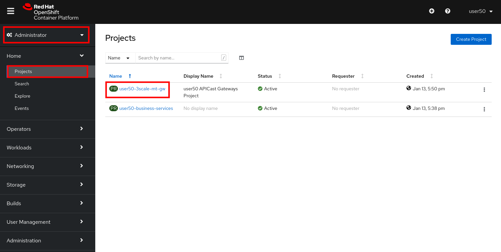
. Navigate to *Workload -> Pods*.
. Click on the staging APIcast pod. This is the pod whose name begins with `apicast-stage`.
+
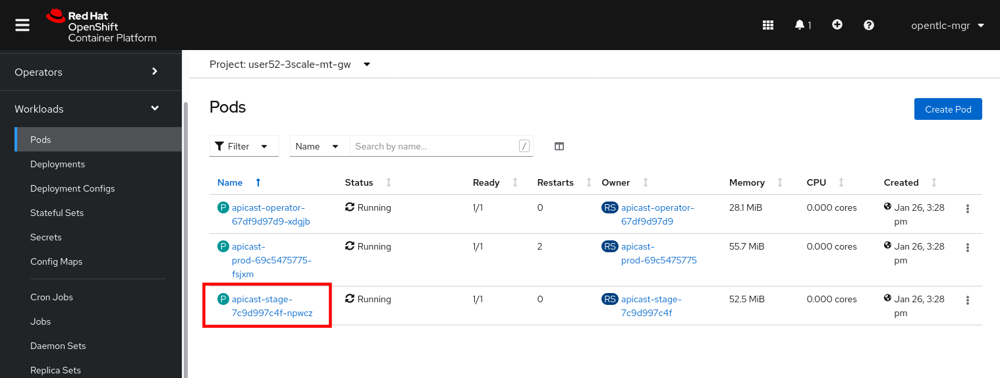
. On the page for the pod, select the *Log* tab to see the logs of the pod.
+
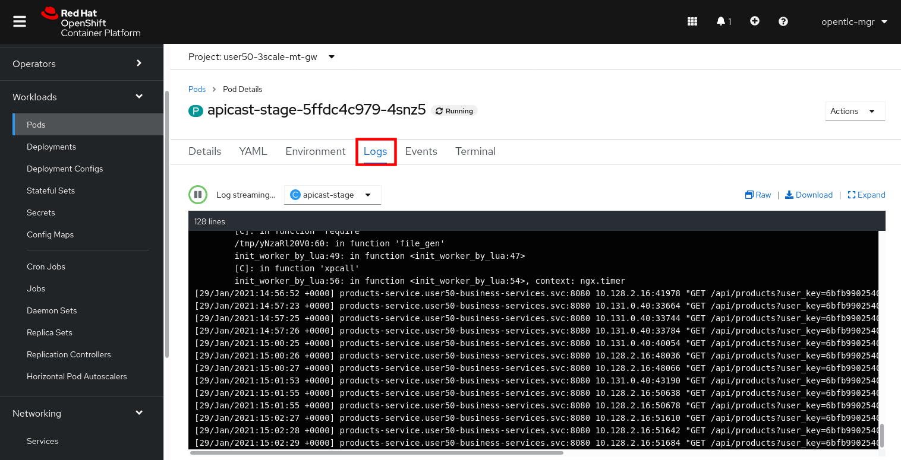
====

=== Disable Access Logging for a Product

A first use case for the Logging policy is to disable access logging for an API.

. In a browser window, navigate to your tenant's 3scale Admin Portal.
. Navigate to *Product: Products API -> Integration -> Policies*.
+
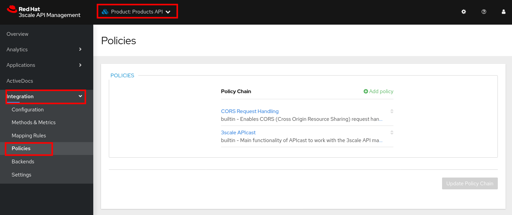
+
Expect to see the _3scale APIcast_ policy. +
The _3scale APIcast_ policy manages the functionality of APIcast. This policy should (almost) always be the last in the list.
. Click *Add Policy*.
. From the list of policies, select *Logging*.
+
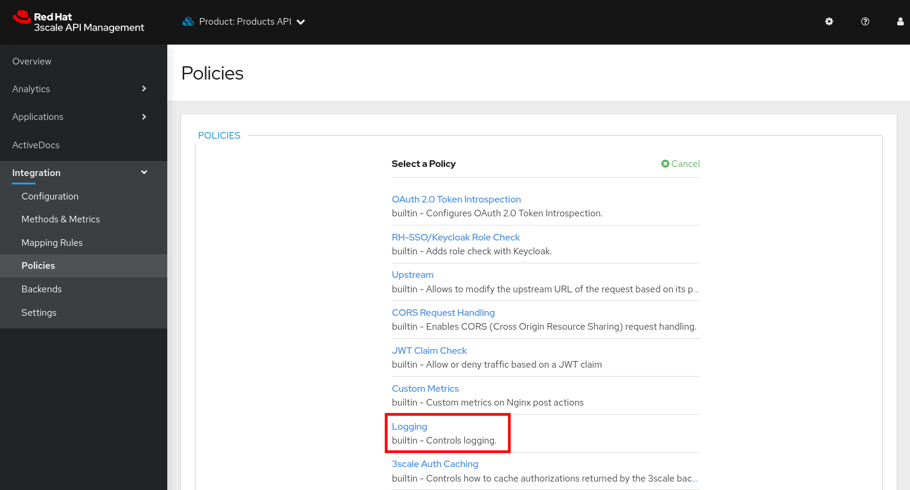
. Click the positioning arrows on the right to move the _Logging_ policy above the _3scale APIcast_ policy in the policy chain:
+
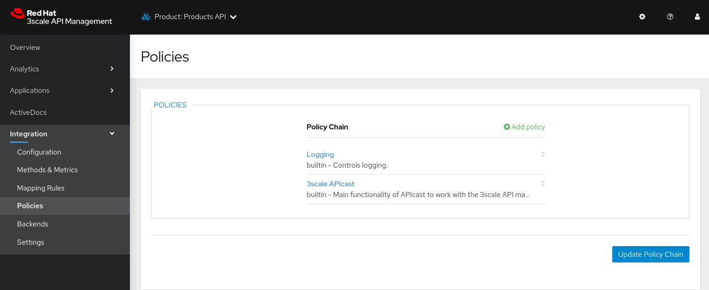

. Click the *Logging* policy to expand it.
. To disable access logging.
* Make sure that the policy is *Enabled*
* Explicitly check and uncheck the *enable_access_logs*:
+
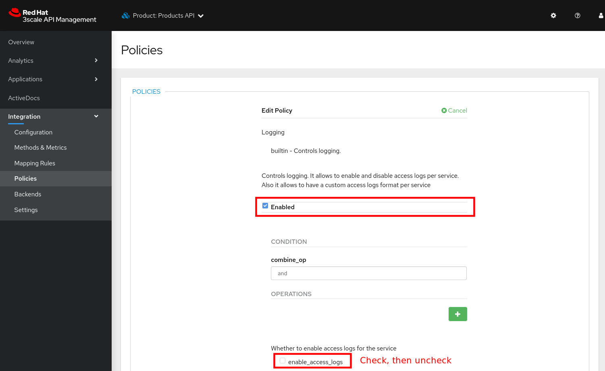

. Click *Update Policy*.
. Back on the _Policies_ page, click *Update Policy Chain*.
. Navigate to *Integration -> Configuration* and promote the configuration tot the staging APIcast.
. Make a couple of requests to the `GET /api/products` endpoint of the Products API on the staging APIcast.
. Verify the logs of the staging APIcast pod. +
No access log statements should be produced for requests to the Products API.

=== Customize Access Log Format

Using the Logging policy, the format of the access log can be customized. The policy also allows to log in JSON format.
Conditions can be defined for when to log. This makes it possible for example to only log successful requests (with HTTP return code `200`).

. Edit the _Logging_ policy you created previously.
* Check *enable_access_logs*.
* Paste the following string in the *Custom Logging Format* text box:
+
----
[{{time_local}}] {{host}}:{{server_port}} {{remote_addr}}:{{remote_port}} "{{request}}" {{status}} {{body_bytes_sent}} ({{request_time}}) {{post_action_impact}}
----
+
This is the format that corresponds to the default access log.
. Click *Update Policy*, and *Update Policy Chain*.
. Promote the configuration to the staging APIcast.
. Make a couple of requests to the `GET /api/products` endpoint of the Products API on the staging APIcast.
. Verify the logs of the staging APIcast pod. +
Expect to see access log entries with the same format as the default access logs.
. Edit the _Logging_ policy.
* In the *Custom Logging Format* text box, replace `{{remote_addr}}:{{remote_port}}` with `{{req.headers.x-forwarded-for}}`.
** `{{remote_addr}}:{{remote_port}}` resolves to the internal IP address of the OpenShift Ingress router, which is not very useful.
** `{{req.headers.x-forwarded-for}}` is the value of the `x-forwarded-for` HTTP header. The value of the header is set by the OpenShift Ingress router to the originating IP address of the client.
. Update the policy and the policy chain, and promote the configuration to the staging APIcast.
. Make a couple of requests to the `GET /api/products` endpoint of the Products API on the staging APIcast.
. Verify the logs of the staging APIcast pod. +
Expect to see access log entries which contain the IP address of the caller:
+
----
[29/Jan/2021:16:45:39 +0000] products-service.user50-business-services.svc:8080 178.119.47.150 "GET /api/products?user_key=6bfb9902540e2f1cf5906f46e54309b7 HTTP/1.1" 200 1038 (0.191) 0.013
[29/Jan/2021:16:45:40 +0000] products-service.user50-business-services.svc:8080 178.119.47.150 "GET /api/products?user_key=6bfb9902540e2f1cf5906f46e54309b7 HTTP/1.1" 200 1038 (0.160) 0.004
[29/Jan/2021:16:45:41 +0000] products-service.user50-business-services.svc:8080 178.119.47.150 "GET /api/products?user_key=6bfb9902540e2f1cf5906f46e54309b7 HTTP/1.1" 200 1038 (0.150) 0.004
----

== Policy Chain for IP check

In this section, you set up a policy to accept or deny a request based on the request's IP address.
This is a standard policy plug-in available in 3scale API Management that can be configured directly in the service configuration.

. In a browser window, navigate to your tenant's 3scale Admin Portal.
. Navigate to *Product: Products API -> Integration -> Policies*.
. Click *Add Policy*.
. From the list of policies, select *IP Check*.
. Click the positioning arrows on the right to move the _IP Check_ policy to the top of the policy chain.
. Click *IP check* to expand the policy.
* In the *CLIENT_IP_SOURCES* section, add *Get the IP from the X-Forwarded-For header* and move the entry to the top of the list.
* Add `127.0.0.1` as a new IP address in the *IPS* list.
* Make sure *check_type* is set as *Allow only the IPs included in the list*:
+
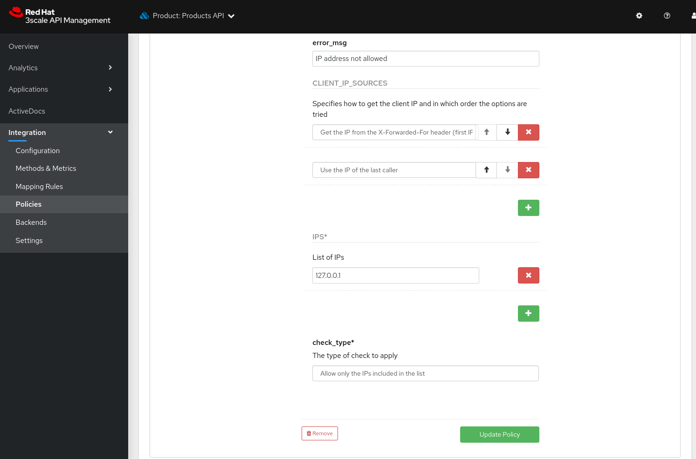

. Click *Update Policy*, and *Update Policy Chain*.
. Promote the configuration to the staging APIcast.
. Make a couple of requests to the `GET /api/products` endpoint of the Products API on the staging APIcast.
. Expect a HTTP `403 Forbidden` return code, with error message `IP address not allowed`.
. Go back to the _IP Check_ policy.
. Add the public IP address of your workstation to the list of IPs. +
You can find the public IP address in the access log of the staging APIcast pod.
. Update the policy and the policy chain, and promote the configuration to the staging APIcast.
. Make a couple of requests to the `GET /api/products` endpoint of the Products API on the staging APIcast.
. Expect the calls to succeed.

. When you are done with this lab, remove the _IP check_ policy so that it does not affect the remaining labs.

== Custom Metrics Policy

The Custom metrics policy adds the availability to add metrics after the response sent by the upstream API. The main use case for this policy is to add metrics based on response code status, headers, or different NGINX variables.

The `GET /api/product/{productId}` endpoint returns an HTTP `404` code when the product with the give ID does not exist. With the `Custom Metrics` policy you can add a custom metrics to measure these 404's.

. In a browser window, navigate to your tenant's 3scale Admin Portal.
. Navigate to *Product: Products API -> Integration -> Methods & Metrics*.
. In the _Metrics_ section, click *New metric* to create a custom metric.
+
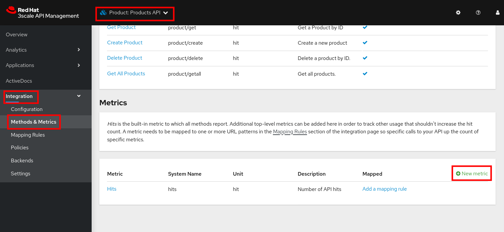
. Create a new metric to capture 404 responses.
* *Friendly name*: `Hits 404`
* *System name*: `hits_404`
* *Unit*: `hit`
. Click *Create Metric* to create the metric.
+
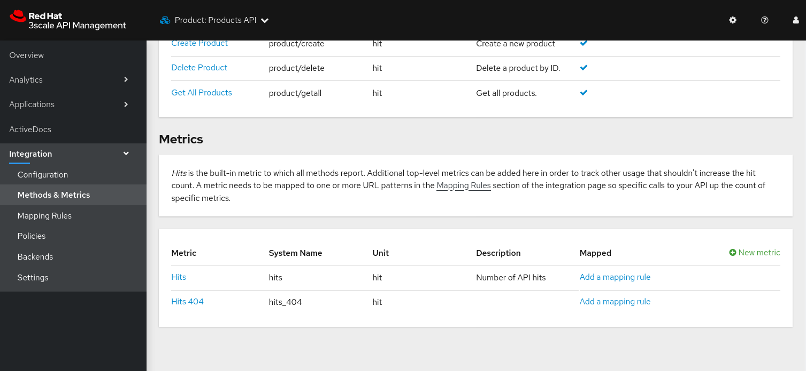

. Navigate to the *Policies* section.
. Click *Add Policy*.
. From the list of policies, select *Custom Metrics*.
. Click the positioning arrows on the right to move the _Custom Metrics_ policy above the _3scale APIcast_ policy.
. Click *Custom Metrics* to expand the policy.
. In the policy configuration page, enter the following values:
* Make sure the policy is enabled.
* *Increment*: `1`
* *Metric to increment*: `hits_404`
* *op*: `==`.
* *right*: `{{status}}` +
This matches the HTTP response code returned by the backend.
* *left_type*: select `Evaluate 'left' as plain text`
* *left*: `404`
* *right type*: select `Evaluate 'right' as liquid`
* *Combine operation*: leave to `and`
. Click *Update Policy*, and *Update Policy Chain*.
. Promote the configuration to the staging APIcast.
. Make a couple of requests to the `GET /api/product/{productId}` endpoint of the Products API on the staging APIcast. Make sure to chose a product ID which does not exist.
+
----
$ curl -v -X GET --header "Accept: application/json" "https://products-api-${OCP_USER}-staging.${OCP_WILDCARD_DOMAIN}:443/api/product/250?user_key=${PRODUCTS_API_TEST_ADMIN_USER_KEY}"
----
+
.Output (truncated)
----
*   Trying 34.240.138.165:443...
* Connected to products-api-user50-staging.apps.cluster-e189.e189.sandbox1208.opentlc.com (34.240.138.165) port 443 (#0)
[...]
< HTTP/1.1 404 Not Found
< server: openresty
< date: Sat, 30 Jan 2021 14:45:38 GMT
< content-length: 0
< set-cookie: f834931a80a7552cfa2ec69e8192582f=9e302d1cf8c1ab5cd5b011d803d2c173; path=/; HttpOnly; Secure; SameSite=None
< cache-control: private
<
----
. Navigate to *Product: Products API -> Analytics -> Traffic*.
. On the traffic graph, select `Hits 404`. Expect to see a number of hits.
+
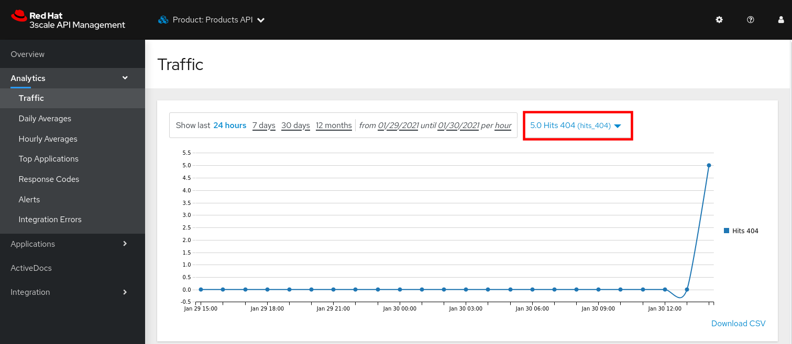

== JWT Claim Check Policy

In this section, you set up a policy to accept or deny a request based on the JWT token claim value.
This is a standard policy plug-in available in 3scale API Management that can be configured directly in the service configuration. This policy is useful when the service is configured to use *OpenId Connect* authentication.

=== Setup policy in 3scale admin portal
. In a browser window, navigate to your tenant's 3scale Admin Portal.
. Navigate to *Product: Products API -> Integration -> Policies*.
. Click *Add Policy*.
. From the list of policies, select *JWT Claim Check*.
. Click the positioning arrows on the right to move the _JWT Claim Check_ policy on top of the *3scale APIcast* policy.
. Click *JWT Claim Check* to expand the policy.
. In the policy configuration page, enter the following values:
* Make sure the policy is enabled.
* *resource_type*: `Evaluate as plain text`
* *op*: `==`
* *jwt_claim_type*: `Evaluate as plain text`
* *jwt_claim*: `role`
* *value_type*: `Evaluate as plain text`
* *value*: `admin`
* *combine_op*: `and`
* *resource*: `/time/now`
* *Allowed methods*: `GET`
* *Error message*: `Not authorized to use the operation`

+
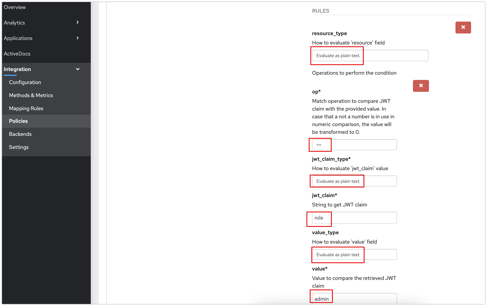
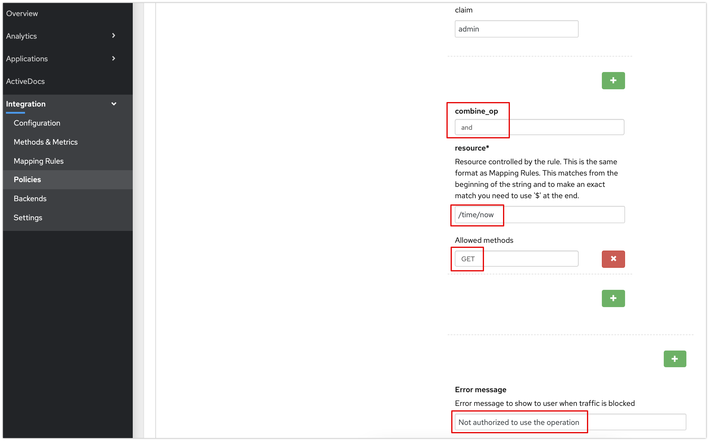

=== Setup RH-SSO 

When an application is created for a 3scale service, a client corresponding to it is created in RH-SSO by 3scale zync component. Create a mapper in RH-SSO admin console as suggested below.

. Navigate to *Realm: threescale-realm -> Clients -> Client : (3scale application client)-> Mappers*. 
. Click *Create* and create token mapper with these values
* *Name*: `User Role`
* *Mapper Type*: `User Attribute`
* *User Attribute*: `role`
* *Token Claim Name*: `role`
* *Claim JSON Type*: `String`
. Click *Save*

+
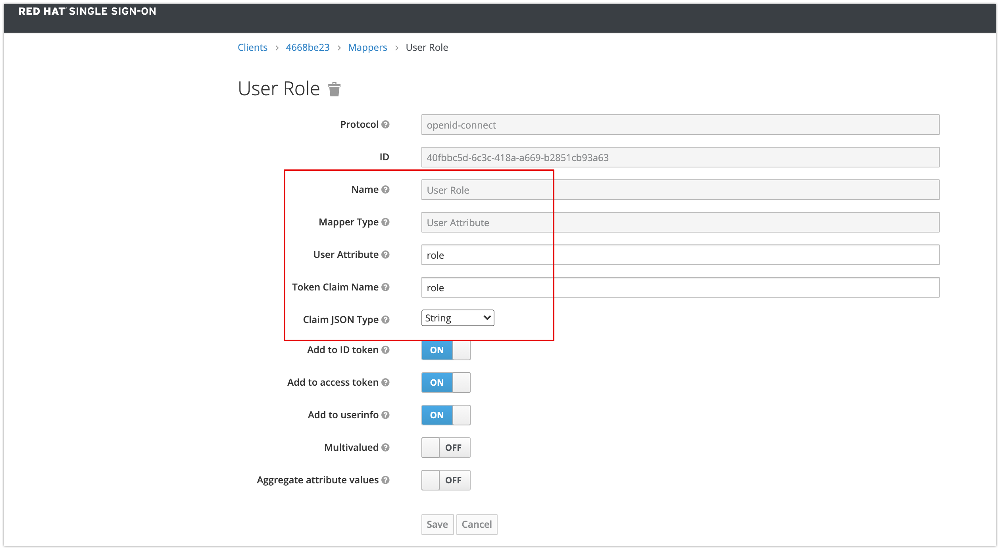

=== Create users in SSO

Create two users (normal,admin) in threescale_realm for testing the *JWT Claim Check* policy.

. Navigate to *Realm: threescale-realm -> users*
. Click *Add user* with these values
* *Username*: `admin`
* *Email*: `admin.sso@openshift.com`
* *First Name*: `admin`
* *First Name*: `sso`
* *User Enabled*: `ON`
* *Email Verified*: `ON`
. Click *Save*
. Click *Credentials* tab, set the password and save
. Click *Attributes* tab
* *key*: `role`
* *value*: `admin`

+
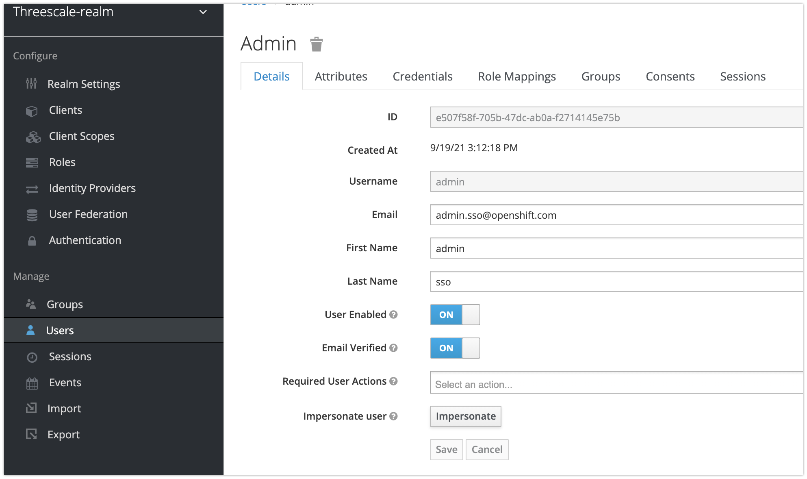
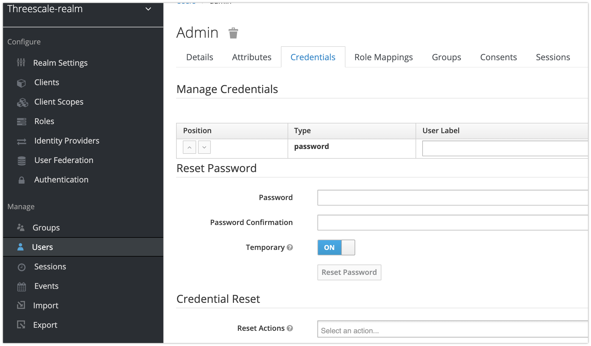
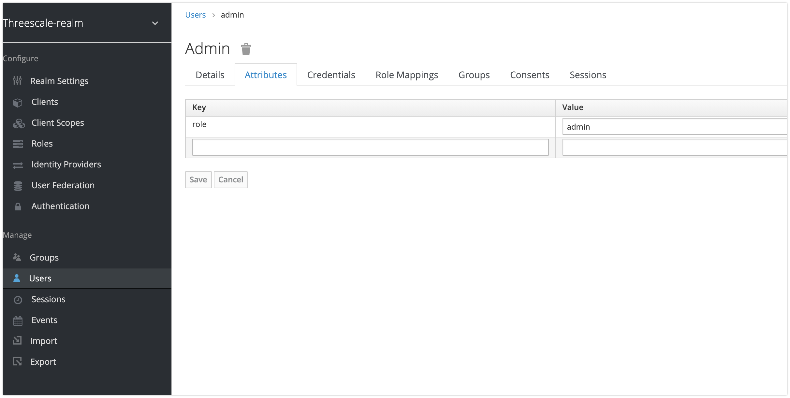
+
. Click *Add user* again to create *normal* user with these values
* *Username*: `normal`
* *Email*: `normal.sso@openshift.com`
* *First Name*: `normal`
* *First Name*: `sso`
* *User Enabled*: `ON`
* *Email Verified*: `ON`
. Click *Save*
. Click *Credentials* tab, set the password and save
. Click *Attributes* tab
* *key*: `role`
* *value*: `normal`

+
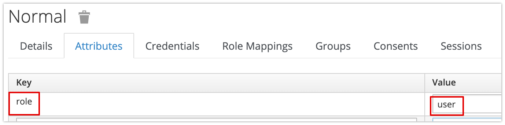

=== Test the policy

Set up postman where OpenID connect token is obtained using *Autorization code* grant.

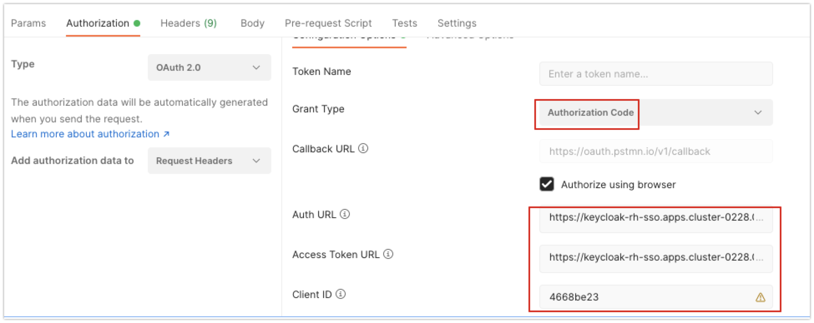

. Click *Get New Access Token*
. When prompted for user credentials, enter either *admin* OR *normal* user credentials as setup above
* Admin user will return a response with http status code as 200 since the claim *role* in the token generated for admin user has *admin* as value
+
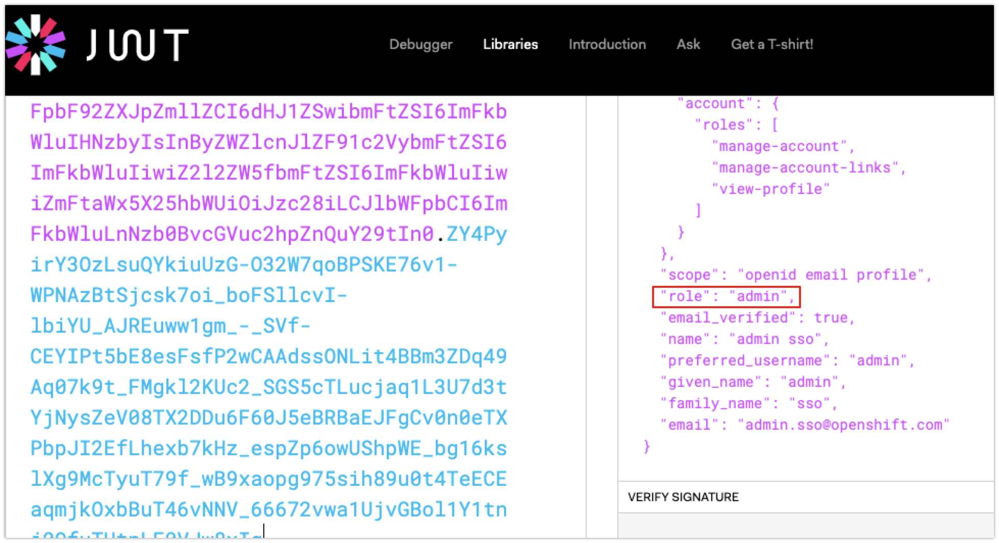
+
* Normal user will return a response with http status code as 403 since the claim *role* in the token generated for normal user has *normal* as value. Response will be *Not authorized to use the operation*

+
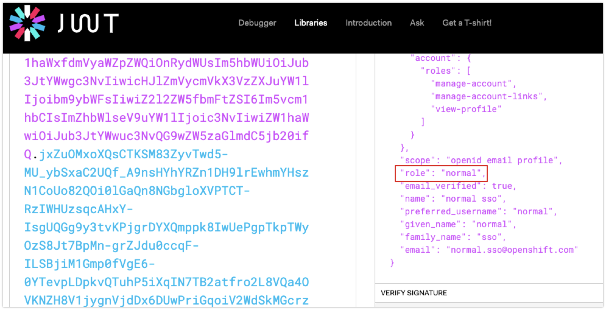
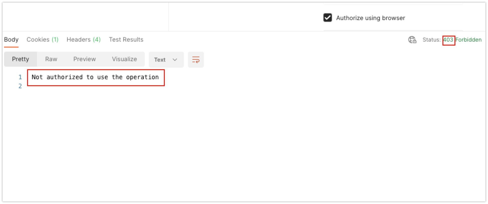
+

== RH-SSO/Keycloak Role Check Policy

In this section, you set up a policy to accept or deny a request based on the RH-SSO realm/client role assigned to the user.
This is a standard policy plug-in available in 3scale API Management that can be configured directly in the service configuration. This policy is useful when the service is configured to use *OpenId Connect* authentication.

=== Setup policy in 3scale admin portal
. In a browser window, navigate to your tenant's 3scale Admin Portal.
. Navigate to *Product: Products API -> Integration -> Policies*.
. Click *Add Policy*.
. From the list of policies, select *RH-SSO/Keycloak Role Check*.
. Click the positioning arrows on the right to move the _RH-SSO/Keycloak Role Check_ policy on top of the *3scale APIcast* policy.
. Click *RH-SSO/Keycloak Role Check* to expand the policy.
. In the policy configuration page, enter the following values:
* Make sure the policy is enabled.
* *type*: `whitelist`
* *resource_type*: `Evaluate 'value' as plain text`
* *Allowed methods*: `ANY`
* *resource*: `/time/now`
+
*_Client and/or realm roles can be configured_*
+
* *Realm Role(s)*
** *name_type*: `Evaluate 'value' as plain text`
** *name*: `admin_realm_role`
* *Client Role(s)*
** *client_type*: `Evaluate 'value' as plain text`
** *name*: `admin_client_role` 
** *name_type*: `Evaluate 'value' as plain text`
** *client*: `Client Id where role is created`
+
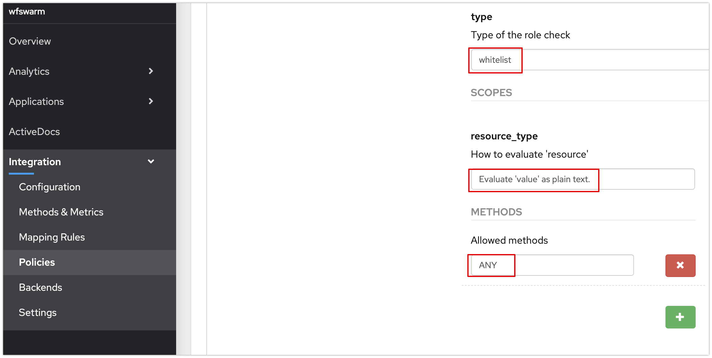
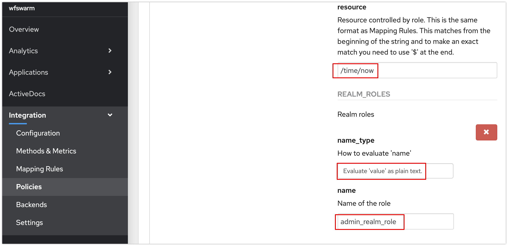
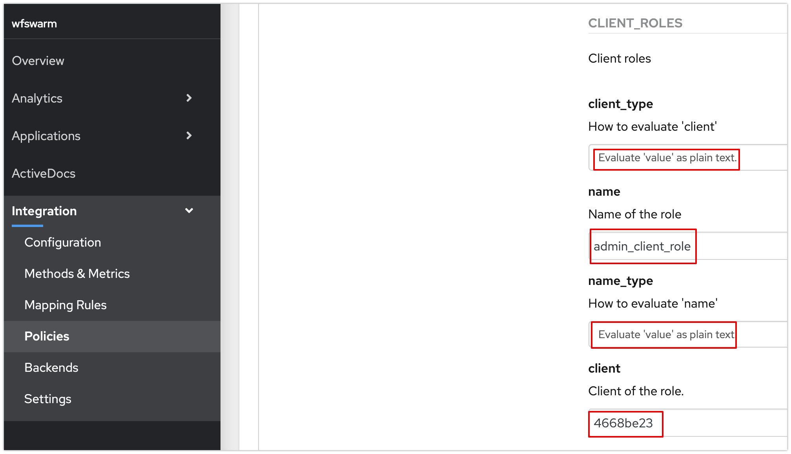
+

=== Setup RH-SSO 

In RH-SSO, roles can be created at realm and/or client scopes. Roles created at a realm scope can be assigned to the clients and/or users in that realm. Roles created at a client scope can be assigned to the users only.

. Navigate to *Realm: threescale-realm -> Roles*
. Click *Add Role* and create a role with these values
* *Role Name*: `admin_realm_role`
* *Description*: `Admin Role at Realm scope`
* *Composite Roles*: `OFF`
. Click *Save*

+
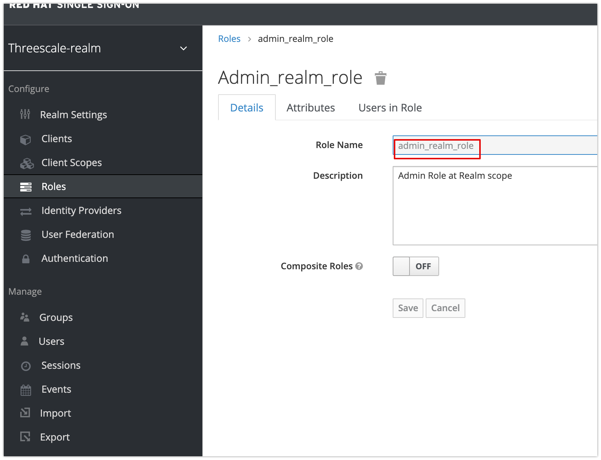

When an application is created for a 3scale service, a client corresponding to it is created in RH-SSO by 3scale zync component. Create a role in RH-SSO admin console with these values.

. Navigate to *Realm: threescale-realm -> Clients -> Select the client created by 3scale zync*
. Click *Roles* tab and then click *Add Role*. Create a role with these values
* *Role Name*: `admin_client_role`
* *Description*: `Admin Role at Client scope`
* *Composite Roles*: `OFF`
. Click *Save*

+
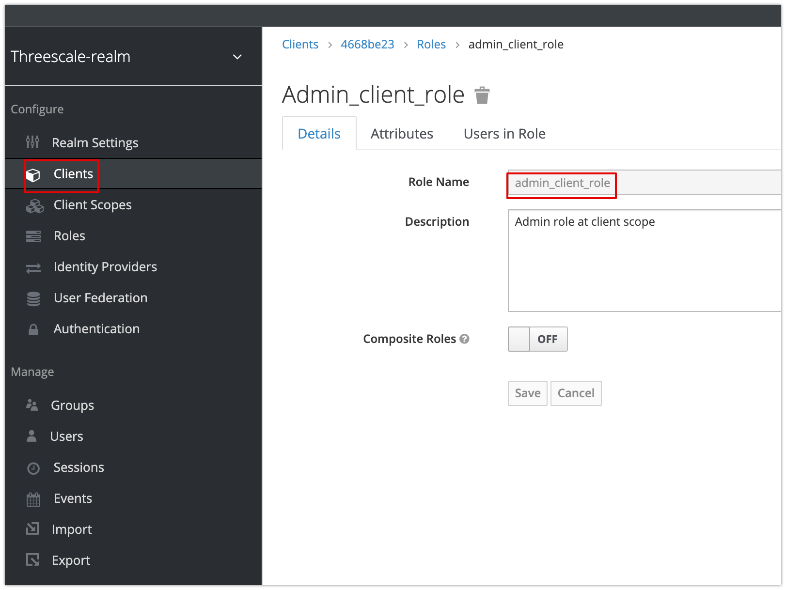

=== Create users in SSO

Create two users (normal,admin) in threescale_realm for testing the *RH-SSO/Keycloak Role Check* policy.

. Navigate to *Realm: threescale-realm -> users*
. Click *Add user* with these values
* *Username*: `admin`
* *Email*: `admin.sso@openshift.com`
* *First Name*: `admin`
* *First Name*: `sso`
* *User Enabled*: `ON`
* *Email Verified*: `ON`
. Click *Save*
. Click *Credentials* tab, set the password and save
. Click *Role Mappings* tab. Select the *admin_realm_role* in *Available Roles* and click *Add selected*
. Click *Client Roles* tab. Enter the *client id* and select the *client* that shows up. Select the *admin_client_role* in *Available Roles* and click *Add selected*

+

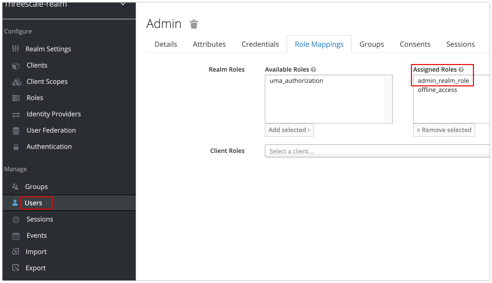
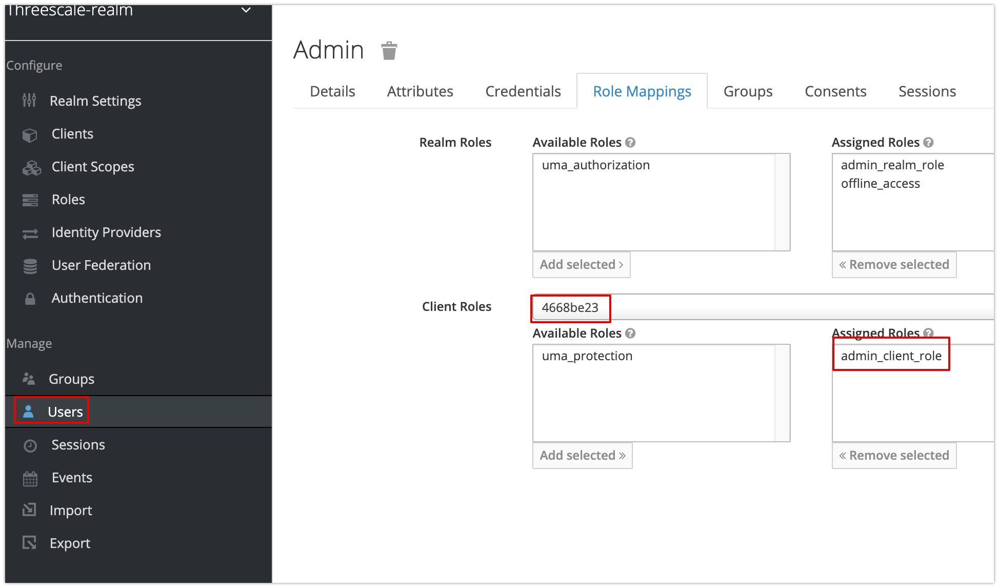
+

. Click *Add user* again to create *normal* user with these values
* *Username*: `normal`
* *Email*: `normal.sso@openshift.com`
* *First Name*: `normal`
* *First Name*: `sso`
* *User Enabled*: `ON`
* *Email Verified*: `ON`
. Click *Save*
. Click *Credentials* tab, set the password and save
. DO NOT assign a realm and/or client role to the user

=== Test the policy

Set up postman where OpenID connect token is obtained using *Autorization code* grant.

. Click *Get New Access Token*
. When prompted for user credentials, enter either *admin* OR *normal* user credentials as setup above
* Admin user will return a response with http status code as 200 since the token generated for admin user has both  realm and client roles required.
+
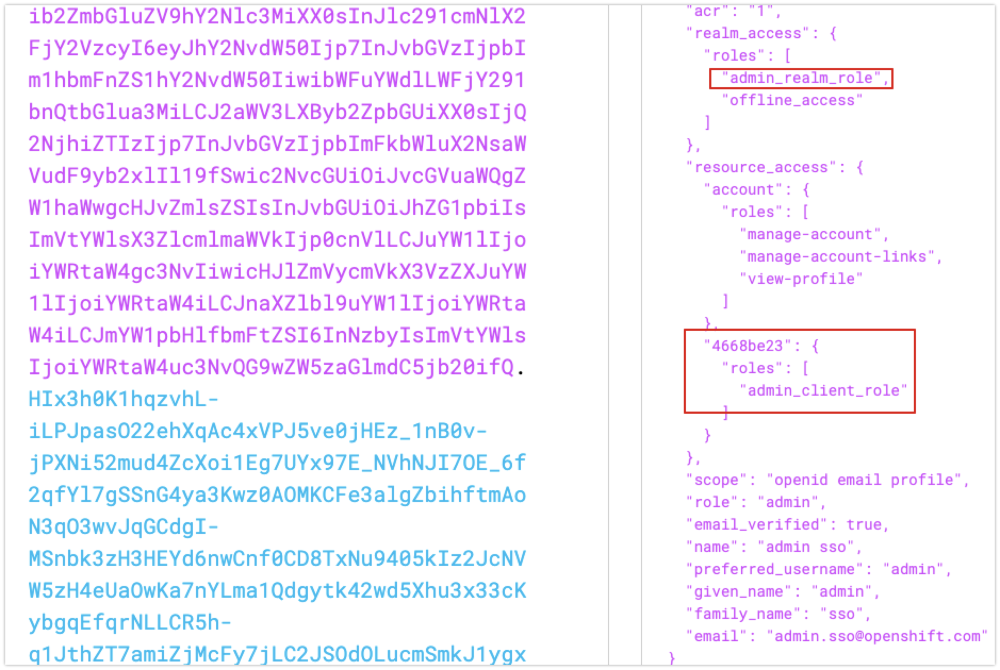
+
* Normal user will return a response with http status code as 403 since no role is assigned.
+
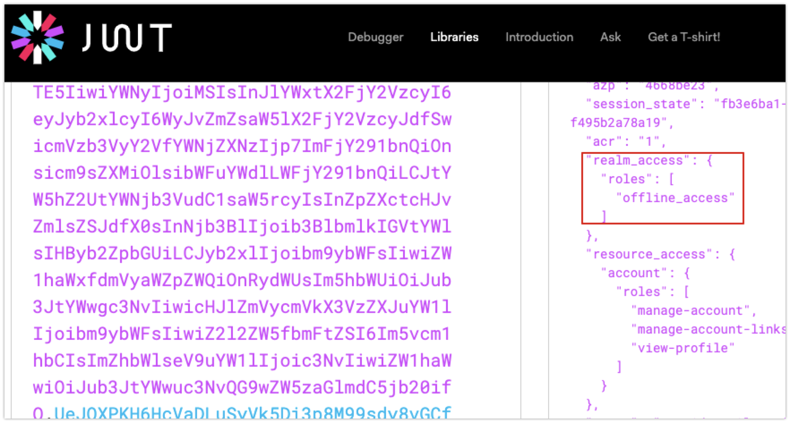
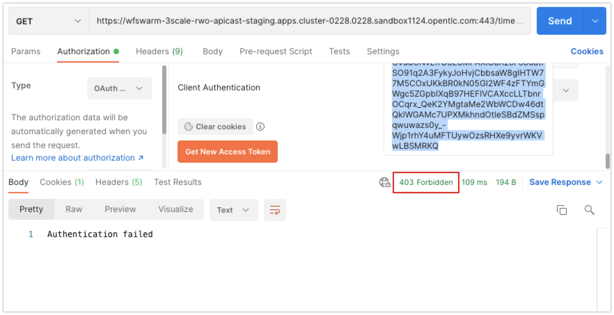
+
* Modify *admin* user and unassign either client or realm role in RH-SSO. Now, for the same user it will return a response with http status code as 403 since the sso role check policy is checking for the existence of both realm and client roles.
+
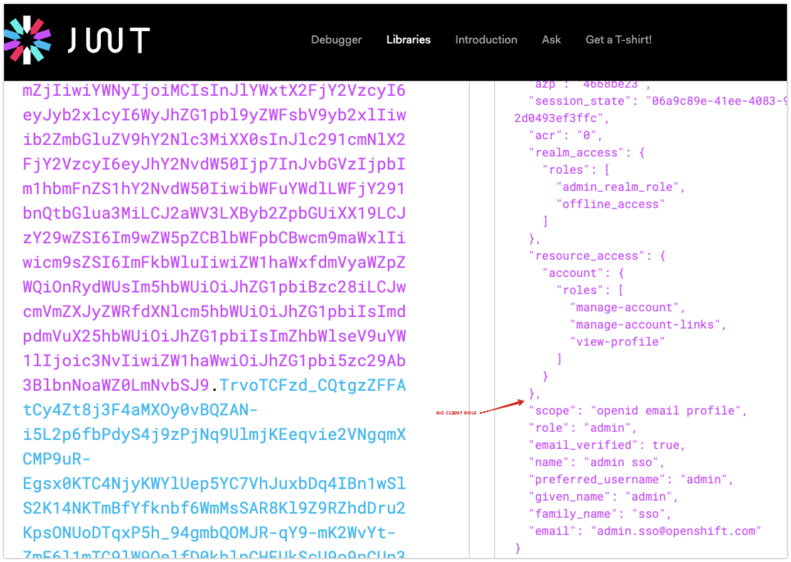
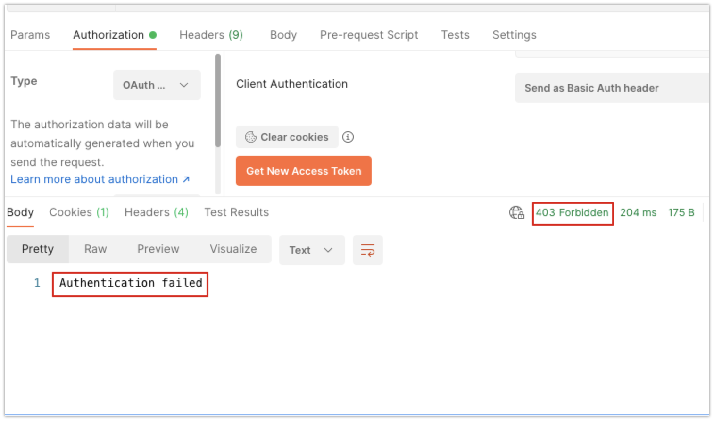
+