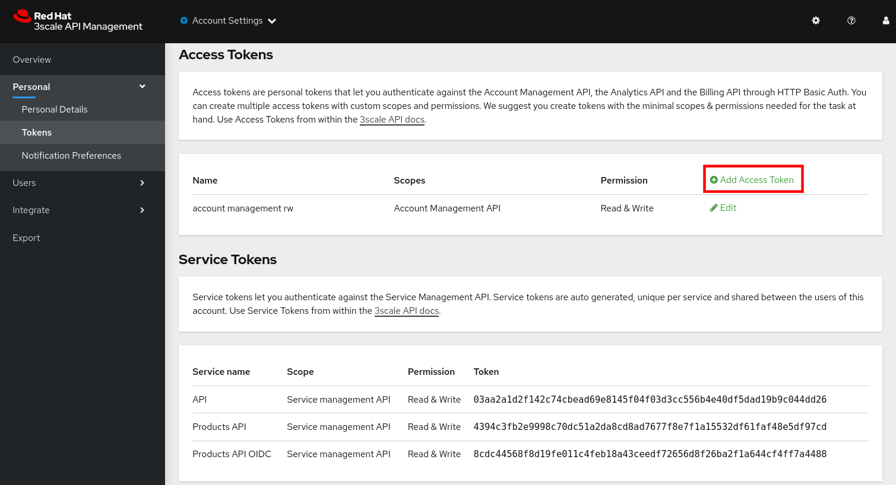

:noaudio:
:scrollbar:
:toc2:
:linkattrs:
:data-uri:

== Account Management API Lab

In previous labs, you have manually created all API management resources via the Admin Portal to manage backend business services.

In this lab, you create the same resources in a programmatic fashion by invoking the RESTful administrative APIs exposed by 3scale.

This lab is a lead-in to the larger topic of automated and repeatable provisioning of your entire API-managed environment using tools like Tekton, Jenkins or Ansible.

.Goals
. Gain exposure to the ActiveDocs-based documentation of the RESTful APIs exposed by 3scale
. Configure 3scale API Management platform in a programmatic manner by invoking its Account Management API

:numbered:

== Admin Access Token

3scale has two types of tokens: Access tokens (created by the user) and Service tokens (automatically created when a new service is deployed in 3scale).

Access tokens allow API provider admins and members to authenticate against the 3scale APIs – Billing, Account Management, and Analytics.

An access token may provide either read and write access, or read only.

Access tokens work according to the member’s rights. Admins can create tokens to authenticate against all three 3scale APIs. Members will be limited by their permissions to access the different parts of the Admin Portal. For example, if a member does not have access to the Billing area, they will not be able to create a token to authenticate against the Billing API.

Tokens are not stored on 3scale. Once created, the token cannot be recovered from 3scale. In case the value is lost, the token needs to be deleted to invalidate it, and a new one created.

In this section of the lab you create an access token for the 3scale APIs.

. In a browser window, navigate to your tenant's 3scale Admin Portal and log in as tenant admin user.
. Navigate to *Account Settings* by clicking on the  icon on the right of the top menu bar.
+

. On the _Account Settings Overview_ page, click *access tokens* to create  new access token.
+

. On the _Access tokens_ page, click *Add Access Token* to create a new access token.
+

. On the _New Access Token_ page, enter the following values:
* *Name*: `admin token`
* *Scopes*: check `Account Management API`, `Analytics API`, `Policy Registry API`.
* *Permission*: `Read & Write`
+

* Click *Create Access token* to create the token.
* On the next page, copy the value of the token, and click *I have copied the token*.

== 3Scale API Docs

In this section, you explore the documentation of the RESTful Admin APIs exposed by 3scale by Red Hat.

This documentation is rendered using _ActiveDocs_.
ActiveDocs is an implementation of the Swagger specification.

Using the 3scale Admin API docs you can experiment with the admin APIs, and find out the exact request and response format for each operation.

. In the 3scale Admin Portal, navigate to *Account Settings -> Integrate -> 3scale API Docs*.
+

. Note that the API documentation is divided into three sections:

* *Service Management API*
+

** Allows for the authorization and reporting of traffic.
** Uses a _service token_ for authentication.
+
Service tokens are automatically generated when an API product is created in the API Manager.
+
They are specific to that product and are shared between the API consumers of a particular product.
** The Service management API is mainly used by the APIcast gateways to authorize and report traffic to the APIs managed by 3scale.

* *Account Management API*
+

** Uses an _access token_ for authentication.
** Manages all aspects of API and Account creation and management.

* *Analytics API*
+

** Uses an _access token_ for authentication.
** Provides access to metrics defined for Applications, Backends and Services.

Other 3scale API categories include the *Billing API* and the *Policy Registry API*. The latter manages custom policy registries.

== Create API Resources via Account Management API

In this section of the lab, you invoke the API Manager's RESTful _Account Management_ APIs to reproduce in a programmatic manner what you accomplished manually in previous labs.

You will use the 3scale API Docs to make calls to the API Manager (alternatively you can also use _curl_ or _Postman_).
It's recommended that with each of these steps, you also view the changes in the 3scale Admin Portal.

For this lab you will use the Echo API, hosted at https://echo-api.3scale.net.

=== Create Echo API Product

. List the existing _Products_.
* In the 3Scale API Docs, locate the _Service List_ operation (`GET /admin/api/services.xml`).
+

* Paste the value of the access token you created in a previous step in the *access_token* field.
* Click *Send Request*.
* Expect a Response code `200`, and a response body in XML format - most of the 3scale by Red Hat Admin API endpoints return XML.
+

* The response XML contains of a list of the _Products_ defined in your 3scale API management tenant.
+
[NOTE]
====
_Products_ is the equivalent of _Services_. The concept of _Products_ was introduced with the _API as a Product_ feature in 3scale 2.7.
====

. Create a new Product for the Echo API.
* In the 3Scale API Docs, locate the _Service Create_ operation (`POST /admin/api/services.xml`).
* Fill in the following values:
** *access_token*: value of your access token.
** *name*: `Echo API`
** *description*: `Echo API created with the 3scale API`
** *deployment option*: `self_managed`
** *backend_version*: `1`
** *system_name*: `echo_api`
+

* Click *Send Request*.
* Expect a Response code `201`, and a response body which describes the new Product.
+

* Take note of the service ID of the _Echo API_ Product.
* As part of the creation of the service, a corresponding metric called _hits_ was created. Take a note of the ID of this metric. You will use it later to create a limit on the metric.
. Check the 3Scale Admin Portal for the presence of the _Echo API_ product.
+

=== Default Service Plan

. When the _Echo API_ was created, a corresponding default service plan was also created. You will need the id of this default service plan when signing up an account to the _Echo API_.
* Locate the _Service Plan List_ operation (`GET /admin/api/services/{id}/service_plans.xml`).
* Enter the access token, and the service ID of _Echo API_.
* From the response, take note of the service plan ID.

=== Create Custom Plans

Later in this lab, you invoke the _Signup Express_ endpoint of the Account Management API to create a new account.
The following resources are referenced when creating a new account using the Signup Express endpoint:

* _Service Plan_ (generated by default when you created the _Echo_API_ service)
* _Account Plan_
* _Application Plan_

In the next section, you create the latter two API management resources.

==== Create Application Plan

. Locate the _Application Plan Create_ operation (`POST /admin/api/services/{service_id}/application_plans.xml`)
. Fill in the following values:
* *access_token*: value of your access token.
* *service_id*: service ID of _Echo API_
* *name*: `Echo API Application Plan`
* *system_name*: `echo_api/app_plan`
* Leave all the other fields blank.
. From the response, take note of the ID of the application plan.

==== Create Usage Limit for _hit_ Metric

The 3scale API allows you to define limits on the metrics and methods on an application plan. For this lab, you set the a limit to the default _hit_ metric of 100 requests per minute.

. Locate the _Limit Create_ operation (`POST /admin/api/application_plans/{application_plan_id}/metrics/{metric_id}/limits.xml`)
. Fill in the following values:
* *access_token*: value of your access token.
* *application_plan_id*: ID of the _Echo API Application Plan_ application plan
* *metric_id*: ID of the _hits_ metric of _Echo API_
* *period*: `minute`
* *value*: `100`
. From the response, take note of the ID of the metric limit.
. Check the 3Scale Admin Portal for the presence of the application plan and the limit.
+

==== Create Account Plan

Create an account plan for subscribers of the _Echo API_.

. Locate the _Account Plan Create_ operation (`POST /admin/api/account_plans.xml`)
. Fill in the following values:
* *access_token*: value of your access token.
* *name*: `Echo API Account Plan`
* *approval_required*: `false`
* *system_name*: `echo_api_account_plan`
* *state_event*: Leave blank
. From the response, take note of the ID of the account plan.

=== Set Up Accounts and Users

The _Signup Express_ API request allows to reproduce a developer sign-up in a single API call. It will create an Account, an Admin User for the account, and optionally an Application with its keys. If the plan ID is not passed, the default plan will be used instead.

. Locate the _Signup Express (Account Create)_ operation (`POST /admin/api/signup.xml`)
. Fill in the following values:
* *access_token*: value of your access token.
* *org_name*: `EchoAccount`
* *username*: `echo-dev`
* *email*: a valid email address
* *password*: an easy to remember password
* *account_plan_id*: the ID of the account plan created in a previous step.
* *service_plan_id*: the ID of the default service plan of the _Echo API_ product
* *application_plan_id*: the ID of the _Echo API_ application plan created in a previous step
. From the response, take note of the ID of the newly created account.
. Note that it could be that several applications have been created for the new account, depending on the existence of default application plans in the API products. Recall that for new accounts, applications are automatically created for every product with a default application plan. The application for the _Echo API_ was created because the ID of the application plan was added to the API request. +
From the response, locate and take note of the user key for the _Echo API_ application. You can find the key in the `<applications>` section of the response. Look for the application whose application plan corresponds to _Echo API Application Plan_.
+

. Check the 3Scale Admin Portal for the presence of the account.
+

=== Configure Services

==== Update Service Proxy

For every service, there is one service proxy resource.

In this section of the lab, you update the _service-proxy_ resource for the _Echo API_ with information about the backend RESTful API and URLs to invoke the API via the APIcast gateways.

. Start by creating new stage and production routes for the staging and production APIcast. Using the _oc_ command line utility:
+
-----
$ oc create route edge echo-api-stage --service=apicast-stage --hostname=echo-api-${OCP_USER}-staging.${OCP_WILDCARD_DOMAIN} -n $OCP_USER-3scale-gw

$ oc create route edge echo-api-prod --service=apicast-prod --hostname=echo-api-${OCP_USER}.${OCP_WILDCARD_DOMAIN} -n $OCP_USER-3scale-gw
-----

. Locate the _Backend Create_ operation (`POST /admin/api/backend_apis.json`)
. Fill in the following values:
* *access_token*: value of your access token.
* *name*: `Echo API Backend`
* *system_name*: `echo_api_backend`
* *description*: `Backend for the Echo API`
* *private_endpoint*: `https://echo-api.3scale.net:443`
. From the response, take note of the ID of the newly created backend.
. Check the 3Scale Admin Portal for the presence of the backend.
+

. Add the backend API to the _Echo API_. Locate the _Backend Usage Create_ operation (`POST /admin/api/services/{service_id}/backend_usages.json`).
. Fill in the following values:
* *access_token*: value of your access token
* *service_id*: service ID of _Echo API_
* *backend_api_id*: ID of the backend API created in a previous step
* *path*: `/`

. Set the staging APIcast URL and the production APIcast URL on the service proxy. Locate the _Proxy Update_ operation (`PATCH /admin/api/services/{service_id}/proxy.xml`).
. Fill in the following values:
* *access_token*: value of your access token
* *service_id*: service ID of _Echo API_
* *endpoint*: https://echo-api-${OCP_USER}.${OCP_WILDCARD_DOMAIN}:443
* *sandbox_endpoint*: https://echo-api-${OCP_USER}-staging.${OCP_WILDCARD_DOMAIN}:443
* Leave all the other fields blank
. Check in the 3Scale Admin Portal that the settings for the _Echo API_ product contain the URLs to the staging and production APIcast.
+

==== Promote to production

For every service proxy, there are two proxy configuration resource types:

* *sandbox* (aka staging)
* *production*

There can be multiple proxy configuration versions for each _proxy_config_ type.

. Determine the ID of the sandbox environment _proxy_config_. Locate the _Proxy Configs List_ operation (`GET /admin/api/services/{service_id}/proxy/configs/{environment}.json`).
. Fill in the following values:
* *access_token*: value of your access token
* *service_id*: service ID of _Echo API_
* *environment*: `sandbox`
. The response body contains the list of _proxy_config_ resources for the staging environment of the _Echo API_. The list should contain only one entry. Take note of the ID and the version of the _proxy_config_.

. Promote the sandbox environment to a production environment. Locate the _Proxy Config Promote_ operation (`POST /admin/api/services/{service_id}/proxy/configs/{environment}/{version}/promote.json`).
. Fill in the following values:
* *access_token*: value of your access token
* *service_id*: service ID of _Echo API_
* *environment*: `sandbox`
* *version*: the version of the staging config to promote. This should be equal to `1`.
* *to*: `production`
. Expect a `201` response code.
. Check in the 3Scale Admin Portal the configuration settings for the _Echo API_ product.
+

== Test

As the final exercise in this lab, you make sure that the configurations for the _Echo API_ are working as expected.

. Use the _curl_ utility from the command line (or Postman if you prefer) to send a request to the Echo API back-end service via the production APIcast gateway .
+
.Sample Command
-----
$ curl -v https://echo-api-${OCP_USER}.${OCP_WILDCARD_DOMAIN}/test?user_key=$ECHO_ACCOUNT_USER_KEY
-----
+
.Sample output
----
*   Trying 54.171.49.89:443...
* Connected to echo-api-user50.apps.cluster-e189.e189.sandbox1208.opentlc.com (54.171.49.89) port 443 (#0)
* ALPN, offering h2 
* ALPN, offering http/1.1
* successfully set certificate verify locations:
*   CAfile: /etc/pki/tls/certs/ca-bundle.crt
  CApath: none
* TLSv1.3 (OUT), TLS handshake, Client hello (1):
* TLSv1.3 (IN), TLS handshake, Server hello (2):
* TLSv1.3 (IN), TLS handshake, Encrypted Extensions (8):
* TLSv1.3 (IN), TLS handshake, Certificate (11):
* TLSv1.3 (IN), TLS handshake, CERT verify (15):
* TLSv1.3 (IN), TLS handshake, Finished (20):
* TLSv1.3 (OUT), TLS change cipher, Change cipher spec (1):
* TLSv1.3 (OUT), TLS handshake, Finished (20):
* SSL connection using TLSv1.3 / TLS_AES_256_GCM_SHA384
* ALPN, server did not agree to a protocol
* Server certificate:
*  subject: CN=api.cluster-e189.e189.sandbox1208.opentlc.com
*  start date: Jan 26 12:40:23 2021 GMT
*  expire date: Apr 26 12:40:23 2021 GMT
*  subjectAltName: host "echo-api-user50.apps.cluster-e189.e189.sandbox1208.opentlc.com" matched cert's "*.apps.cluster-e189.e189.sandbox1208.opentlc.com"
*  issuer: C=US; O=Let's Encrypt; CN=R3
*  SSL certificate verify ok.
> GET /test?user_key=98f3aada356c29fbed70fe953a37ad3c HTTP/1.1
> Host: echo-api-user50.apps.cluster-e189.e189.sandbox1208.opentlc.com
> User-Agent: curl/7.71.1
> Accept: */*
>
* TLSv1.3 (IN), TLS handshake, Newsession Ticket (4):
* TLSv1.3 (IN), TLS handshake, Newsession Ticket (4):
* old SSL session ID is stale, removing
* Mark bundle as not supporting multiuse
< HTTP/1.1 200 OK
< server: openresty
< date: Sun, 31 Jan 2021 21:52:09 GMT
< content-type: application/json
< content-length: 737
< cache-control: private
< set-cookie: d8c1dd0e39ac4456ed39ce5889b9a5a5=a512fce6a5a587137349fd6dc3b9cc89; path=/; HttpOnly
< vary: Origin
< x-3scale-echo-api: echo-api/1.0.3
< x-content-type-options: nosniff
< set-cookie: d45c3262b72278dcc0722baca1659122=88927c0f1ef3d96949e9594d8ecd98e7; path=/; HttpOnly; Secure; SameSite=None
<
{
  "method": "GET",
  "path": "/test",
  "args": "user_key=98f3aada356c29fbed70fe953a37ad3c",
  "body": "",
  "headers": {
    "HTTP_VERSION": "HTTP/1.1",
    "HTTP_HOST": "echo-api.3scale.net",
    "HTTP_ACCEPT": "*/*",
    "HTTP_USER_AGENT": "curl/7.71.1",
    "HTTP_X_3SCALE_PROXY_SECRET_TOKEN": "Shared_secret_sent_from_proxy_to_API_backend_c11b064235818f62",
    "HTTP_X_REAL_IP": "10.131.0.9",
    "HTTP_X_FORWARDED_FOR": "178.119.47.150, 54.216.143.158, 10.0.103.117",
    "HTTP_X_FORWARDED_HOST": "echo-api.3scale.net",
    "HTTP_X_FORWARDED_PORT": "443",
    "HTTP_X_FORWARDED_PROTO": "https",
    "HTTP_FORWARDED": "for=10.0.103.117;host=echo-api.3scale.net;proto=https"
  },
  "uuid": "50a9f72b-bbb6-41b6-91ab-5d7f3163439a"
* Connection #0 to host echo-api-user50.apps.cluster-e189.e189.sandbox1208.opentlc.com left intact
----

You have successfully configured an on-premise 3scale by API Management environment in a programmatic manner using the 3scale Admin APIs.
