:noaudio:
:scrollbar:
:toc2:
:linkattrs:
:data-uri:

== 3scale ToolBox Lab

:numbered:

== Introduction

The _3scale toolbox_ is a command line interface (CLI) for the 3scale API management platform. The aim of the 3scale toolbox is to help administrators operate their APIs, and to help them automate the delivery of these APIs through Continuous Delivery pipelines.

Compared to the RESTful 3scale APIs discussed in a previous lab, the 3scale toolbox has a coarser granularity and as such is easier and less verbose to work with than using directly the fine-grained 3scale APIs.

The 3scale toolbox follows the usual conventions from CLIs:

* Output a non-zero status code on error.
* _stderr_ contains error messages; _stdout_ contains useful output.
* the output can be JSON or YAML, making it easy to be parsed by scripts or pipelines.

Another characteristic of the 3scale Toolbox is that most operations are idempotent. This means you can express the desired state of the system and the 3scale Toolbox will act accordingly: update the existing configuration if it exists, create it when it is missing. Idempotency greatly helps building more reliable automation tools in case of an outage or transient perturbation.

The 3scale toolbox is written in Ruby. It is a wrapper around the 3scale APIs.

== Installation and usage of 3scale ToolBox

The officially supported method of installing the 3scale toolbox is using the 3scale toolbox container image, and use `docker` or `podman` to run the container.

However, there are are also alternative, albeit unsupported, ways to install and run the toolbox on different target platforms, including CentOS/Fedora, Mac and Windows. Please refer to https://github.com/3scale-labs/3scale_toolbox_packaging for installation instructions.

In this lab you will run the 3scale toolbox with Podman or Docker (on a Mac). Alternatively, the toolbox can also run on OpenShift, avoiding the need to install anything on your local workstation. Refer to the appendix at the end of this lab for installation instructions, and instructions how to interface with the toolbox running on OpenShift.

To download the 3scale toolbox image, you need a Red Hat Customer Portal account.

. Log in to the Red Hat Ecosystem Catalog (registry.redhat.io):
+
----
$ podman login registry.redhat.io
Username: ${REDHAT_CUSTOMER_PORTAL_ACCOUNT_USERNAME}
Password: ${REDHAT_CUSTOMER_PORTAL_ACCOUNT_PASSWORD}
Login Succeeded!
----
. Pull the toolbox container image:
+
----
$ podman pull registry.redhat.io/3scale-amp2/toolbox-rhel7:3scale2.9
----
. Verify the installation:
+
----
$ podman run registry.redhat.io/3scale-amp2/toolbox-rhel7:3scale2.9 3scale help
----
+
.Expected Output
----
NAME
    3scale - 3scale toolbox

USAGE
    3scale <sub-command> [options]

DESCRIPTION
    3scale toolbox to manage your API from the terminal.

COMMANDS
    account              account super command
    activedocs           activedocs super command
    application          application super command
    application-plan     application-plan super command
    backend              backend super command
    copy                 copy super command
    help                 show help
    import               import super command
    method               method super command
    metric               metric super command
    policy-registry      policy-registry super command
    product              product super command
    proxy-config         proxy-config super command
    remote               remotes super command
    service              services super command
    update               [DEPRECATED] update super command

OPTIONS
    -c --config-file=<value>      3scale toolbox configuration file (default:
                                  /opt/app-root/src/.3scalerc.yaml)
    -h --help                     show help for this command
    -k --insecure                 Proceed and operate even for server
                                  connections otherwise considered insecure
    -v --version                  Prints the version of this command
       --verbose                  Verbose mode
----

== Create API resources with 3scale Toolbox

In this section of the lab, you use the 3scale toolbox to create API resources on 3scale in a programmatic way.

For this lab you will use the Products service application, hosted in the ${OCP_USER}-business-services namespace in the OpenShift cluster.

=== Manage remote access credentials

To be able to interface with the 3scale platform, the 3scale toolbox requires an access token and the URL to the 3scale admin portal.

The access token and URL can be passed with every toolbox command in the format `https://<access token>@<3scale instance domain>`.

But to make working with the toolbox easier, the remote access credentials can also be added to the toolbox image.

. Obtain an access token. Refer to the previous lab for details on how to create an access token.
. Add the remote credentials to the 3scale toolbox image. Here you use `tenant-${OCP_USER}` as identifier for the credentials.
+
----
$ podman run --name toolbox-container registry.redhat.io/3scale-amp2/toolbox-rhel7:3scale2.9 3scale remote add tenant-${OCP_USER} https://${ACCESS_TOKEN}@${OCP_USER}-3scale-admin.${OCP_WILDCARD_DOMAIN}
----
. Commit the image in a new image that includes the remote information.
+
----
$ podman commit toolbox-container toolbox
----
. For the remainder of the lab you can use the newly created image to access the remote 3scale instance. For example, to list the _Services_ defined on the 3scale instance:
+
----
$ podman run toolbox 3scale service list tenant-${OCP_USER}
----
+
.Sample Output
----
ID      NAME              SYSTEM_NAME
3       API               api
8       Products API      products_api
10      Products API OIDC products_api_oidc
13      Echo API          echo_api
----
+
[NOTE]
====
Storing secrets for toolbox in a container is a potential security risk, for example when distributing the container with secrets to other users or using the container for automation.
In this lab you use it mostly for convenience purposes.
In real world environments you should use secured volumes in Podman or OpenShift secrets (if running a CI/CD pipeline on OpenShift for example).
====
. At any time you can use the `help` function of the toolbox to get more details about a command.
For example, to get help about the `import openapi` command:
+
----
$ podman run toolbox 3scale import openapi --help
----
+
.Output
----
NAME
    openapi - Import API definition in OpenAPI specification from a local file or URL

USAGE
    3scale import openapi [opts] -d <destination> <spec>
    (/path/to/your/spec/file.[json|yaml|yml] OR
    http[s]://domain/resource/path.[json|yaml|yml])

DESCRIPTION
    Using an API definition format like OpenAPI, import to your 3scale API
    directly from a local OpenAPI spec compliant file or a remote URL

OPTIONS
       --activedocs-hidden                        Create ActiveDocs in hidden
                                                  state
       --backend-api-host-header=<value>          Custom host header sent by
                                                  the API gateway to the
                                                  backend API
       --backend-api-secret-token=<value>         Custom secret token sent by
                                                  the API gateway to the
                                                  backend API
    -d --destination=<value>                      3scale target instance.
                                                  Format:
                                                  "http[s]://<authentication>@3scale_domain"
       --default-credentials-userkey=<value>      Default credentials policy
                                                  userkey
       --oidc-issuer-endpoint=<value>             OIDC Issuer Endpoint
       --override-private-base-url=<value>        Custom private base URL
       --override-private-basepath=<value>        Override the basepath for
                                                  the private URLs
       --override-public-basepath=<value>         Override the basepath for
                                                  the public URLs
       --prefix-matching                          Use prefix matching instead
                                                  of strict matching on
                                                  mapping rules derived from
                                                  openapi operations
       --production-public-base-url=<value>       Custom public production
                                                  URL
       --skip-openapi-validation                  Skip OpenAPI schema
                                                  validation
       --staging-public-base-url=<value>          Custom public staging URL
    -t --target_system_name=<value>               Target system name

OPTIONS FOR IMPORT
    -c --config-file=<value>                      3scale toolbox
                                                  configuration file
                                                  (default:
                                                  /opt/app-root/src/.3scalerc.yaml)
    -h --help                                     show help for this command
    -k --insecure                                 Proceed and operate even
                                                  for server connections
                                                  otherwise considered
                                                  insecure
    -v --version                                  Prints the version of this
                                                  command
       --verbose                                  Verbose mode
----

=== Import OpenAPI Spec

The 3scale toolbox allows you to import an OpenAPI specification document for an API. The OpenAPI specification will be introspected and based upon its structure a number of API artifacts will be created on 3scale, including a product, backend, mapping rules and various settings.

In this lab you import the OpenAPI specification for the Products service you used earlier in this course. The OpenAPI specification is structured a bit differently compared to the version you used earlier.

. Review the OpenAPI specification at https://raw.githubusercontent.com/btison/3scale_labs/main/openapi/products.json. Note the following:
* The document contains a `SecurityScheme`, specifying that a API Key is expected in a header with name `user_key`.
+
----
    "securitySchemes": {
      "ApiKeyAuth": {
        "type": "apiKey",
        "in": "header",
        "name": "user_key"
      }
    }
----
* The document has a single `servers.url` element. The `server.url` element’s path component (`api`) is used as the OpenAPI’s `basePath` property. 

. Import the OpenAPI document into 3scale using the 3scale toolbox:
+
----
$ podman run toolbox 3scale import openapi \
    -d tenant-${OCP_USER} \
    https://raw.githubusercontent.com/btison/3scale_labs/main/openapi/products.json \
    --target_system_name products-toolbox \
    --override-public-basepath=/api/v1 \
    --override-private-base-url=http://products-service.${OCP_USER}-business-services.svc:8080 \
    --staging-public-base-url=https://products-toolbox-${OCP_USER}-staging.${OCP_WILDCARD_DOMAIN} \
    --production-public-base-url=https://products-toolbox-${OCP_USER}.${OCP_WILDCARD_DOMAIN}
----
* `target-system-name` specifies the system name that is used for the _Product_ and _Backend_ that will be created.
* `--override-public-basepath` specifies the base path for the exposed API. For the sake of this exercise you decide to expose the API using the `api/v1` base path, rather than the `api` base path defined in the OpenAPI document.
* `--override-private-base-url` specifies the private base URL for the API. This URL points to the Products service application deployed on OpenShift.
* `--staging-public-base-url` and `--production-public-base-url`: the public base URLs for the staging and production APIcast gateways.
* The output of the 3scale toolbox command looks like:
+
.Sample Output
----
Created service id: 19, name: CoolStore Products API
Service proxy updated
destroying all mapping rules
Created GET /api/v1/product/{id}$ endpoint
Created DELETE /api/v1/product/{id}$ endpoint
Created POST /api/v1/product$ endpoint
Created GET /api/v1/products$ endpoint
Service policies updated
----

. Navigate to the 3Scale Admin Portal and review the API resources created by the 3scale toolbox command. These include:
* An _API Product_ `Coolstore Products API`.
+
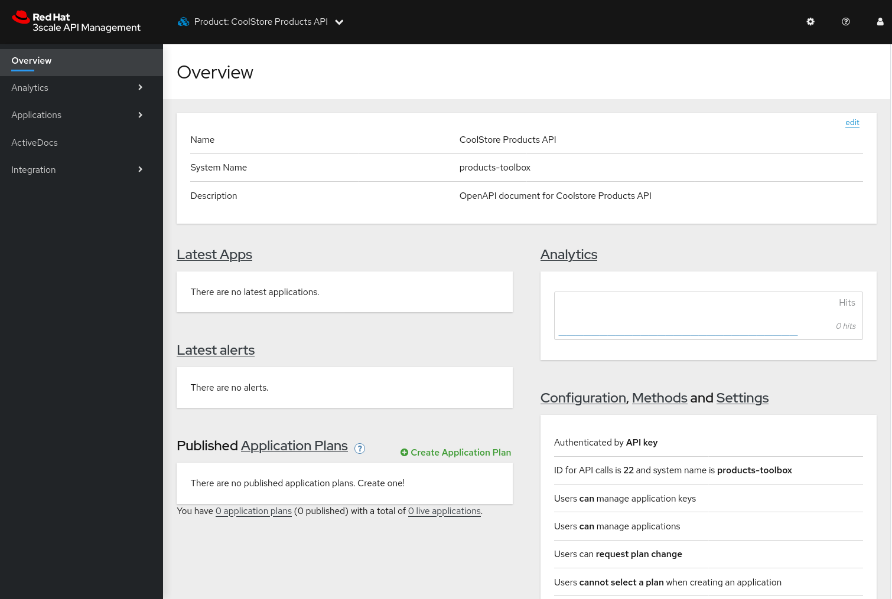
* A _Backend_ `Coolstore Products API Backend`.
+
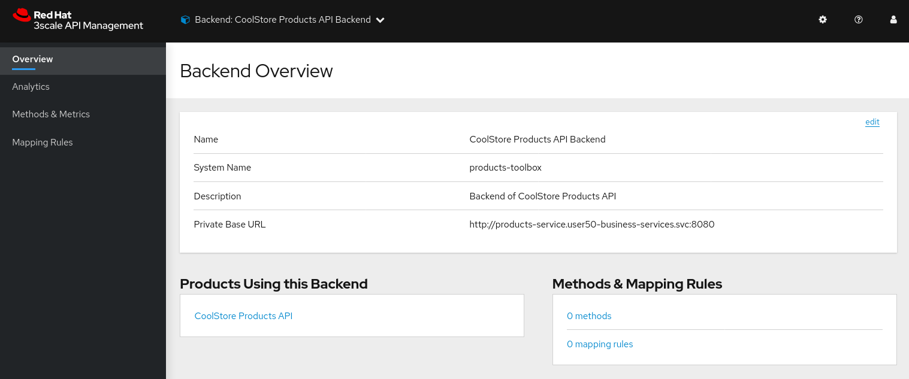
* API Product Settings including the Public Base URLs, and authentication settings (API Key as `user_key` HTTP header)
+
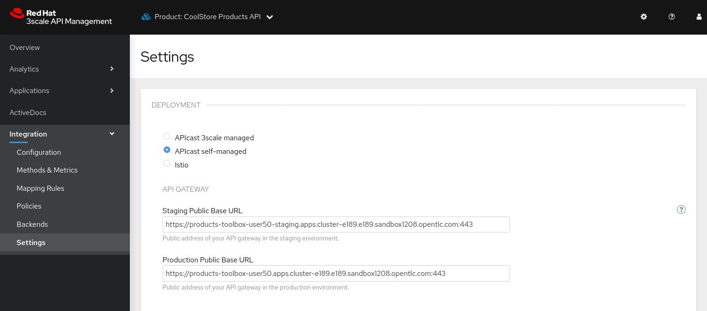
+
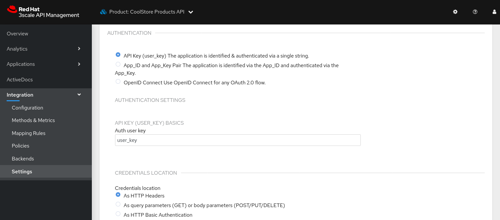
* Mapping Rules for the 4 operations defined in the OpenAPI specification.
+
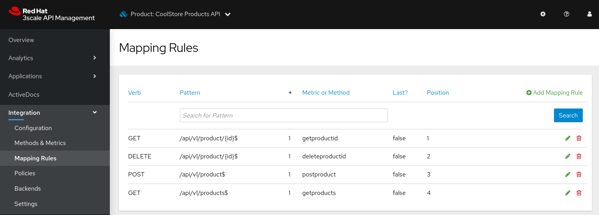
+
Note that the relative URLs of the mapping rules follow the specified public basepath.
* Methods for the 4 operations defined in the OpenAPI specification.
+
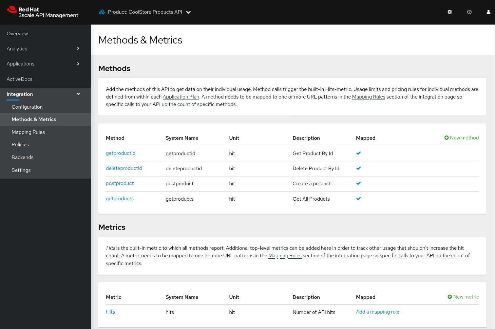
* A _URL Rewriting_ policy.
+
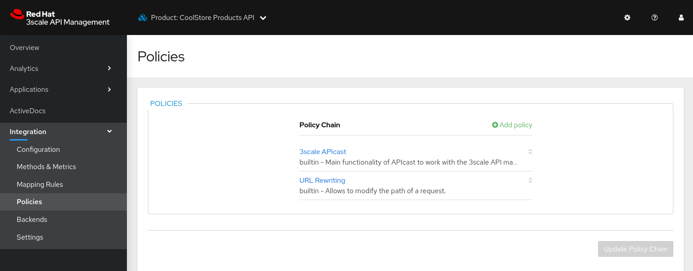
+
This policy translates the public base path of the URL (`api/v1`) to the base path of the backend application (`/api`).
+
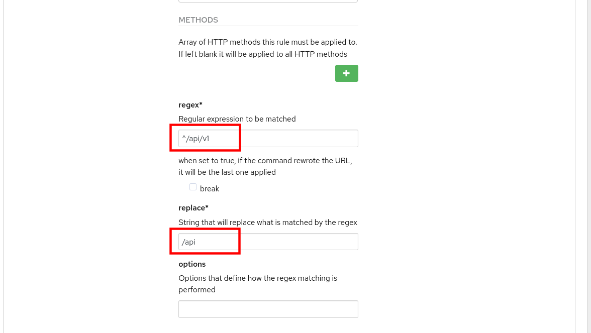
* ActiveDocs for the API.
+
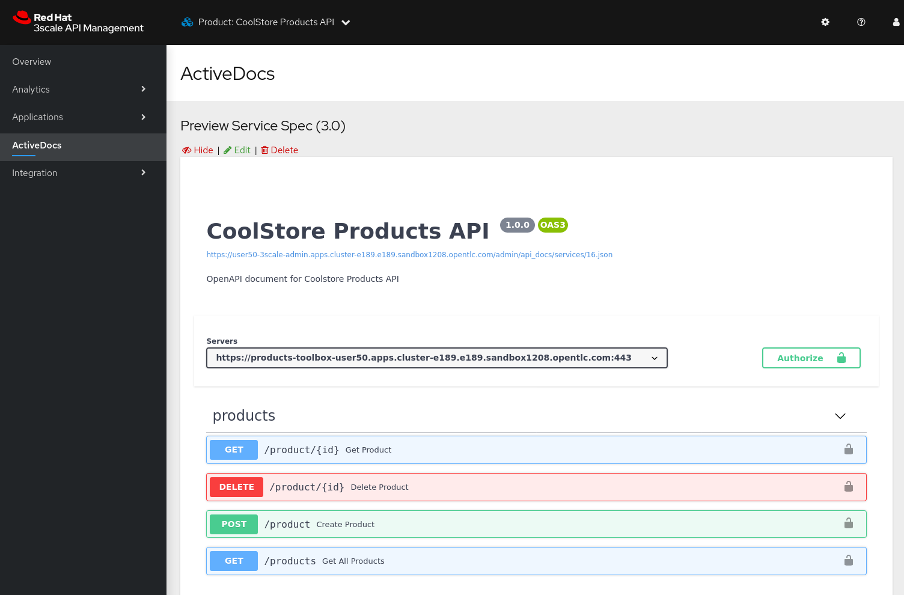

. You can change the name of the generated _Product_.
+
----
$ podman run toolbox 3scale service apply tenant-${OCP_USER} products-toolbox --name="Products V1"
----
+
On the 3scale Admin Portal this becomes:
+
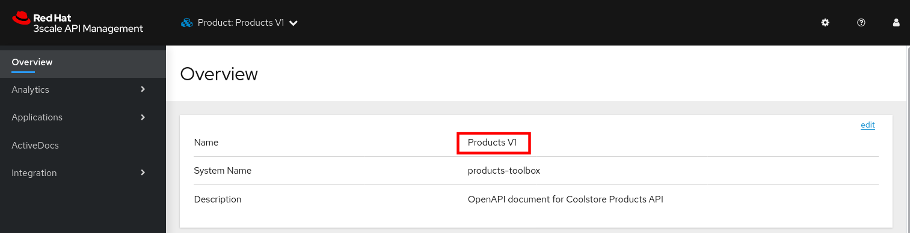

=== Create an Application Plan

The next step in deploying the API is defining one or more application plans.

. Create an application plan:
+
----
$ podman run toolbox 3scale application-plan apply tenant-${OCP_USER} products-toolbox products-toolbox/basic -n "Products Basic Plan" --default --publish
----
+
.Sample output
----
Applied application plan id: 55; Default: true; Published
----
+
On the 3scale Admin Portal:
+
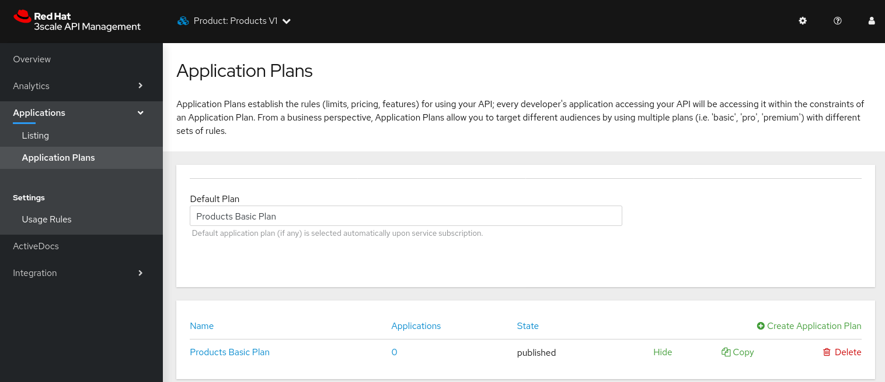

. The toolbox also allows to export or import an application plan definition in _yaml_ format. This allows to define more complex application plans including limits and pricing rules. +
As an example, you can update the application plan created in the previous step to exclude `POST` and `DELETE` operations.
* Create a file with the application plan definition:
+
----
$ echo "
---
plan:
  name: Products Basic Plan
  state: published
  setup_fee: 0.0
  cost_per_month: 0.0
  trial_period_days: 0
  cancellation_period: 0
  approval_required: false
  system_name: products-toolbox/basic
limits:
- period: eternity
  value: 0
  metric_system_name: deleteproductid
- period: eternity
  value: 0
  metric_system_name: postproduct
" | tee /tmp/application-plan.yml
----
* Import the definition file with the 3scale toolbox. The file you just created is mounted into the toolbox container:
+
----
$ podman run -v /tmp/application-plan.yml:/tmp/application-plan.yml toolbox 3scale application-plan import --file=/tmp/application-plan.yml tenant-${OCP_USER} products-toolbox
----
+
.Sample output
----
Application plan updated: 55
Created plan limit: [metric: 59, {"period"=>"eternity", "value"=>0}]
Created plan limit: [metric: 60, {"period"=>"eternity", "value"=>0}]
----
* On the 3scale Admin Portal:
+
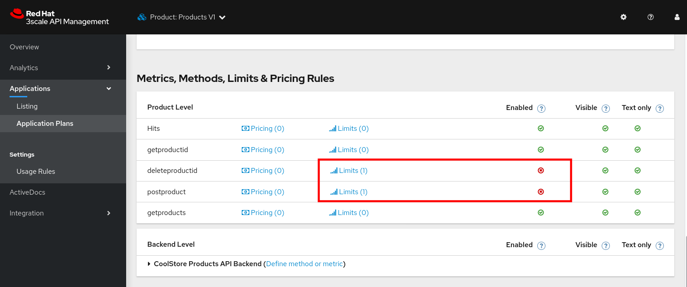

=== Create an Application

To create an application, an application plan is combined with an account and a service.
At this moment the toolbox does not allow to create accounts, so you will use an existing account for the application.

. Create an application for the `TestAccount` account:
+
----
$ podman run toolbox 3scale application apply tenant-${OCP_USER}  1234567890abcdef --account=test-dev --name="Products V1" --plan=products-toolbox/basic --service=products-toolbox
----
+
* `1234567890abcdef` is the user_key for this application
* `test-dev` is the username of the admin user of the account. The account can be referenced by the account ID, or the username, email, or user_id of the admin user of the account.

. Verify the existence of the Application on the 3scale Admin Portal:
+
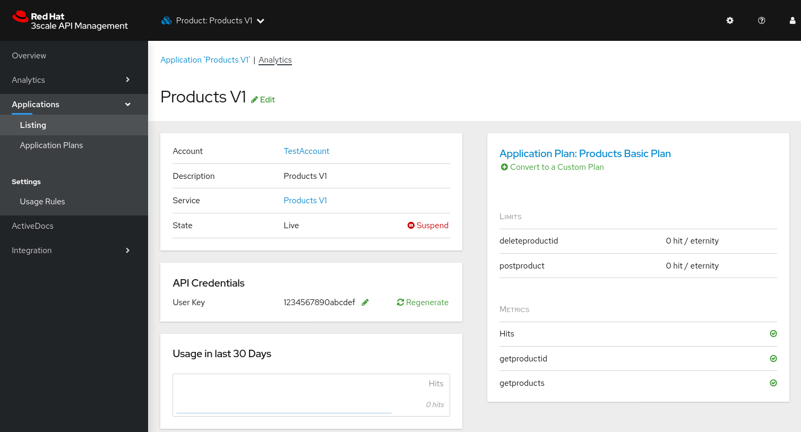

=== Test Staging APIcast and Promote to Production

. Create routes to the staging and production APIcast for the application. Using the _oc_ command line utility:
+
-----
$ oc create route edge products-toolbox-stage --service=apicast-stage --hostname=products-toolbox-${OCP_USER}-staging.${OCP_WILDCARD_DOMAIN} -n ${OCP_USER}-3scale-gw

$ oc create route edge product-toolbox-prod --service=apicast-prod --hostname=products-toolbox-${OCP_USER}.${OCP_WILDCARD_DOMAIN} -n ${OCP_USER}-3scale-gw
-----

. Test the API on the staging APIcast:
+
----
$ curl -v -X GET -H "Accept: application/json" -H "user_key: 1234567890abcdef" https://products-toolbox-${OCP_USER}-staging.${OCP_WILDCARD_DOMAIN}/api/v1/products
----
+
.Expected Response
----
*   Trying 34.240.138.165:443...
* Connected to products-toolbox-user50-staging.apps.cluster-e189.e189.sandbox1208.opentlc.com (34.240.138.165) port 443 (#0)
[...]
< HTTP/1.1 200 OK
< server: openresty
< date: Tue, 02 Feb 2021 15:59:51 GMT
< content-type: application/json
< content-length: 540
< set-cookie: 50a2eb2a468ec69363f9001dac58a6d1=827b2ae8c10c16effcac0c57b240fd26; path=/; HttpOnly; Secure; SameSite=None
< cache-control: private
<
* Connection #0 to host products-toolbox-user50-staging.apps.cluster-e189.e189.sandbox1208.opentlc.com left intact
[{"id":1,"name":"Ninja Blender","price":320.00},{"id":11,"name":"Ninja Blender Pro","price":515.00},{"id":21,"name":"Kitchenhelp Juicer","price":149.99},{"id":31,"name":"ArtCuisine Toaster","price":79.99},{"id":41,"name":"White and Decor Toaster Oven","price":49.99},{"id":51,"name":"Mexpresso Maker","price":199.99},{"id":61,"name":"Mini Fridge","price":229.99},{"id":71,"name":"Slow-Cooker Pot","price":44.99},{"id":81,"name":"SungSamn 4-Door Refrigerator","price":2199.99},{"id":91,"name":"Hanilton 12 Cup Food Processor","price":49.99}]
----

. If the call to the staging APIcast succeeds, you can promote the API to production:
+
----
$ podman run toolbox 3scale proxy-config promote tenant-${OCP_USER} products-toolbox
----
+
.Sample output
----
Proxy Configuration version 4 promoted to 'production'
----

. Test the API on the production APIcast:
+
----
$ curl -v -X GET -H "Accept: application/json" -H "user_key: 1234567890abcdef" https://products-toolbox-${OCP_USER}.${OCP_WILDCARD_DOMAIN}/api/v1/products
----
+
.Expected Response
----
*   Trying 34.240.138.165:443...
* Connected to products-toolbox-user50.apps.cluster-e189.e189.sandbox1208.opentlc.com (34.240.138.165) port 443 (#0)
[...]
< HTTP/1.1 200 OK
< server: openresty
< date: Tue, 02 Feb 2021 15:59:51 GMT
< content-type: application/json
< content-length: 540
< set-cookie: 44497ac6e88e2aca197d9ef2dc8181e9=33525add02bed17131e674997483ce7c; path=/; HttpOnly; Secure; SameSite=None
< cache-control: private
<
* Connection #0 to host products-toolbox-user50.apps.cluster-e189.e189.sandbox1208.opentlc.com left intact
[{"id":1,"name":"Ninja Blender","price":320.00},{"id":11,"name":"Ninja Blender Pro","price":515.00},{"id":21,"name":"Kitchenhelp Juicer","price":149.99},{"id":31,"name":"ArtCuisine Toaster","price":79.99},{"id":41,"name":"White and Decor Toaster Oven","price":49.99},{"id":51,"name":"Mexpresso Maker","price":199.99},{"id":61,"name":"Mini Fridge","price":229.99},{"id":71,"name":"Slow-Cooker Pot","price":44.99},{"id":81,"name":"SungSamn 4-Door Refrigerator","price":2199.99},{"id":91,"name":"Hanilton 12 Cup Food Processor","price":49.99}]
----

You have successfully deployed an API on 3scale using the 3scale toolbox.

:!numbered:

== Appendix: Running 3scale Toolbox on OpenShift

You can also run the 3scale toolbox container image on OpenShift, avoiding the need to install Podman or Docker on your local workstation.

You issue commands against the toolbox with OpenShift _jobs_, which will spin up a container, execute a command and tear the container down, much like what you would do with Podman or Docker locally.

The 3scale credentials are put in an OpenShift secret and mounted into the toolbox container.

Follow the instructions below to do the lab with the toolbox running on OpenShift.

. Create a secret holding the toolbox configuration.
* Create a configuration file for the 3scale toolbox
+
----
$ echo "
:remotes:
  tenant-${OCP_USER}:
    :authentication: ${ACCESS_TOKEN}
    :endpoint: https://${OCP_USER}-3scale-admin.${OCP_WILDCARD_DOMAIN}
" | tee /tmp/toolbox.yml
----
* Create a secret from the file in the `${OCP_USER}-3scale-gw` namespace on OpenShift:
+
----
$ oc create secret generic 3scale-toolbox --from-file=.3scalerc.yaml=/tmp/toolbox.yml -n ${OCP_USER}-3scale-gw
----

. Import the OpenAPI spec for the Products API.
* Create a job on OpenShift:
+
----
$ echo "
apiVersion: batch/v1
kind: Job
metadata:
  name: toolbox-import-openapi
spec:
  backoffLimit: 0
  activeDeadlineSeconds: 300
  template:
    spec:
      restartPolicy: Never
      containers:
      - name: toolbox
        image: registry.redhat.io/3scale-amp2/toolbox-rhel7:3scale2.9
        imagePullPolicy: IfNotPresent
        args:
          - 3scale
          - import
          - openapi
          - --destination=tenant-${OCP_USER}
          - https://raw.githubusercontent.com/btison/3scale_labs/main/openapi/products.json
          - --target_system_name=products-toolbox-ocp
          - --override-public-basepath=/api/v1
          - --override-private-base-url=http://products-service.${OCP_USER}-business-services.svc:8080
          - --staging-public-base-url=https://products-toolbox-ocp-${OCP_USER}-staging.${OCP_WILDCARD_DOMAIN}
          - --production-public-base-url=https://products-toolbox-ocp-${OCP_USER}.${OCP_WILDCARD_DOMAIN}
        env:
        - name: HOME
          value: /config
        volumeMounts:
        - name: toolbox-config
          mountPath: /config
      volumes:
      - name: toolbox-config
        secret:
          secretName: 3scale-toolbox
" | oc create -f - -n ${OCP_USER}-3scale-gw
----
* Check the logs of the job:
+
----
$ oc logs job/toolbox-import-openapi -n ${OCP_USER}-3scale-gw
----
+
.Sample output
----
Created service id: 23, name: CoolStore Products API
Service proxy updated
destroying all mapping rules
Created GET /api/v1/product/{id}$ endpoint
Created DELETE /api/v1/product/{id}$ endpoint
Created POST /api/v1/product$ endpoint
Created GET /api/v1/products$ endpoint
Service policies updated
----

. Change the name of the service:
+
----
$ echo "
apiVersion: batch/v1
kind: Job
metadata:
  name: toolbox-service-name
spec:
  backoffLimit: 0
  activeDeadlineSeconds: 300
  template:
    spec:
      restartPolicy: Never
      containers:
      - name: toolbox
        image: registry.redhat.io/3scale-amp2/toolbox-rhel7:3scale2.9
        imagePullPolicy: IfNotPresent
        args:
          - 3scale
          - service
          - apply
          - tenant-${OCP_USER}
          - products-toolbox-ocp
          - '--name=Products V1 OCP'
        env:
        - name: HOME
          value: /config
        volumeMounts:
        - name: toolbox-config
          mountPath: /config
      volumes:
      - name: toolbox-config
        secret:
          secretName: 3scale-toolbox
" | oc create -f - -n ${OCP_USER}-3scale-gw
----

. Create an application plan:
* Create a file with the application definition:
+
----
$ echo "
---
plan:
  name: Products Basic Plan
  state: published
  setup_fee: 0.0
  cost_per_month: 0.0
  trial_period_days: 0
  cancellation_period: 0
  approval_required: false
  system_name: products-toolbox-ocp/basic
limits:
- period: eternity
  value: 0
  metric_system_name: deleteproductid
- period: eternity
  value: 0
  metric_system_name: postproduct
" | tee /tmp/application-plan.yml
----
* Create a configmap holding the file:
+
----
$ oc create configmap application-plan --from-file=/tmp/application-plan.yml -n ${OCP_USER}-3scale-gw
----
* Create a job on OpenShift:
+
----
$ echo "
apiVersion: batch/v1
kind: Job
metadata:
  name: toolbox-application-plan
spec:
  backoffLimit: 0
  activeDeadlineSeconds: 300
  template:
    spec:
      restartPolicy: Never
      containers:
      - name: toolbox
        image: registry.redhat.io/3scale-amp2/toolbox-rhel7:3scale2.9
        imagePullPolicy: IfNotPresent
        args:
          - 3scale
          - application-plan
          - import
          - --file=/artifacts/application-plan.yml
          - tenant-${OCP_USER}
          - products-toolbox-ocp
        env:
        - name: HOME
          value: /config
        volumeMounts:
        - name: toolbox-config
          mountPath: /config
        - name: artifacts
          mountPath: /artifacts
      volumes:
      - name: toolbox-config
        secret:
          secretName: 3scale-toolbox
      - name: artifacts
        configMap:
          name: application-plan
" | oc create -f - -n ${OCP_USER}-3scale-gw
----
* Check the logs of the job:
+
----
$ oc logs job/toolbox-application-plan -n ${OCP_USER}-3scale-gw
----
+
.Sample output
----
Application plan created: 61
Created plan limit: [metric: 74, {"period"=>"eternity", "value"=>0}] 
Created plan limit: [metric: 75, {"period"=>"eternity", "value"=>0}]
----

. Create an application:
+
----
$ echo "
apiVersion: batch/v1
kind: Job
metadata:
  name: toolbox-application
spec:
  backoffLimit: 0
  activeDeadlineSeconds: 300
  template:
    spec:
      restartPolicy: Never
      containers:
      - name: toolbox
        image: registry.redhat.io/3scale-amp2/toolbox-rhel7:3scale2.9
        imagePullPolicy: IfNotPresent
        args:
          - 3scale
          - application
          - apply
          - tenant-${OCP_USER}
          - 1234567890abcdef
          - --account=test-dev
          - '--name=Products V1 OCP'
          - --plan=products-toolbox-ocp/basic
          - --service=products-toolbox-ocp
        env:
        - name: HOME
          value: /config
        volumeMounts:
        - name: toolbox-config
          mountPath: /config
      volumes:
      - name: toolbox-config
        secret:
          secretName: 3scale-toolbox
" | oc create -f - -n ${OCP_USER}-3scale-gw
----

. Promote to production:
+
----
$ echo "
apiVersion: batch/v1
kind: Job
metadata:
  name: toolbox-promote
spec:
  backoffLimit: 0
  activeDeadlineSeconds: 300
  template:
    spec:
      restartPolicy: Never
      containers:
      - name: toolbox
        image: registry.redhat.io/3scale-amp2/toolbox-rhel7:3scale2.9
        imagePullPolicy: IfNotPresent
        args:
          - 3scale
          - proxy-config
          - promote
          - tenant-${OCP_USER}
          - products-toolbox-ocp
        env:
        - name: HOME
          value: /config
        volumeMounts:
        - name: toolbox-config
          mountPath: /config
      volumes:
      - name: toolbox-config
        secret:
          secretName: 3scale-toolbox
" | oc create -f - -n ${OCP_USER}-3scale-gw
----
